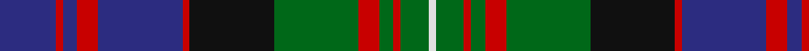

In pattern [BRBRBRKGRGRGW](/patterns/brbrbrkgrgrgw/).

This was sourced from house-of-tartan.  It is a [13 stripes tartan](/stripes/stripes13/).

Original link http://www.house-of-tartan.scotland.net/house/TartanViewjs.asp?colr=Def&tnam=471

## Thread count
DB/16 R2 DB4 R6 DB24 R2 K24 G24 R6 G4 R2 G8 LN/2

## Palette
Each colour and its ΔE from the base-6 reference it is a variant of.

| Colour | Shade | Base | ΔE (OKLab) |
|---|---|---|---|
| DB | <code style="background-color:#2C2C80;">#2C2C80</code> `#2C2C80` | B <code style="background-color:#2A418A;">#2A418A</code> | 0.06 |
| G | <code style="background-color:#006818;">#006818</code> `#006818` | G <code style="background-color:#006100;">#006100</code> | 0.02 |
| K | <code style="background-color:#101010;">#101010</code> `#101010` | K <code style="background-color:#000000;">#000000</code> | 0.17 |
| LN | <code style="background-color:#E0E0E0;">#E0E0E0</code> `#E0E0E0` | W <code style="background-color:#F7F7F7;">#F7F7F7</code> | 0.07 |
| R | <code style="background-color:#C80000;">#C80000</code> `#C80000` | R <code style="background-color:#CC0000;">#CC0000</code> | 0.01 |

## Nearest tartans

The nearest existing variants by ΔTartan distance.

1. [MacDonell of Glengarry](/setts/s13/b8r1b2r3b12r1k12g12r3g2r1g4w1~b2c4084-g005020-k101010-rdc0000-we0e0e0~x2/) — ΔT 0.32
1. [MacDonald of Clanranald](/setts/s13/b8r1b2r3b12r1k12w1g12r3g2r1g8~b2c4084-g005020-k101010-rdc0000-we0e0e0~x2/) — ΔT 0.48
1. [MacDonell of Glengarry - 1914 (Clan)](/setts/s13/b8r1b2r3b12r1k12g12r3g2r1g4w1~b1c0070-g006818-k101010-r880000-wc0c0c0~x2/) — ΔT 0.57
1. [MacDonell of Glengarry #2](/setts/s11/b8r4b12r1k12g12r3g2r1g4w1~b2c4084-g005020-k101010-rdc0000-we0e0e0~x2/) — ΔT 0.58
1. [MacNeil of Colonsay (Highland Society of London)](/setts/s13/g16k5g4k8g44k40g4b52r10b4r4b10w6~b2c2c80-g285800-k101010-rc80000-we0e0e0/) — ΔT 0.60
1. [Deas Clan Tartan Tartan Number: 2139. Earliest known date: pre 2003 The name Deas is described as an 'alias' for Davidson in historic records, and is a recognised sept of Clan Dhai (Davidson). See products available Copyright © Blair Urquhart, Comrie, 2015](/setts/s14/g21k2r8k6r8k2b21k2b2k12y3k12g2k2~b2c2c80-g006818-k101010-rc80000-ye8c000~x2/) — ΔT 0.62
1. [MacDonald of Clanranald #2](/setts/s13/b16r2b2r7b31r2k32w3g31r7g2r2g16~b2c4084-g005020-k101010-rdc0000-we0e0e0~x2/) — ΔT 0.66
1. [Cameron of Erracht (Clan)](/setts/s11/g8r1g1r3g16k16r1b16r3b8y2~b2c2c80-g006818-k101010-rc80000-ye8c000~x2/) — ΔT 0.67
1. [MacKusick (Piper) #1 (Personal)](/setts/s13/b4k1b2k1b6r2k4r2k8w2g12r2g4~b2c2c80-g006818-k101010-rb468ac-wc0c0c0~x2/) — ΔT 0.68
1. [MacKenzie Clan Tartan Tartan Number: 267. Earliest known date: 1778 The MacKenzie is the regimental tartan of the Seaforth Highlanders, who were raised by MacKenzie, Earl of Seaforth, in 1778. The clan held lands in Ross-shire and around Muir of Ord, but in the 12th century, they were removed to Wester Ross, (Kintail). The chiefly line of Kintail died out (as prophecisied by the Brahan Seer) and the MacKenzies of Cromarty were recognised as Chiefs of the Clan. Wilson's 1819 pattern book records various widths and weights of cloth suitable for the different ranks in the regiment. The 'hard' tartan of the period was known to cut the legs of the private soldiers. There is a certified sample in the Highland Society of London collection signed by Mrs MacKenzie of Seaforth (1816). See products available Copyright © Blair Urquhart, Comrie, 2015](/setts/s15/b12k2b2k2b2k12g12k1w3k1g12k12b12k1r3~b2c2c80-g006818-k101010-rc80000-we0e0e0~x2/) — ΔT 0.71

## Neighbour map

Every grey dot is one of 15726 variants placed by the first two principal components of the ΔTartan feature space (44% of its variance). Red is this tartan; blue dots are its nearest — click one to open its page.

<svg viewBox="0 0 640 380" role="img" style="max-width:100%;height:auto;border:1px solid #e0e0e0;border-radius:4px;display:block" xmlns="http://www.w3.org/2000/svg"><image href="/nn/cloud.v1.png" width="640" height="380"/><a href="/setts/s13/b8r1b2r3b12r1k12g12r3g2r1g4w1~b2c4084-g005020-k101010-rdc0000-we0e0e0~x2/"><circle cx="175.1" cy="155.1" r="4" fill="#3465a4"><title>MacDonell of Glengarry</title></circle></a><a href="/setts/s13/b8r1b2r3b12r1k12w1g12r3g2r1g8~b2c4084-g005020-k101010-rdc0000-we0e0e0~x2/"><circle cx="169.3" cy="160.1" r="4" fill="#3465a4"><title>MacDonald of Clanranald</title></circle></a><a href="/setts/s13/b8r1b2r3b12r1k12g12r3g2r1g4w1~b1c0070-g006818-k101010-r880000-wc0c0c0~x2/"><circle cx="174.3" cy="158.5" r="4" fill="#3465a4"><title>MacDonell of Glengarry - 1914 (Clan)</title></circle></a><a href="/setts/s11/b8r4b12r1k12g12r3g2r1g4w1~b2c4084-g005020-k101010-rdc0000-we0e0e0~x2/"><circle cx="160.8" cy="169.4" r="4" fill="#3465a4"><title>MacDonell of Glengarry #2</title></circle></a><a href="/setts/s13/g16k5g4k8g44k40g4b52r10b4r4b10w6~b2c2c80-g285800-k101010-rc80000-we0e0e0/"><circle cx="180.4" cy="145.2" r="4" fill="#3465a4"><title>MacNeil of Colonsay (Highland Society of London)</title></circle></a><a href="/setts/s14/g21k2r8k6r8k2b21k2b2k12y3k12g2k2~b2c2c80-g006818-k101010-rc80000-ye8c000~x2/"><circle cx="156.0" cy="151.9" r="4" fill="#3465a4"><title>Deas Clan Tartan Tartan Number: 2139. Earliest known date: pre 2003 The name Deas is described as an 'alias' for Davidson in historic records, and is a recognised sept of Clan Dhai (Davidson). See products available Copyright © Blair Urquhart, Comrie, 2015</title></circle></a><a href="/setts/s13/b16r2b2r7b31r2k32w3g31r7g2r2g16~b2c4084-g005020-k101010-rdc0000-we0e0e0~x2/"><circle cx="179.0" cy="139.3" r="4" fill="#3465a4"><title>MacDonald of Clanranald #2</title></circle></a><a href="/setts/s11/g8r1g1r3g16k16r1b16r3b8y2~b2c2c80-g006818-k101010-rc80000-ye8c000~x2/"><circle cx="171.9" cy="151.6" r="4" fill="#3465a4"><title>Cameron of Erracht (Clan)</title></circle></a><a href="/setts/s13/b4k1b2k1b6r2k4r2k8w2g12r2g4~b2c2c80-g006818-k101010-rb468ac-wc0c0c0~x2/"><circle cx="131.2" cy="159.9" r="4" fill="#3465a4"><title>MacKusick (Piper) #1 (Personal)</title></circle></a><a href="/setts/s15/b12k2b2k2b2k12g12k1w3k1g12k12b12k1r3~b2c2c80-g006818-k101010-rc80000-we0e0e0~x2/"><circle cx="164.1" cy="157.1" r="4" fill="#3465a4"><title>MacKenzie Clan Tartan Tartan Number: 267. Earliest known date: 1778 The MacKenzie is the regimental tartan of the Seaforth Highlanders, who were raised by MacKenzie, Earl of Seaforth, in 1778. The clan held lands in Ross-shire and around Muir of Ord, but in the 12th century, they were removed to Wester Ross, (Kintail). The chiefly line of Kintail died out (as prophecisied by the Brahan Seer) and the MacKenzies of Cromarty were recognised as Chiefs of the Clan. Wilson's 1819 pattern book records various widths and weights of cloth suitable for the different ranks in the regiment. The 'hard' tartan of the period was known to cut the legs of the private soldiers. There is a certified sample in the Highland Society of London collection signed by Mrs MacKenzie of Seaforth (1816). See products available Copyright © Blair Urquhart, Comrie, 2015</title></circle></a><circle cx="166.7" cy="151.9" r="5" fill="#c00000"/></svg>

ID: /setts/s13/b8r1b2r3b12r1k12g12r3g2r1g4w1~b2c2c80-g006818-k101010-rc80000-we0e0e0~x2/
