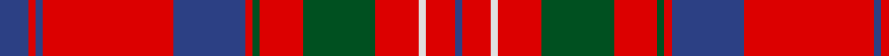

In pattern [BRBRBRGRGRWRB](/patterns/brbrbrgrgrwrb/).

This was sourced from register-of-tartans.  It is a [13 stripes tartan](/stripes/stripes13/).

Original link https://www.tartanregister.gov.uk/tartanDetails.aspx?ref=497

## Thread count
B/8 R2 B2 R36 B20 R2 G2 R12 G20 R12 LN2 R8 B/2

## Palette
Each colour and its ΔE from the base-6 reference it is a variant of.

| Colour | Shade | Base | ΔE (OKLab) |
|---|---|---|---|
| B | <code style="background-color:#2C4084;">#2C4084</code> `#2C4084` | B <code style="background-color:#2C4084;">#2C4084</code> | 0.00 |
| G | <code style="background-color:#005020;">#005020</code> `#005020` | G <code style="background-color:#006400;">#006400</code> | 0.08 |
| LN | <code style="background-color:#E0E0E0;">#E0E0E0</code> `#E0E0E0` | W <code style="background-color:#F4F4F0;">#F4F4F0</code> | 0.06 |
| R | <code style="background-color:#DC0000;">#DC0000</code> `#DC0000` | R <code style="background-color:#C80000;">#C80000</code> | 0.04 |

## Nearest tartans

The nearest existing variants by ΔTartan distance.

1. [Cameron of Locheil](/setts/s13/b8r2b2r36b20r2g2r12g20r12w2r8b2-b304080-g008000-rc00000-we0e0e0/) — ΔT 0.51
1. [Hughes (Welsh Name)](/setts/s11/g4r34b20r4b8r6ba2r5b2r3g4-b003c64-ba202060-g006818-rc80000/) — ΔT 0.76
1. [Leslie Red (VS)](/setts/s14/r64b32r8k12y4k12r8k12y4k12r8b32r64k4-b2c2c80-k101010-rc80000-ye8c000/) — ΔT 0.82
1. [Jenkins (Name)](/setts/s10/b4r60g16r6g16r12b8r6b24w4-b202060-g006818-rc80000-we0e0e0/) — ΔT 0.82
1. [MacDougall](/setts/s11/b8g16ba12b16r12g4r4g4r48g2r6-b5a008c-ba2c4084-g005020-rdc0000/) — ΔT 0.85
1. [Harkness Family Tartan Tartan Number: 580. Earliest known date: 1982 Based on the Nithsdale District tartan. See products available Copyright © Blair Urquhart, Comrie, 2015](/setts/s10/b20r4w4r32g12r2g4r2g6r12-b2c2c80-g006818-rc80000-we0e0e0/) — ΔT 0.85
1. [Drummond of Megginch - Child's Kilt (c.1890)](/setts/s15/r12b4r6g24r4g4r4b8r4w4r28b4r4b2r12-b000064-g004c00-rc80000-w98c8e8/) — ΔT 0.89
1. [MacDougall VS](/setts/s11/b4g8ba6b8r6g2r2g2r24g1r3-b5a3094-ba00004c-g004c00-rc80000/) — ΔT 0.90
1. [Chisholm of Strathglass](/setts/s10/r14w4r72b12g6b6g6b6g24r8-b2c2c80-g003820-rc80000-wfcfcfc/) — ΔT 0.93
1. [Winthrop University (Corporate)](/setts/s15/r4w4b12r4b4r4b2r40y2r4y4r4y12w4y4-b202060-r880000-we8ccb8-ybc8c00/) — ΔT 0.93

## Neighbour map

Every grey dot is one of 15726 variants placed by the first two principal components of the ΔTartan feature space (44% of its variance). Red is this tartan; blue dots are its nearest — click one to open its page.

<svg viewBox="0 0 640 380" role="img" style="max-width:100%;height:auto;border:1px solid #e0e0e0;border-radius:4px;display:block" xmlns="http://www.w3.org/2000/svg"><image href="/nn/cloud.v1.png" width="640" height="380"/><a href="/setts/s13/b8r2b2r36b20r2g2r12g20r12w2r8b2-b304080-g008000-rc00000-we0e0e0/"><circle cx="343.0" cy="139.9" r="4" fill="#3465a4"><title>Cameron of Locheil</title></circle></a><a href="/setts/s11/g4r34b20r4b8r6ba2r5b2r3g4-b003c64-ba202060-g006818-rc80000/"><circle cx="365.0" cy="143.7" r="4" fill="#3465a4"><title>Hughes (Welsh Name)</title></circle></a><a href="/setts/s14/r64b32r8k12y4k12r8k12y4k12r8b32r64k4-b2c2c80-k101010-rc80000-ye8c000/"><circle cx="314.1" cy="132.0" r="4" fill="#3465a4"><title>Leslie Red (VS)</title></circle></a><a href="/setts/s10/b4r60g16r6g16r12b8r6b24w4-b202060-g006818-rc80000-we0e0e0/"><circle cx="314.4" cy="150.2" r="4" fill="#3465a4"><title>Jenkins (Name)</title></circle></a><a href="/setts/s11/b8g16ba12b16r12g4r4g4r48g2r6-b5a008c-ba2c4084-g005020-rdc0000/"><circle cx="327.2" cy="128.4" r="4" fill="#3465a4"><title>MacDougall</title></circle></a><a href="/setts/s10/b20r4w4r32g12r2g4r2g6r12-b2c2c80-g006818-rc80000-we0e0e0/"><circle cx="303.1" cy="153.4" r="4" fill="#3465a4"><title>Harkness Family Tartan Tartan Number: 580. Earliest known date: 1982 Based on the Nithsdale District tartan. See products available Copyright © Blair Urquhart, Comrie, 2015</title></circle></a><a href="/setts/s15/r12b4r6g24r4g4r4b8r4w4r28b4r4b2r12-b000064-g004c00-rc80000-w98c8e8/"><circle cx="326.2" cy="142.6" r="4" fill="#3465a4"><title>Drummond of Megginch - Child's Kilt (c.1890)</title></circle></a><a href="/setts/s11/b4g8ba6b8r6g2r2g2r24g1r3-b5a3094-ba00004c-g004c00-rc80000/"><circle cx="324.9" cy="131.5" r="4" fill="#3465a4"><title>MacDougall VS</title></circle></a><a href="/setts/s10/r14w4r72b12g6b6g6b6g24r8-b2c2c80-g003820-rc80000-wfcfcfc/"><circle cx="372.0" cy="130.9" r="4" fill="#3465a4"><title>Chisholm of Strathglass</title></circle></a><a href="/setts/s15/r4w4b12r4b4r4b2r40y2r4y4r4y12w4y4-b202060-r880000-we8ccb8-ybc8c00/"><circle cx="335.3" cy="106.0" r="4" fill="#3465a4"><title>Winthrop University (Corporate)</title></circle></a><circle cx="336.6" cy="133.9" r="5" fill="#c00000"/></svg>

ID: /setts/s13/b8r2b2r36b20r2g2r12g20r12w2r8b2-b2c4084-g005020-rdc0000-we0e0e0/
