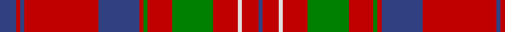

In pattern [BRBRBRGRGRWRB](/patterns/brbrbrgrgrwrb/).

This was sourced from weddslist.  It is a [13 stripes tartan](/stripes/stripes13/).

Original link http://www.weddslist.com/cgi-bin/tartans/pg.pl?source=sts

## Thread count
B/8 R2 B2 R36 B20 R2 G2 R12 G20 R12 LN2 R8 B/2

## Palette
Each colour and its ΔE from the base-6 reference it is a variant of.

| Colour | Shade | Base | ΔE (OKLab) |
|---|---|---|---|
| B | <code style="background-color:#304080;">#304080</code> `#304080` | B <code style="background-color:#2C4084;">#2C4084</code> | 0.01 |
| G | <code style="background-color:#008000;">#008000</code> `#008000` | G <code style="background-color:#006400;">#006400</code> | 0.09 |
| LN | <code style="background-color:#E0E0E0;">#E0E0E0</code> `#E0E0E0` | W <code style="background-color:#F4F4F0;">#F4F4F0</code> | 0.06 |
| R | <code style="background-color:#C00000;">#C00000</code> `#C00000` | R <code style="background-color:#C80000;">#C80000</code> | 0.02 |

## Nearest tartans

The nearest existing variants by ΔTartan distance.

1. [Cameron of Locheil](/setts/s13/b8r2b2r36b20r2g2r12g20r12w2r8b2-b2c4084-g005020-rdc0000-we0e0e0/) — ΔT 0.51
1. [Hughes (Welsh Name)](/setts/s11/g4r34b20r4b8r6ba2r5b2r3g4-b003c64-ba202060-g006818-rc80000/) — ΔT 0.66
1. [Jenkins (Name)](/setts/s10/b4r60g16r6g16r12b8r6b24w4-b202060-g006818-rc80000-we0e0e0/) — ΔT 0.84
1. [Harkness Family Tartan Tartan Number: 580. Earliest known date: 1982 Based on the Nithsdale District tartan. See products available Copyright © Blair Urquhart, Comrie, 2015](/setts/s10/b20r4w4r32g12r2g4r2g6r12-b2c2c80-g006818-rc80000-we0e0e0/) — ΔT 0.84
1. [Harkness](/setts/s10/b20r4w4r32g12r2g4r2g6r12-b304080-g008000-rc00000-we0e0e0/) — ΔT 0.85
1. [London Caledonian Commemorative Tartan Tartan Number: 1388. Earliest known date: 1953 For London Caledonian Games Association. See products available Copyright © Blair Urquhart, Comrie, 2015](/setts/s13/r18b4r42ba4r4b16r4g4r4g34r4b4r16-b2c2c80-ba5c8ca8-g006818-rc80000/) — ΔT 0.87
1. [Chisholm, The (MacGregor-Hastie)](/setts/s10/r24w4r74b12g6b6r8b6g42r8-b1474b4-g006818-rc80000-wfcfcfc/) — ΔT 0.90
1. [Chisholm of Strathglass (Clan)](/setts/s10/r14w4r72b12g6b6g6b6g24r8-b1474b4-g00643c-rc80000-wfcfcfc/) — ΔT 0.91
1. [Chisholm of Strathglass Clan Tartan Tartan Number: 1455. Earliest known date: 1830 A slight variation in proportions from the Chisholm sett in the collection of the Highland Society of London. Logan gives this sett as Chisholm, as do Smibert(1850) and the Smiths (1850), but Grant (1886) shows the Vestiarium design. See products available Copyright © Blair Urquhart, Comrie, 2015](/setts/s10/r14w4r72b12g6b6g6b6g24r8-b2c2c80-g006818-rc80000-we0e0e0/) — ΔT 0.93
1. [London, Caledonian](/setts/s13/r18b4r42ba4r4b16r4g4r4g34r4b4r16-b304080-ba5480b0-g008000-rc00000/) — ΔT 0.94

## Neighbour map

Every grey dot is one of 15726 variants placed by the first two principal components of the ΔTartan feature space (44% of its variance). Red is this tartan; blue dots are its nearest — click one to open its page.

<svg viewBox="0 0 640 380" role="img" style="max-width:100%;height:auto;border:1px solid #e0e0e0;border-radius:4px;display:block" xmlns="http://www.w3.org/2000/svg"><image href="/nn/cloud.v1.png" width="640" height="380"/><a href="/setts/s13/b8r2b2r36b20r2g2r12g20r12w2r8b2-b2c4084-g005020-rdc0000-we0e0e0/"><circle cx="336.6" cy="133.9" r="4" fill="#3465a4"><title>Cameron of Locheil</title></circle></a><a href="/setts/s11/g4r34b20r4b8r6ba2r5b2r3g4-b003c64-ba202060-g006818-rc80000/"><circle cx="365.0" cy="143.7" r="4" fill="#3465a4"><title>Hughes (Welsh Name)</title></circle></a><a href="/setts/s10/b4r60g16r6g16r12b8r6b24w4-b202060-g006818-rc80000-we0e0e0/"><circle cx="314.4" cy="150.2" r="4" fill="#3465a4"><title>Jenkins (Name)</title></circle></a><a href="/setts/s10/b20r4w4r32g12r2g4r2g6r12-b2c2c80-g006818-rc80000-we0e0e0/"><circle cx="303.1" cy="153.4" r="4" fill="#3465a4"><title>Harkness Family Tartan Tartan Number: 580. Earliest known date: 1982 Based on the Nithsdale District tartan. See products available Copyright © Blair Urquhart, Comrie, 2015</title></circle></a><a href="/setts/s10/b20r4w4r32g12r2g4r2g6r12-b304080-g008000-rc00000-we0e0e0/"><circle cx="305.6" cy="155.4" r="4" fill="#3465a4"><title>Harkness</title></circle></a><a href="/setts/s13/r18b4r42ba4r4b16r4g4r4g34r4b4r16-b2c2c80-ba5c8ca8-g006818-rc80000/"><circle cx="337.7" cy="159.2" r="4" fill="#3465a4"><title>London Caledonian Commemorative Tartan Tartan Number: 1388. Earliest known date: 1953 For London Caledonian Games Association. See products available Copyright © Blair Urquhart, Comrie, 2015</title></circle></a><a href="/setts/s10/r24w4r74b12g6b6r8b6g42r8-b1474b4-g006818-rc80000-wfcfcfc/"><circle cx="379.0" cy="140.1" r="4" fill="#3465a4"><title>Chisholm, The (MacGregor-Hastie)</title></circle></a><a href="/setts/s10/r14w4r72b12g6b6g6b6g24r8-b1474b4-g00643c-rc80000-wfcfcfc/"><circle cx="379.7" cy="134.5" r="4" fill="#3465a4"><title>Chisholm of Strathglass (Clan)</title></circle></a><a href="/setts/s10/r14w4r72b12g6b6g6b6g24r8-b2c2c80-g006818-rc80000-we0e0e0/"><circle cx="377.1" cy="133.1" r="4" fill="#3465a4"><title>Chisholm of Strathglass Clan Tartan Tartan Number: 1455. Earliest known date: 1830 A slight variation in proportions from the Chisholm sett in the collection of the Highland Society of London. Logan gives this sett as Chisholm, as do Smibert(1850) and the Smiths (1850), but Grant (1886) shows the Vestiarium design. See products available Copyright © Blair Urquhart, Comrie, 2015</title></circle></a><a href="/setts/s13/r18b4r42ba4r4b16r4g4r4g34r4b4r16-b304080-ba5480b0-g008000-rc00000/"><circle cx="339.4" cy="161.0" r="4" fill="#3465a4"><title>London, Caledonian</title></circle></a><circle cx="343.0" cy="139.9" r="5" fill="#c00000"/></svg>

ID: /setts/s13/b8r2b2r36b20r2g2r12g20r12w2r8b2-b304080-g008000-rc00000-we0e0e0/
