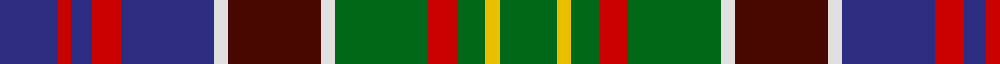

In pattern [BRBRBWBWGRGYG](/patterns/brbrbwbwgrgyg/).

This was sourced from house-of-tartan.  It is a [13 stripes tartan](/stripes/stripes13/).

Original link http://www.house-of-tartan.scotland.net/house/TartanViewjs.asp?colr=Def&tnam=434

## Thread count
DB/16 R4 DB6 R8 DB26 LN4 DR26 LN4 G26 R8 G8 Y4 G/16

## Palette
Each colour and its ΔE from the base-6 reference it is a variant of.

| Colour | Shade | Base | ΔE (OKLab) |
|---|---|---|---|
| DB | <code style="background-color:#2C2C80;">#2C2C80</code> `#2C2C80` | B <code style="background-color:#2A418A;">#2A418A</code> | 0.06 |
| DR | <code style="background-color:#480800;">#480800</code> `#480800` | B <code style="background-color:#2A418A;">#2A418A</code> | 0.24 |
| G | <code style="background-color:#006818;">#006818</code> `#006818` | G <code style="background-color:#006100;">#006100</code> | 0.02 |
| LN | <code style="background-color:#E0E0E0;">#E0E0E0</code> `#E0E0E0` | W <code style="background-color:#F7F7F7;">#F7F7F7</code> | 0.07 |
| R | <code style="background-color:#C80000;">#C80000</code> `#C80000` | R <code style="background-color:#CC0000;">#CC0000</code> | 0.01 |
| Y | <code style="background-color:#E8C000;">#E8C000</code> `#E8C000` | Y <code style="background-color:#F2BF00;">#F2BF00</code> | 0.02 |

## Nearest tartans

The nearest existing variants by ΔTartan distance.

1. [Bowie (white lines) (Name)](/setts/s13/b8r2b3r4b13w2g13w2ga13r4ga4y2ga8x2~b000048-g784c18-ga184800-rf03000-wfcfcfc-yc88c00/) — ΔT 0.62
1. [Bowie](/setts/s13/b8r2b3r4b13w2ra13w2g13r4g4y2g8x2~b304080-g008000-rc00000-ra703000-we0e0e0-yf0c000/) — ΔT 0.80
1. [North of Scotland Tartan Army](/setts/s13/b3k3b10k11g14ba3g14k11w3y3ba15y2w2x2~b780078-ba2c2c80-g006818-k101010-we0e0e0-ya0a0a0/) — ΔT 0.81
1. [Kinloch Anderson Heather (Corporate)](/setts/s12/b4ba4b2ba14g6ga3g6gb2ga4gb2ga15r3x2~b780078-ba440044-g003820-ga289c18-gb006818-r888888/) — ΔT 0.82
1. [Watt (Personal)](/setts/s13/b9k2w4b4y2k10g12k3g12k8r11k2y4x2~b2c2c80-g006818-k101010-rc80000-wf8f8f8-ybc8c00/) — ΔT 0.82
1. [Lee Cox (Personal)](/setts/s17/b3w2r2ba6g10b3k3b3k3b3g14b3k3b3k7g2r3x2~b5c8ca8-ba780078-g006818-k101010-rc8002c-we0e0e0/) — ΔT 0.90
1. [Langston (Personal)](/setts/s18/k14g2b14g3b14g2k14g14w2g14k14r2g2r10y4r10g2r2x2~b2888c4-g006818-k101010-rc80000-we0e0e0-ye8c000/) — ΔT 0.91
1. [Festival Celtique de Qubecc](/setts/s14/g5k1g5k1b5w1b5g2w1y2b1r3y1r3x4~b2c2c80-g006818-k101010-rc80000-wfcfcfc-yfccc00/) — ΔT 0.91
1. [MacDonald of Clanranald #3](/setts/s13/b6r2b2r3b12r2k11w2g11r3g2r2g6x2~b2c2c80-g006818-k101010-rc80000-wfcfcfc/) — ΔT 0.93
1. [MacDonald of Clanranald Clan Tartan Tartan Number: 427. Earliest known date: 1850 This is the count from the Lord Lyons records multiplied by four. It corresponds to the sett given by A. and W. Smith in 'The Authenticated Tartans of the Clans and Families of Scotland' (1850) and in the work of J.Grant (1886). The tartan is distinguished by the two white lines. There is a certified example in the Highland Society of London collection. See products available Copyright © Blair Urquhart, Comrie, 2015](/setts/s13/b6r2b2r3b12r2k11w2g11r3g2r2g6x2~b2c2c80-g006818-k101010-rc80000-we0e0e0/) — ΔT 0.93

## Neighbour map

Every grey dot is one of 15726 variants placed by the first two principal components of the ΔTartan feature space (44% of its variance). Red is this tartan; blue dots are its nearest — click one to open its page.

<svg viewBox="0 0 640 380" role="img" style="max-width:100%;height:auto;border:1px solid #e0e0e0;border-radius:4px;display:block" xmlns="http://www.w3.org/2000/svg"><image href="/nn/cloud.v1.png" width="640" height="380"/><a href="/setts/s13/b8r2b3r4b13w2g13w2ga13r4ga4y2ga8x2~b000048-g784c18-ga184800-rf03000-wfcfcfc-yc88c00/"><circle cx="66.4" cy="161.5" r="4" fill="#3465a4"><title>Bowie (white lines) (Name)</title></circle></a><a href="/setts/s13/b8r2b3r4b13w2ra13w2g13r4g4y2g8x2~b304080-g008000-rc00000-ra703000-we0e0e0-yf0c000/"><circle cx="86.4" cy="166.8" r="4" fill="#3465a4"><title>Bowie</title></circle></a><a href="/setts/s13/b3k3b10k11g14ba3g14k11w3y3ba15y2w2x2~b780078-ba2c2c80-g006818-k101010-we0e0e0-ya0a0a0/"><circle cx="62.3" cy="163.7" r="4" fill="#3465a4"><title>North of Scotland Tartan Army</title></circle></a><a href="/setts/s12/b4ba4b2ba14g6ga3g6gb2ga4gb2ga15r3x2~b780078-ba440044-g003820-ga289c18-gb006818-r888888/"><circle cx="94.4" cy="160.0" r="4" fill="#3465a4"><title>Kinloch Anderson Heather (Corporate)</title></circle></a><a href="/setts/s13/b9k2w4b4y2k10g12k3g12k8r11k2y4x2~b2c2c80-g006818-k101010-rc80000-wf8f8f8-ybc8c00/"><circle cx="39.4" cy="175.5" r="4" fill="#3465a4"><title>Watt (Personal)</title></circle></a><a href="/setts/s17/b3w2r2ba6g10b3k3b3k3b3g14b3k3b3k7g2r3x2~b5c8ca8-ba780078-g006818-k101010-rc8002c-we0e0e0/"><circle cx="86.9" cy="151.4" r="4" fill="#3465a4"><title>Lee Cox (Personal)</title></circle></a><a href="/setts/s18/k14g2b14g3b14g2k14g14w2g14k14r2g2r10y4r10g2r2x2~b2888c4-g006818-k101010-rc80000-we0e0e0-ye8c000/"><circle cx="56.8" cy="145.5" r="4" fill="#3465a4"><title>Langston (Personal)</title></circle></a><a href="/setts/s14/g5k1g5k1b5w1b5g2w1y2b1r3y1r3x4~b2c2c80-g006818-k101010-rc80000-wfcfcfc-yfccc00/"><circle cx="47.1" cy="168.1" r="4" fill="#3465a4"><title>Festival Celtique de Qubecc</title></circle></a><a href="/setts/s13/b6r2b2r3b12r2k11w2g11r3g2r2g6x2~b2c2c80-g006818-k101010-rc80000-wfcfcfc/"><circle cx="98.1" cy="180.5" r="4" fill="#3465a4"><title>MacDonald of Clanranald #3</title></circle></a><a href="/setts/s13/b6r2b2r3b12r2k11w2g11r3g2r2g6x2~b2c2c80-g006818-k101010-rc80000-we0e0e0/"><circle cx="101.8" cy="182.1" r="4" fill="#3465a4"><title>MacDonald of Clanranald Clan Tartan Tartan Number: 427. Earliest known date: 1850 This is the count from the Lord Lyons records multiplied by four. It corresponds to the sett given by A. and W. Smith in 'The Authenticated Tartans of the Clans and Families of Scotland' (1850) and in the work of J.Grant (1886). The tartan is distinguished by the two white lines. There is a certified example in the Highland Society of London collection. See products available Copyright © Blair Urquhart, Comrie, 2015</title></circle></a><circle cx="80.0" cy="165.0" r="5" fill="#c00000"/></svg>

ID: /setts/s13/b8r2b3r4b13w2ba13w2g13r4g4y2g8x2~b2c2c80-ba480800-g006818-rc80000-we0e0e0-ye8c000/
