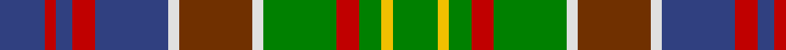

In pattern [BRBRBWRWGRGYG](/patterns/brbrbwrwgrgyg/).

This was sourced from weddslist.  It is a [13 stripes tartan](/stripes/stripes13/).

Original link http://www.weddslist.com/cgi-bin/tartans/pg.pl?source=sts

## Thread count
B/16 R4 B6 R8 B26 LN4 T26 LN4 G26 R8 G8 Y4 G/16

## Palette
Each colour and its ΔE from the base-6 reference it is a variant of.

| Colour | Shade | Base | ΔE (OKLab) |
|---|---|---|---|
| B | <code style="background-color:#304080;">#304080</code> `#304080` | B <code style="background-color:#2A418A;">#2A418A</code> | 0.02 |
| G | <code style="background-color:#008000;">#008000</code> `#008000` | G <code style="background-color:#006100;">#006100</code> | 0.10 |
| LN | <code style="background-color:#E0E0E0;">#E0E0E0</code> `#E0E0E0` | W <code style="background-color:#F7F7F7;">#F7F7F7</code> | 0.07 |
| R | <code style="background-color:#C00000;">#C00000</code> `#C00000` | R <code style="background-color:#CC0000;">#CC0000</code> | 0.03 |
| T | <code style="background-color:#703000;">#703000</code> `#703000` | R <code style="background-color:#CC0000;">#CC0000</code> | 0.19 |
| Y | <code style="background-color:#F0C000;">#F0C000</code> `#F0C000` | Y <code style="background-color:#F2BF00;">#F2BF00</code> | 0.00 |

## Nearest tartans

The nearest existing variants by ΔTartan distance.

1. [Gordonstoun Corporate Tartan Tartan Number: 190. Earliest known date: 1966 The specimen in the cloth archive of the Scottish Tartans Society was supplied by Bullard in 1969. The original sindex card says it was supplied by Gordon Stewart in 1966. See products available Copyright © Blair Urquhart, Comrie, 2015](/setts/s12/y3g15r2b8ba2r8g8r2ga15r2ga2ba2~b2c2c80-ba5c8ca8-g289c18-ga003820-ra00048-ye8c000~x2/) — ΔT 0.78
1. [Kinloch Anderson Heather (Corporate)](/setts/s12/b4ba4b2ba14g6ga3g6gb2ga4gb2ga15r3~b780078-ba440044-g003820-ga289c18-gb006818-r888888~x2/) — ΔT 0.79
1. [Bowie (Dalgety) Family Tartan Tartan Number: 434. Earliest known date: 1970-80 The name Bowie or Buie is associated with Argyllshire and the islands of Jura, Uist and Bute. The design comes from J. Dalgety, a weaving manufacturer who specializes in tartan. The date of the tartan is assumed. See products available Copyright © Blair Urquhart, Comrie, 2015](/setts/s13/b8r2b3r4b13w2ba13w2g13r4g4y2g8~b2c2c80-ba480800-g006818-rc80000-we0e0e0-ye8c000~x2/) — ΔT 0.80
1. [Highlands of Haliburton (District)](/setts/s15/b3g1b1g5r2ba4b3g2w1b1y1g1ba2r2y1~b5c8ca8-ba441800-g006818-rc80000-we0e0e0-ye8c000~x4/) — ΔT 0.83
1. [Gordonstoun](/setts/s12/y3g15r2b8ba2r8g8r2ga15r2ga2ba2~b304080-ba5480b0-g008000-ga003000-r900030-yf0c000~x2/) — ΔT 0.90
1. [Haliburton, Highlands of...](/setts/s15/b3g1b1g5r2ba4b3g2w1b1y1g1ba2r2y1~b5480b0-ba401000-g008000-rc00000-we0e0e0-yf0c000~x4/) — ΔT 0.92
1. [Lee Cox (Personal)](/setts/s17/b3w2r2ba6g10b3k3b3k3b3g14b3k3b3k7g2r3~b5c8ca8-ba780078-g006818-k101010-rc8002c-we0e0e0~x2/) — ΔT 0.94
1. [Jones-MacGregor](/setts/s14/b2y2b3y8g4b4g3b8r12g7r3g2k1w1~b123d59-g085e23-k101010-rd82819-wf7f1e8-y78a692~x2/) — ΔT 1.01
1. [Greyfriars (District)](/setts/s11/b30r6g16w6ga10w14ga24y4g10w3g28~b1474b4-g604000-ga006818-rc80000-wc49cd8-ye8c000/) — ΔT 1.02
1. [Manderson Family Tartan Tartan Number: 2230. Earliest known date: 1993 A Family Tartan designed for Mr N. Manderson of Edinburgh. See products available Copyright © Blair Urquhart, Comrie, 2015](/setts/s11/k4r10k4g8k12ra5g16b16ra5b6w2~b5c8ca8-g006818-k101010-r888888-ra901c38-we0e0e0~x2/) — ΔT 1.04

## Neighbour map

Every grey dot is one of 15726 variants placed by the first two principal components of the ΔTartan feature space (44% of its variance). Red is this tartan; blue dots are its nearest — click one to open its page.

<svg viewBox="0 0 640 380" role="img" style="max-width:100%;height:auto;border:1px solid #e0e0e0;border-radius:4px;display:block" xmlns="http://www.w3.org/2000/svg"><image href="/nn/cloud.v1.png" width="640" height="380"/><a href="/setts/s12/y3g15r2b8ba2r8g8r2ga15r2ga2ba2~b2c2c80-ba5c8ca8-g289c18-ga003820-ra00048-ye8c000~x2/"><circle cx="90.9" cy="152.0" r="4" fill="#3465a4"><title>Gordonstoun Corporate Tartan Tartan Number: 190. Earliest known date: 1966 The specimen in the cloth archive of the Scottish Tartans Society was supplied by Bullard in 1969. The original sindex card says it was supplied by Gordon Stewart in 1966. See products available Copyright © Blair Urquhart, Comrie, 2015</title></circle></a><a href="/setts/s12/b4ba4b2ba14g6ga3g6gb2ga4gb2ga15r3~b780078-ba440044-g003820-ga289c18-gb006818-r888888~x2/"><circle cx="94.4" cy="160.0" r="4" fill="#3465a4"><title>Kinloch Anderson Heather (Corporate)</title></circle></a><a href="/setts/s13/b8r2b3r4b13w2ba13w2g13r4g4y2g8~b2c2c80-ba480800-g006818-rc80000-we0e0e0-ye8c000~x2/"><circle cx="80.0" cy="165.0" r="4" fill="#3465a4"><title>Bowie (Dalgety) Family Tartan Tartan Number: 434. Earliest known date: 1970-80 The name Bowie or Buie is associated with Argyllshire and the islands of Jura, Uist and Bute. The design comes from J. Dalgety, a weaving manufacturer who specializes in tartan. The date of the tartan is assumed. See products available Copyright © Blair Urquhart, Comrie, 2015</title></circle></a><a href="/setts/s15/b3g1b1g5r2ba4b3g2w1b1y1g1ba2r2y1~b5c8ca8-ba441800-g006818-rc80000-we0e0e0-ye8c000~x4/"><circle cx="41.8" cy="175.8" r="4" fill="#3465a4"><title>Highlands of Haliburton (District)</title></circle></a><a href="/setts/s12/y3g15r2b8ba2r8g8r2ga15r2ga2ba2~b304080-ba5480b0-g008000-ga003000-r900030-yf0c000~x2/"><circle cx="105.1" cy="159.7" r="4" fill="#3465a4"><title>Gordonstoun</title></circle></a><a href="/setts/s15/b3g1b1g5r2ba4b3g2w1b1y1g1ba2r2y1~b5480b0-ba401000-g008000-rc00000-we0e0e0-yf0c000~x4/"><circle cx="35.2" cy="173.2" r="4" fill="#3465a4"><title>Haliburton, Highlands of...</title></circle></a><a href="/setts/s17/b3w2r2ba6g10b3k3b3k3b3g14b3k3b3k7g2r3~b5c8ca8-ba780078-g006818-k101010-rc8002c-we0e0e0~x2/"><circle cx="86.9" cy="151.4" r="4" fill="#3465a4"><title>Lee Cox (Personal)</title></circle></a><a href="/setts/s14/b2y2b3y8g4b4g3b8r12g7r3g2k1w1~b123d59-g085e23-k101010-rd82819-wf7f1e8-y78a692~x2/"><circle cx="98.9" cy="140.1" r="4" fill="#3465a4"><title>Jones-MacGregor</title></circle></a><a href="/setts/s11/b30r6g16w6ga10w14ga24y4g10w3g28~b1474b4-g604000-ga006818-rc80000-wc49cd8-ye8c000/"><circle cx="126.6" cy="169.0" r="4" fill="#3465a4"><title>Greyfriars (District)</title></circle></a><a href="/setts/s11/k4r10k4g8k12ra5g16b16ra5b6w2~b5c8ca8-g006818-k101010-r888888-ra901c38-we0e0e0~x2/"><circle cx="50.9" cy="181.0" r="4" fill="#3465a4"><title>Manderson Family Tartan Tartan Number: 2230. Earliest known date: 1993 A Family Tartan designed for Mr N. Manderson of Edinburgh. See products available Copyright © Blair Urquhart, Comrie, 2015</title></circle></a><circle cx="86.4" cy="166.8" r="5" fill="#c00000"/></svg>

ID: /setts/s13/b8r2b3r4b13w2ra13w2g13r4g4y2g8~b304080-g008000-rc00000-ra703000-we0e0e0-yf0c000~x2/
