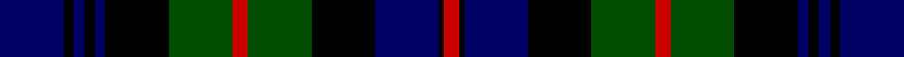

In pattern [BKBKBKGRGKBKR](/stripes/bkbkbkgrgkbkr/).

This was sourced from weddslist.  It is a [13 stripe tartan](/stripes/stripes13/).

Original link http://www.weddslist.com/cgi-bin/tartans/pg.pl?source=rb

## Also known as

This cloth is also recorded under:

- Atholl
- Murray of Atholl #3
- Transvaal Scottish Regiment (Militar

## Attestations

This cloth appears in 2 source records; the oldest owns this page.

- undated — Murray of Atholl (weddslist, [record](http://www.weddslist.com/cgi-bin/tartans/pg.pl?source=rb))
- undated — Murray of Atholl (weddslist, [record](http://www.weddslist.com/cgi-bin/tartans/pg.pl?source=x))

## Thread count
DB/12 K2 DB2 K2 DB2 K12 G12 R3 G12 K12 DB12 K1 R/3

## Palette
Each colour and the base-6 reference it is a variant of.

| Colour | Shade | Base |
|---|---|---|
| DB | <code style="background-color:#000064;">#000064</code> `oklch(22.7% 0.158 264.1)` <small>#000064</small> | B <code style="background-color:#2A418A;">#2A418A</code> |
| G | <code style="background-color:#004C00;">#004C00</code> `oklch(36.1% 0.123 142.5)` <small>#004C00</small> | G <code style="background-color:#006100;">#006100</code> |
| K | <code style="background-color:#000000;">#000000</code> `oklch(0.0% 0.000 0.0)` <small>#000000</small> | K <code style="background-color:#000000;">#000000</code> |
| R | <code style="background-color:#C80000;">#C80000</code> `oklch(52.3% 0.215 29.2)` <small>#C80000</small> | R <code style="background-color:#CC0000;">#CC0000</code> |

## Nearest tartans

The nearest existing variants by ΔTartan distance.

1. [Murray of Atholl](/setts/s13/db12k2db2k2db2k12dg12r3dg12k12db12k1r3~x2/) — ΔT 0.50
1. [MacDonald](/setts/s12/dg8r1dg2r3dg12k12r1db12r3db2r1db8/) — ΔT 0.68
1. [MacDonald](/setts/s12/dg8r1dg2r3dg12k12r1db12r3db2r1db8~x2/) — ΔT 0.70
1. [Urquhart L](/setts/s13/dg8k1dg1k1dg1k8db8r1db8k8dg8k1dg1~x2/) — ΔT 0.87
1. [MacEwan](/setts/s13/r4k1dg12k12db12k1db4k1db12k12dg12k1ly4~x2/) — ΔT 0.88
1. [Forbes](/setts/s15/db8k1db2k1db2k6dg8k1lb2k1dg8k6db8k1db2/) — ΔT 0.90
1. [Dewar, Highlander](/setts/s13/dg46k5dg6k5dg6k30db38ly6db38k30dg36k6dg6/) — ΔT 0.91
1. [Campbell of Loudon](/setts/s13/lr4k1dg12k12db12k1db4k1db12k12dg12k1ly4~x2/) — ΔT 0.95
1. [Campbell of Loudon](/setts/s13/lr2k1dg12k12db12k1db2k1db12k12dg12k1ly2~x2/) — ΔT 0.96
1. [MacEwan](/setts/s13/r2k1dg12k12db12k1db2k1db12k12dg12k1ly2~x2/) — ΔT 0.97

## Neighbour map

Every grey dot is one of 14299 variants placed by the first two principal components of the ΔTartan feature space (44% of its variance). Red is this tartan; blue dots are its nearest — click one to open its page.

<svg viewBox="0 0 640 380" role="img" style="max-width:100%;height:auto;border:1px solid #e0e0e0;border-radius:4px;display:block" xmlns="http://www.w3.org/2000/svg"><image href="/nn/cloud.v1.png" width="640" height="380"/><a href="/setts/s13/db12k2db2k2db2k12dg12r3dg12k12db12k1r3~x2/"><circle cx="184.8" cy="203.5" r="4" fill="#3465a4"><title>Murray of Atholl</title></circle></a><a href="/setts/s12/dg8r1dg2r3dg12k12r1db12r3db2r1db8/"><circle cx="185.6" cy="192.6" r="4" fill="#3465a4"><title>MacDonald</title></circle></a><a href="/setts/s12/dg8r1dg2r3dg12k12r1db12r3db2r1db8~x2/"><circle cx="170.4" cy="184.3" r="4" fill="#3465a4"><title>MacDonald</title></circle></a><a href="/setts/s13/dg8k1dg1k1dg1k8db8r1db8k8dg8k1dg1~x2/"><circle cx="183.7" cy="209.6" r="4" fill="#3465a4"><title>Urquhart L</title></circle></a><a href="/setts/s13/r4k1dg12k12db12k1db4k1db12k12dg12k1ly4~x2/"><circle cx="141.4" cy="180.3" r="4" fill="#3465a4"><title>MacEwan</title></circle></a><a href="/setts/s15/db8k1db2k1db2k6dg8k1lb2k1dg8k6db8k1db2/"><circle cx="179.8" cy="203.4" r="4" fill="#3465a4"><title>Forbes</title></circle></a><a href="/setts/s13/dg46k5dg6k5dg6k30db38ly6db38k30dg36k6dg6/"><circle cx="192.3" cy="200.4" r="4" fill="#3465a4"><title>Dewar, Highlander</title></circle></a><a href="/setts/s13/lr4k1dg12k12db12k1db4k1db12k12dg12k1ly4~x2/"><circle cx="131.6" cy="176.5" r="4" fill="#3465a4"><title>Campbell of Loudon</title></circle></a><a href="/setts/s13/lr2k1dg12k12db12k1db2k1db12k12dg12k1ly2~x2/"><circle cx="169.4" cy="175.7" r="4" fill="#3465a4"><title>Campbell of Loudon</title></circle></a><a href="/setts/s13/r2k1dg12k12db12k1db2k1db12k12dg12k1ly2~x2/"><circle cx="164.9" cy="172.8" r="4" fill="#3465a4"><title>MacEwan</title></circle></a><circle cx="170.3" cy="196.0" r="5" fill="#c00000"/></svg>

ID: /setts/s13/db12k2db2k2db2k12dg12r3dg12k12db12k1r3/
