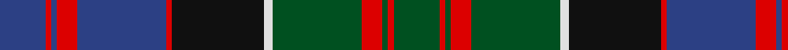

**Bands:** [BRBRBRKWGRGRG](/stripes/brbrbrkwgrgrg/) · **Stripes:** [DB R DB R DB R K W DG R DG R DG](/stripes/stripes13/) DB R DB R DB R K W DG R DG R DG

This was sourced from register-of-tartans.  It is a [13 band tartan](/bands/bands13/).

Original link https://www.tartanregister.gov.uk/tartanDetails.aspx?ref=2353

## Register references

External register numbers recorded for this tartan.

- Scottish Register of Tartans: [2353](https://www.tartanregister.gov.uk/tartanDetails.aspx?ref=2353)
- Scottish Tartans World Register: 426

## Variants

Other setts woven to the same stripe pattern.

- [MacDonald of Clanranald](/setts/s13/db8r1db2r3db12r1k12w1dg12r3dg2r1dg8~x2/)

## Thread count
B/32 R4 B4 R14 B62 R4 K64 LN6 G62 R14 G4 R4 G/32

## Palette
Each colour and its ΔE from the base-6 reference it is a variant of.

| Colour | Shade | Base | ΔE (OKLab) |
|---|---|---|---|
| B | <code style="background-color:#2C4084;">#2C4084</code> `#2C4084` | B <code style="background-color:#2A418A;">#2A418A</code> | 0.01 |
| G | <code style="background-color:#005020;">#005020</code> `#005020` | G <code style="background-color:#006100;">#006100</code> | 0.07 |
| K | <code style="background-color:#101010;">#101010</code> `#101010` | K <code style="background-color:#000000;">#000000</code> | 0.17 |
| LN | <code style="background-color:#E0E0E0;">#E0E0E0</code> `#E0E0E0` | W <code style="background-color:#F7F7F7;">#F7F7F7</code> | 0.07 |
| R | <code style="background-color:#DC0000;">#DC0000</code> `#DC0000` | R <code style="background-color:#CC0000;">#CC0000</code> | 0.03 |

## Nearest tartans

The nearest existing variants by ΔTartan distance.

1. [MacNeil of Colonsay (Highland Society of London)](/setts/s13/dg16k5dg4k8dg44k40dg4db52r10db4r4db10w6/) — ΔT 0.46
1. [Unnamed C20th - Unregistered Error](/setts/s13/db13r2db2r6db25r2k27ly2dg25r6dg2r2dg13~x2/) — ΔT 0.51
1. [MacDonell of Glengarry #3](/setts/s11/db16r5db30r2k33g30r5g2r2g7w4/) — ΔT 0.56
1. [MacDonell of Glengarry](/setts/s13/db8r1db2r3db12r1k12dg12r3dg2r1dg4w1~x2/) — ΔT 0.59
1. [MacDonald of Clanranald](/setts/s13/db8r1db2r3db12r1k12w1dg12r3dg2r1dg8~x2/) — ΔT 0.60
1. [MacDonald of Clanranald #5](/setts/s14/db20r2db2r5db30r2k32w2dg30r5dg4r2dg4w2/) — ΔT 0.60
1. [Cameron of Erracht (Clan)](/setts/s11/g8r1g1r3g16k16r1db16r3db8ly2~x2/) — ΔT 0.61
1. [MacLennan](/setts/s11/r6db3r2db2r2db16k12dg16r1k1ly2~x2/) — ΔT 0.66
1. [Logan #7](/setts/s11/r6db3r2db2r2db16k12g16r1k1ly2~x2/) — ΔT 0.69
1. [MacDonell of Glengarry - 1914 (Clan)](/setts/s13/db8r1db2r3db12r1k12g12r3g2r1g4lb1~x2/) — ΔT 0.78

## Neighbour map

Every grey dot is one of 14313 variants placed by the first two principal components of the ΔTartan feature space (44% of its variance). Red is this tartan; blue dots are its nearest — click one to open its page.

<svg viewBox="0 0 640 380" role="img" style="max-width:100%;height:auto;border:1px solid #e0e0e0;border-radius:4px;display:block" xmlns="http://www.w3.org/2000/svg"><image href="/nn/cloud.v1.png" width="640" height="380"/><a href="/setts/s13/dg16k5dg4k8dg44k40dg4db52r10db4r4db10w6/"><circle cx="183.6" cy="150.8" r="4" fill="#3465a4"><title>MacNeil of Colonsay (Highland Society of London)</title></circle></a><a href="/setts/s13/db13r2db2r6db25r2k27ly2dg25r6dg2r2dg13~x2/"><circle cx="175.5" cy="153.8" r="4" fill="#3465a4"><title>Unnamed C20th - Unregistered Error</title></circle></a><a href="/setts/s11/db16r5db30r2k33g30r5g2r2g7w4/"><circle cx="182.0" cy="150.0" r="4" fill="#3465a4"><title>MacDonell of Glengarry #3</title></circle></a><a href="/setts/s13/db8r1db2r3db12r1k12dg12r3dg2r1dg4w1~x2/"><circle cx="178.1" cy="160.6" r="4" fill="#3465a4"><title>MacDonell of Glengarry</title></circle></a><a href="/setts/s13/db8r1db2r3db12r1k12w1dg12r3dg2r1dg8~x2/"><circle cx="172.2" cy="166.0" r="4" fill="#3465a4"><title>MacDonald of Clanranald</title></circle></a><a href="/setts/s14/db20r2db2r5db30r2k32w2dg30r5dg4r2dg4w2/"><circle cx="203.5" cy="131.3" r="4" fill="#3465a4"><title>MacDonald of Clanranald #5</title></circle></a><a href="/setts/s11/g8r1g1r3g16k16r1db16r3db8ly2~x2/"><circle cx="175.1" cy="156.3" r="4" fill="#3465a4"><title>Cameron of Erracht (Clan)</title></circle></a><a href="/setts/s11/r6db3r2db2r2db16k12dg16r1k1ly2~x2/"><circle cx="177.2" cy="143.9" r="4" fill="#3465a4"><title>MacLennan</title></circle></a><a href="/setts/s11/r6db3r2db2r2db16k12g16r1k1ly2~x2/"><circle cx="171.3" cy="141.8" r="4" fill="#3465a4"><title>Logan #7</title></circle></a><a href="/setts/s13/db8r1db2r3db12r1k12g12r3g2r1g4lb1~x2/"><circle cx="177.5" cy="164.3" r="4" fill="#3465a4"><title>MacDonell of Glengarry - 1914 (Clan)</title></circle></a><circle cx="182.0" cy="145.2" r="5" fill="#c00000"/></svg>

ID: /setts/s13/db16r2db2r7db31r2k32w3dg31r7dg2r2dg16~x2/
