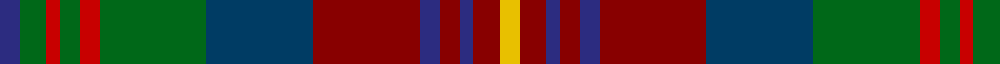

**Bands:** [YRBRBRBGRGRGB](/stripes/yrbrbrbgrgrgb/) · **Stripes:** [LY R DB R DB R DT G R G R G DB](/stripes/stripes13/) LY R DB R DB R DT G R G R G DB

This was sourced from register-of-tartans.  It is a [13 band tartan](/bands/bands13/).

Original link https://www.tartanregister.gov.uk/tartanDetails.aspx?ref=859

## Attestations

This cloth appears in 2 source records; the oldest owns this page.

- 01/07/2006 — Cuthill (Personal) (register-of-tartans, [record](https://www.tartanregister.gov.uk/tartanDetails.aspx?ref=859))
- 2006 July — Cuthill (Personal) (tartans-authority, [record](http://www.tartansauthority.com/tartan-ferret/display/6954/))

## Register references

External register numbers recorded for this tartan.

- Scottish Register of Tartans: [859](https://www.tartanregister.gov.uk/tartanDetails.aspx?ref=859)
- Scottish Tartans Authority (ITI): 6954

## Thread count
DB/6 G8 R4 G6 R6 G32 DBa32 DR32 DB6 DR6 DB4 DR8 Y/6

## Palette
Each colour and its ΔE from the base-6 reference it is a variant of.

| Colour | Shade | Base | ΔE (OKLab) |
|---|---|---|---|
| DB | <code style="background-color:#2C2C80;">#2C2C80</code> `#2C2C80` | B <code style="background-color:#2A418A;">#2A418A</code> | 0.06 |
| DBa | <code style="background-color:#003C64;">#003C64</code> `#003C64` | B <code style="background-color:#2A418A;">#2A418A</code> | 0.08 |
| DR | <code style="background-color:#880000;">#880000</code> `#880000` | R <code style="background-color:#CC0000;">#CC0000</code> | 0.15 |
| G | <code style="background-color:#006818;">#006818</code> `#006818` | G <code style="background-color:#006100;">#006100</code> | 0.02 |
| R | <code style="background-color:#C80000;">#C80000</code> `#C80000` | R <code style="background-color:#CC0000;">#CC0000</code> | 0.01 |
| Y | <code style="background-color:#E8C000;">#E8C000</code> `#E8C000` | Y <code style="background-color:#F2BF00;">#F2BF00</code> | 0.02 |

## Nearest tartans

The nearest existing variants by ΔTartan distance.

1. [Meath, County](/setts/s12/lo5db2r14do9dg8db3r3db3r3db3dg18ly3~x2/) — ΔT 0.77
1. [Bonnie Brae](/setts/s11/r6db3y3r26db20dg26o3dg4o3dg4o6/) — ΔT 0.94
1. [Blaylock Hunting (Name)](/setts/s12/dg4o2dg8do8y2o8y16k2do5o2y5lo2~x2/) — ΔT 1.00
1. [Wcwm 9275-1258](/setts/s12/y8g2k4lo1k1lb1k1do8y3k1y1lb1~x4/) — ΔT 1.02
1. [State Seal of Illinois (Fashion)](/setts/s13/g4db34g4dy4db4dy4g3dy13g21dy4lb3r11lo3~x2/) — ΔT 1.06
1. [Allen Northumbrian Family Tartan Tartan Number: 3208. Earliest known date: 2001 Designed by Jerry M P Allen of Hermitage, Berkshire, for use by his family and relations and others by permission of the designer See products available Copyright © Blair Urquhart, Comrie, 2015](/setts/s14/db11r1db2r3db1do8g11w1g11do8db8ly1r1ly1~x2/) — ΔT 1.07
1. [Allen - 2001 (Personal)](/setts/s14/dt16r2dt3r4dt2dy12g18w2g18dy12dt12ly2r2ly2~x2/) — ΔT 1.09
1. [Kinloch Anderson Granite (Corporate)](/setts/s12/o8dt8o4dt28dt12n6dt12r4n8r4n29lb6/) — ΔT 1.11
1. [Minster](/setts/s14/db6r2db2r3db3r18db16r2g18r2db3t3db2r6~x2/) — ΔT 1.11
1. [Leitrim, County](/setts/s10/lo3do2n18lb3o13lb4k3lb4do18lb3~x2/) — ΔT 1.12

## Neighbour map

Every grey dot is one of 14299 variants placed by the first two principal components of the ΔTartan feature space (44% of its variance). Red is this tartan; blue dots are its nearest — click one to open its page.

<svg viewBox="0 0 640 380" role="img" style="max-width:100%;height:auto;border:1px solid #e0e0e0;border-radius:4px;display:block" xmlns="http://www.w3.org/2000/svg"><image href="/nn/cloud.v1.png" width="640" height="380"/><a href="/setts/s12/lo5db2r14do9dg8db3r3db3r3db3dg18ly3~x2/"><circle cx="150.7" cy="170.6" r="4" fill="#3465a4"><title>Meath, County</title></circle></a><a href="/setts/s11/r6db3y3r26db20dg26o3dg4o3dg4o6/"><circle cx="154.3" cy="166.5" r="4" fill="#3465a4"><title>Bonnie Brae</title></circle></a><a href="/setts/s12/dg4o2dg8do8y2o8y16k2do5o2y5lo2~x2/"><circle cx="141.9" cy="178.3" r="4" fill="#3465a4"><title>Blaylock Hunting (Name)</title></circle></a><a href="/setts/s12/y8g2k4lo1k1lb1k1do8y3k1y1lb1~x4/"><circle cx="148.6" cy="150.5" r="4" fill="#3465a4"><title>Wcwm 9275-1258</title></circle></a><a href="/setts/s13/g4db34g4dy4db4dy4g3dy13g21dy4lb3r11lo3~x2/"><circle cx="176.9" cy="147.5" r="4" fill="#3465a4"><title>State Seal of Illinois (Fashion)</title></circle></a><a href="/setts/s14/db11r1db2r3db1do8g11w1g11do8db8ly1r1ly1~x2/"><circle cx="140.7" cy="148.2" r="4" fill="#3465a4"><title>Allen Northumbrian Family Tartan Tartan Number: 3208. Earliest known date: 2001 Designed by Jerry M P Allen of Hermitage, Berkshire, for use by his family and relations and others by permission of the designer See products available Copyright © Blair Urquhart, Comrie, 2015</title></circle></a><a href="/setts/s14/dt16r2dt3r4dt2dy12g18w2g18dy12dt12ly2r2ly2~x2/"><circle cx="141.0" cy="163.4" r="4" fill="#3465a4"><title>Allen - 2001 (Personal)</title></circle></a><a href="/setts/s12/o8dt8o4dt28dt12n6dt12r4n8r4n29lb6/"><circle cx="135.5" cy="187.4" r="4" fill="#3465a4"><title>Kinloch Anderson Granite (Corporate)</title></circle></a><a href="/setts/s14/db6r2db2r3db3r18db16r2g18r2db3t3db2r6~x2/"><circle cx="186.2" cy="155.4" r="4" fill="#3465a4"><title>Minster</title></circle></a><a href="/setts/s10/lo3do2n18lb3o13lb4k3lb4do18lb3~x2/"><circle cx="114.6" cy="157.0" r="4" fill="#3465a4"><title>Leitrim, County</title></circle></a><circle cx="125.6" cy="158.7" r="5" fill="#c00000"/></svg>

ID: /setts/s13/db3g4r2g3r3g16dt16r16db3r3db2r4ly3~x2/
