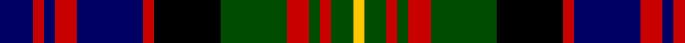

**Bands:** [YGRGRGKRBRBRB](/stripes/ygrgrgkrbrbrb/) · **Stripes:** [LY DG R DG R DG K R DB R DB R DB](/stripes/stripes13/) LY DG R DG R DG K R DB R DB R DB

This was sourced from weddslist.  It is a [13 band tartan](/bands/bands13/).

Original link http://www.weddslist.com/cgi-bin/tartans/pg.pl?source=rb

## Attestations

This cloth appears in 3 source records; the oldest owns this page.

- undated — Carnegie (weddslist, [record](http://www.weddslist.com/cgi-bin/tartans/pg.pl?source=rb))
- undated — Carnegie (weddslist, [record](http://www.weddslist.com/cgi-bin/tartans/pg.pl?source=tinsel))
- undated — Carnegie (weddslist, [record](http://www.weddslist.com/cgi-bin/tartans/pg.pl?source=x))

## Register references

External register numbers recorded for this tartan.

- Scottish Register of Tartans: [1166](https://www.tartanregister.gov.uk/tartanDetails.aspx?ref=1166)
- Scottish Register of Tartans: [1510](https://www.tartanregister.gov.uk/tartanDetails.aspx?ref=1510)
- Scottish Register of Tartans: [1758](https://www.tartanregister.gov.uk/tartanDetails.aspx?ref=1758)
- Scottish Register of Tartans: [2307](https://www.tartanregister.gov.uk/tartanDetails.aspx?ref=2307)
- Scottish Register of Tartans: [2349](https://www.tartanregister.gov.uk/tartanDetails.aspx?ref=2349)
- Scottish Register of Tartans: [2540](https://www.tartanregister.gov.uk/tartanDetails.aspx?ref=2540)
- Scottish Register of Tartans: [2582](https://www.tartanregister.gov.uk/tartanDetails.aspx?ref=2582)
- Scottish Register of Tartans: [2585](https://www.tartanregister.gov.uk/tartanDetails.aspx?ref=2585)
- Scottish Register of Tartans: [2625](https://www.tartanregister.gov.uk/tartanDetails.aspx?ref=2625)
- Scottish Register of Tartans: [2666](https://www.tartanregister.gov.uk/tartanDetails.aspx?ref=2666)
- Scottish Register of Tartans: [2730](https://www.tartanregister.gov.uk/tartanDetails.aspx?ref=2730)
- Scottish Register of Tartans: [2862](https://www.tartanregister.gov.uk/tartanDetails.aspx?ref=2862)
- Scottish Register of Tartans: [3072](https://www.tartanregister.gov.uk/tartanDetails.aspx?ref=3072)
- Scottish Register of Tartans: [3555](https://www.tartanregister.gov.uk/tartanDetails.aspx?ref=3555)
- Scottish Register of Tartans: [3808](https://www.tartanregister.gov.uk/tartanDetails.aspx?ref=3808)
- Scottish Register of Tartans: [4925](https://www.tartanregister.gov.uk/tartanDetails.aspx?ref=4925)
- Scottish Register of Tartans: [696](https://www.tartanregister.gov.uk/tartanDetails.aspx?ref=696)
- Scottish Register of Tartans: [697](https://www.tartanregister.gov.uk/tartanDetails.aspx?ref=697)
- Scottish Register of Tartans: [982](https://www.tartanregister.gov.uk/tartanDetails.aspx?ref=982)
- Scottish Tartans Authority (ITI): 1277
- Scottish Tartans Authority (ITI): 1429
- Scottish Tartans Authority (ITI): 218
- Scottish Tartans Authority (ITI): 977
- Scottish Tartans World Register: 1010
- Scottish Tartans World Register: 1042
- Scottish Tartans World Register: 127
- Scottish Tartans World Register: 1277
- Scottish Tartans World Register: 1399
- Scottish Tartans World Register: 1429
- Scottish Tartans World Register: 1585
- Scottish Tartans World Register: 1593
- Scottish Tartans World Register: 218
- Scottish Tartans World Register: 2218
- Scottish Tartans World Register: 3061
- Scottish Tartans World Register: 441
- Scottish Tartans World Register: 737
- Scottish Tartans World Register: 858
- Scottish Tartans World Register: 864
- Scottish Tartans World Register: 873
- Scottish Tartans World Register: 897
- Scottish Tartans World Register: 977
- Scottish Tartans World Register: 978

## Thread count
DB/6 R2 DB2 R4 DB12 R2 K12 G12 R4 G2 R2 G4 Y/2

## Palette
Each colour and its ΔE from the base-6 reference it is a variant of.

| Colour | Shade | Base | ΔE (OKLab) |
|---|---|---|---|
| DB | <code style="background-color:#000064;">#000064</code> `#000064` | B <code style="background-color:#2A418A;">#2A418A</code> | 0.18 |
| G | <code style="background-color:#004C00;">#004C00</code> `#004C00` | G <code style="background-color:#006100;">#006100</code> | 0.07 |
| K | <code style="background-color:#000000;">#000000</code> `#000000` | K <code style="background-color:#000000;">#000000</code> | 0.00 |
| R | <code style="background-color:#C80000;">#C80000</code> `#C80000` | R <code style="background-color:#CC0000;">#CC0000</code> | 0.01 |
| Y | <code style="background-color:#FFC800;">#FFC800</code> `#FFC800` | Y <code style="background-color:#F2BF00;">#F2BF00</code> | 0.03 |

## Nearest tartans

The nearest existing variants by ΔTartan distance.

1. [MacDonald of Clanranald D](/setts/s13/dg6r2dg2r3dg12lb2k10r2db12r3db2r2db6/) — ΔT 0.29
1. [MacDonald of Clanranald D](/setts/s13/dg6r2dg2r3dg11lr2k11r2db12r3db2r2db6~x2/) — ΔT 0.64
1. [MacDonald of Clanranald D](/setts/s13/dg6r2dg2r3dg11lr2k11r2db12r3db2r2db6/) — ΔT 0.64
1. [Kinloch Anderson Limited](/setts/s12/r4o14o2o4o2k6o3k6k14r2k4r4~x2/) — ΔT 0.88
1. [Carnegie](/setts/s13/db3r1db1r2db6r1k6g6r2g1r1g2ly1~x2/) — ΔT 0.90
1. [MacLeods Highlanders](/setts/s15/db12r2w2r2w2k12g11k2w2k2g11k12db11k2r2~x2/) — ΔT 0.93
1. [Unidentified, pattern](/setts/s12/db2r4k7r8g10k4ly2k8db4r4db14r2~x2/) — ΔT 0.97
1. [Kinloch Anderson, hunting](/setts/s12/m4g14o2g4o2k6g3k6db14m2db4m4~x2/) — ΔT 0.97
1. [Denovan, The Lairdship of..](/setts/s12/db10p2db3r4db14r2k14g14r4g3p2g10~x2/) — ΔT 0.99
1. [MacSporran](/setts/s13/db17r3db4r5db20r3k20g20r5g4r3k3ly11~x2/) — ΔT 1.01

## Neighbour map

Every grey dot is one of 14299 variants placed by the first two principal components of the ΔTartan feature space (44% of its variance). Red is this tartan; blue dots are its nearest — click one to open its page.

<svg viewBox="0 0 640 380" role="img" style="max-width:100%;height:auto;border:1px solid #e0e0e0;border-radius:4px;display:block" xmlns="http://www.w3.org/2000/svg"><image href="/nn/cloud.v1.png" width="640" height="380"/><a href="/setts/s13/dg6r2dg2r3dg12lb2k10r2db12r3db2r2db6/"><circle cx="92.9" cy="183.6" r="4" fill="#3465a4"><title>MacDonald of Clanranald D</title></circle></a><a href="/setts/s13/dg6r2dg2r3dg11lr2k11r2db12r3db2r2db6~x2/"><circle cx="105.1" cy="192.1" r="4" fill="#3465a4"><title>MacDonald of Clanranald D</title></circle></a><a href="/setts/s13/dg6r2dg2r3dg11lr2k11r2db12r3db2r2db6/"><circle cx="105.1" cy="192.1" r="4" fill="#3465a4"><title>MacDonald of Clanranald D</title></circle></a><a href="/setts/s12/r4o14o2o4o2k6o3k6k14r2k4r4~x2/"><circle cx="97.7" cy="174.0" r="4" fill="#3465a4"><title>Kinloch Anderson Limited</title></circle></a><a href="/setts/s13/db3r1db1r2db6r1k6g6r2g1r1g2ly1~x2/"><circle cx="79.8" cy="173.3" r="4" fill="#3465a4"><title>Carnegie</title></circle></a><a href="/setts/s15/db12r2w2r2w2k12g11k2w2k2g11k12db11k2r2~x2/"><circle cx="109.5" cy="177.1" r="4" fill="#3465a4"><title>MacLeods Highlanders</title></circle></a><a href="/setts/s12/db2r4k7r8g10k4ly2k8db4r4db14r2~x2/"><circle cx="69.5" cy="184.8" r="4" fill="#3465a4"><title>Unidentified, pattern</title></circle></a><a href="/setts/s12/m4g14o2g4o2k6g3k6db14m2db4m4~x2/"><circle cx="92.4" cy="180.2" r="4" fill="#3465a4"><title>Kinloch Anderson, hunting</title></circle></a><a href="/setts/s12/db10p2db3r4db14r2k14g14r4g3p2g10~x2/"><circle cx="100.9" cy="184.3" r="4" fill="#3465a4"><title>Denovan, The Lairdship of..</title></circle></a><a href="/setts/s13/db17r3db4r5db20r3k20g20r5g4r3k3ly11~x2/"><circle cx="87.3" cy="165.7" r="4" fill="#3465a4"><title>MacSporran</title></circle></a><circle cx="85.3" cy="179.6" r="5" fill="#c00000"/></svg>

ID: /setts/s13/db3r1db1r2db6r1k6dg6r2dg1r1dg2ly1~x2/
