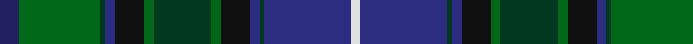

**Bands:** [BGGBKGGGKBGBW](/stripes/bggbkgggkbgbw/) · **Stripes:** [DB G DG DB K G DG G K DB DG DB W](/stripes/stripes13/) DB G DG DB K G DG G K DB DG DB W

This was sourced from register-of-tartans.  It is a [13 band tartan](/bands/bands13/).

Original link https://www.tartanregister.gov.uk/tartanDetails.aspx?ref=5402

## Attestations

This cloth appears in 2 source records; the oldest owns this page.

- undated — Clack (Personal) (register-of-tartans, [record](https://www.tartanregister.gov.uk/tartanDetails.aspx?ref=5402))
- Unknown — Clack (Personal) (tartans-authority, [record](http://www.tartansauthority.com/tartan-ferret/display/3928/))

## Register references

External register numbers recorded for this tartan.

- Scottish Register of Tartans: [5402](https://www.tartanregister.gov.uk/tartanDetails.aspx?ref=5402)
- Scottish Tartans Authority (ITI): 3928

## Thread count
DBa/8 G34 DG2 DB4 K12 G4 DG24 G4 K12 DB4 DG2 DB36 LN/4

## Palette
Each colour and its ΔE from the base-6 reference it is a variant of.

| Colour | Shade | Base | ΔE (OKLab) |
|---|---|---|---|
| DB | <code style="background-color:#2C2C80;">#2C2C80</code> `#2C2C80` | B <code style="background-color:#2A418A;">#2A418A</code> | 0.06 |
| DBa | <code style="background-color:#202060;">#202060</code> `#202060` | B <code style="background-color:#2A418A;">#2A418A</code> | 0.11 |
| DG | <code style="background-color:#003820;">#003820</code> `#003820` | G <code style="background-color:#006100;">#006100</code> | 0.15 |
| G | <code style="background-color:#006818;">#006818</code> `#006818` | G <code style="background-color:#006100;">#006100</code> | 0.02 |
| K | <code style="background-color:#101010;">#101010</code> `#101010` | K <code style="background-color:#000000;">#000000</code> | 0.17 |
| LN | <code style="background-color:#E0E0E0;">#E0E0E0</code> `#E0E0E0` | W <code style="background-color:#F7F7F7;">#F7F7F7</code> | 0.07 |

## Nearest tartans

The nearest existing variants by ΔTartan distance.

1. [Whitson](/setts/s16/lb4k1y19lo1k19n13r2n4r2n4r2n13k19lo1y19k1~x4/) — ΔT 0.95
1. [ENABLE Scotland](/setts/s13/g3dp3dt2dt14g16dp18dt2dp3dt14dt4ly3o1dt2~x2/) — ΔT 0.98
1. [Leinster](/setts/s14/g3g15g2g2k10ly2db12k1g2k1db12k10g18r3~x2/) — ΔT 1.04
1. [Paget Family Tartan Tartan Number: 2072. Earliest known date: 1992 Designed as a 'Family' tartan and woven by Peter MacDonald in Crieff. See products available Copyright © Blair Urquhart, Comrie, 2015](/setts/s14/r3g4g2g10k18g2db18g3db18g2k18g16w1r3~x2/) — ΔT 1.13
1. [Whitson (Name)](/setts/s9/lb4k1y19lo1k19n13r2n4r2~x4/) — ΔT 1.17
1. [Gow Hunting #2](/setts/s14/k24dg12k1ly3k1dg12k1r3k1dg12k12db12db3db12~x4/) — ΔT 1.22
1. [Ayrton (amended)](/setts/s11/ly4k2db25k2dg4k2t10k2dg25k2r4~x2/) — ΔT 1.24
1. [Loch Freuchie District Tartan Tartan Number: 10725. Earliest known date: 25 October 2012 A tartan for the area around Loch Freuchie near Crieff. The tartan is based on the Murray of Atholl and Breadalbane setts, with differences, to relate the tartan to the particular Loch Freuchie area. Mr MacArthur-Fox has created a tartan for anyone to wear without fear of offending another person or group. See products available Copyright © Blair Urquhart, Comrie, 2015](/setts/s10/n3dg3r2dg20k25k2n13k2n3r3~x2/) — ΔT 1.24
1. [Empire Golf Check](/setts/s18/r2dp4dt2dg25dt4dg2dt4k11dp4w2dp4dg11dt2k2dt24dp4dt2r2~x2/) — ΔT 1.26
1. [Les Cercles de Fermieres du Quebec](/setts/s17/db16dg40w5db25g30ly4dg3w3k4db15g22w2dg19g2dy8k4dy16~x2/) — ΔT 1.29

## Neighbour map

Every grey dot is one of 14313 variants placed by the first two principal components of the ΔTartan feature space (44% of its variance). Red is this tartan; blue dots are its nearest — click one to open its page.

<svg viewBox="0 0 640 380" role="img" style="max-width:100%;height:auto;border:1px solid #e0e0e0;border-radius:4px;display:block" xmlns="http://www.w3.org/2000/svg"><image href="/nn/cloud.v1.png" width="640" height="380"/><a href="/setts/s16/lb4k1y19lo1k19n13r2n4r2n4r2n13k19lo1y19k1~x4/"><circle cx="187.1" cy="132.6" r="4" fill="#3465a4"><title>Whitson</title></circle></a><a href="/setts/s13/g3dp3dt2dt14g16dp18dt2dp3dt14dt4ly3o1dt2~x2/"><circle cx="160.1" cy="141.1" r="4" fill="#3465a4"><title>ENABLE Scotland</title></circle></a><a href="/setts/s14/g3g15g2g2k10ly2db12k1g2k1db12k10g18r3~x2/"><circle cx="118.9" cy="135.5" r="4" fill="#3465a4"><title>Leinster</title></circle></a><a href="/setts/s14/r3g4g2g10k18g2db18g3db18g2k18g16w1r3~x2/"><circle cx="167.0" cy="143.0" r="4" fill="#3465a4"><title>Paget Family Tartan Tartan Number: 2072. Earliest known date: 1992 Designed as a 'Family' tartan and woven by Peter MacDonald in Crieff. See products available Copyright © Blair Urquhart, Comrie, 2015</title></circle></a><a href="/setts/s9/lb4k1y19lo1k19n13r2n4r2~x4/"><circle cx="175.6" cy="145.1" r="4" fill="#3465a4"><title>Whitson (Name)</title></circle></a><a href="/setts/s14/k24dg12k1ly3k1dg12k1r3k1dg12k12db12db3db12~x4/"><circle cx="207.6" cy="138.3" r="4" fill="#3465a4"><title>Gow Hunting #2</title></circle></a><a href="/setts/s11/ly4k2db25k2dg4k2t10k2dg25k2r4~x2/"><circle cx="172.8" cy="137.9" r="4" fill="#3465a4"><title>Ayrton (amended)</title></circle></a><a href="/setts/s10/n3dg3r2dg20k25k2n13k2n3r3~x2/"><circle cx="193.8" cy="156.5" r="4" fill="#3465a4"><title>Loch Freuchie District Tartan Tartan Number: 10725. Earliest known date: 25 October 2012 A tartan for the area around Loch Freuchie near Crieff. The tartan is based on the Murray of Atholl and Breadalbane setts, with differences, to relate the tartan to the particular Loch Freuchie area. Mr MacArthur-Fox has created a tartan for anyone to wear without fear of offending another person or group. See products available Copyright © Blair Urquhart, Comrie, 2015</title></circle></a><a href="/setts/s18/r2dp4dt2dg25dt4dg2dt4k11dp4w2dp4dg11dt2k2dt24dp4dt2r2~x2/"><circle cx="186.7" cy="128.3" r="4" fill="#3465a4"><title>Empire Golf Check</title></circle></a><a href="/setts/s17/db16dg40w5db25g30ly4dg3w3k4db15g22w2dg19g2dy8k4dy16~x2/"><circle cx="117.1" cy="113.4" r="4" fill="#3465a4"><title>Les Cercles de Fermieres du Quebec</title></circle></a><circle cx="161.1" cy="141.0" r="5" fill="#c00000"/></svg>

ID: /setts/s13/db4g17dg1db2k6g2dg12g2k6db2dg1db18w2~x2/
