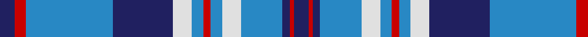

**Bands:** [BRBBWBRBWBBRB](/stripes/brbbwbrbwbbrb/) · **Stripes:** [DB R DB T W T R T W DB T R DB](/stripes/stripes13/) DB R DB T W T R T W DB T R DB

This was sourced from house-of-tartan.  It is a [13 band tartan](/bands/bands13/).

Original link http://www.house-of-tartan.scotland.net/house/TartanViewjs.asp?colr=Def&tnam=2051

## Thread count
DB/8 R6 B46 DB32 LN10 B6 R4 B6 LN10 B22 DB4 R2 DB/8

## Palette
Each colour and its ΔE from the base-6 reference it is a variant of.

| Colour | Shade | Base | ΔE (OKLab) |
|---|---|---|---|
| B | <code style="background-color:#2888C4;">#2888C4</code> `#2888C4` | B <code style="background-color:#2A418A;">#2A418A</code> | 0.21 |
| DB | <code style="background-color:#202060;">#202060</code> `#202060` | B <code style="background-color:#2A418A;">#2A418A</code> | 0.11 |
| LN | <code style="background-color:#E0E0E0;">#E0E0E0</code> `#E0E0E0` | W <code style="background-color:#F7F7F7;">#F7F7F7</code> | 0.07 |
| R | <code style="background-color:#C80000;">#C80000</code> `#C80000` | R <code style="background-color:#CC0000;">#CC0000</code> | 0.01 |

## Nearest tartans

The nearest existing variants by ΔTartan distance.

1. [Illinois, St Andrews Society](/setts/s13/db4r3b23db16w5b3r2b3w5b11db2r1db4~x2/) — ΔT 0.93
1. [Highlands Country Club](/setts/s12/db15lb11lb2lb1lb1g4lb1lb1lb2lb11db15g5~x4/) — ΔT 1.05
1. [Lesotho](/setts/s13/w4k1db24k1dg12k1w12k1db12w4k1w1k2~x2/) — ΔT 1.11
1. [Thorburn #1 (Name)](/setts/s9/db12lb2db2t6db4lb3db4lb18r1~x4/) — ΔT 1.11
1. [Commonwealth Games 1986 (Corp)](/setts/s11/db3w1db1w1db2w3db15t2db2t22r2~x2/) — ΔT 1.16
1. [Caleys Windsor (Corporate)](/setts/s11/dt10w3dt3w3dt5w8dt38t8dt8t61r6/) — ΔT 1.22
1. [Keela](/setts/s12/dt7w3dt2w6dt16t26r4t26dt16w6dt2w3~x2/) — ΔT 1.24
1. [Harmony Eildon](/setts/s14/db41t2w2t2db5t12w31db4w31t12db5t2w2t2~x2/) — ΔT 1.32
1. [Hannay Blue (Fashion?)](/setts/s10/k9t4k2t4k2t30k9t4db14ly2~x2/) — ΔT 1.33
1. [Harmony Eildon (Dance)](/setts/s8/db41t2w2t2db5t12w31db4~x2/) — ΔT 1.33

## Neighbour map

Every grey dot is one of 14313 variants placed by the first two principal components of the ΔTartan feature space (44% of its variance). Red is this tartan; blue dots are its nearest — click one to open its page.

<svg viewBox="0 0 640 380" role="img" style="max-width:100%;height:auto;border:1px solid #e0e0e0;border-radius:4px;display:block" xmlns="http://www.w3.org/2000/svg"><image href="/nn/cloud.v1.png" width="640" height="380"/><a href="/setts/s13/db4r3b23db16w5b3r2b3w5b11db2r1db4~x2/"><circle cx="255.5" cy="121.1" r="4" fill="#3465a4"><title>Illinois, St Andrews Society</title></circle></a><a href="/setts/s12/db15lb11lb2lb1lb1g4lb1lb1lb2lb11db15g5~x4/"><circle cx="209.0" cy="145.6" r="4" fill="#3465a4"><title>Highlands Country Club</title></circle></a><a href="/setts/s13/w4k1db24k1dg12k1w12k1db12w4k1w1k2~x2/"><circle cx="249.0" cy="109.7" r="4" fill="#3465a4"><title>Lesotho</title></circle></a><a href="/setts/s9/db12lb2db2t6db4lb3db4lb18r1~x4/"><circle cx="250.1" cy="157.2" r="4" fill="#3465a4"><title>Thorburn #1 (Name)</title></circle></a><a href="/setts/s11/db3w1db1w1db2w3db15t2db2t22r2~x2/"><circle cx="293.3" cy="124.8" r="4" fill="#3465a4"><title>Commonwealth Games 1986 (Corp)</title></circle></a><a href="/setts/s11/dt10w3dt3w3dt5w8dt38t8dt8t61r6/"><circle cx="297.9" cy="140.1" r="4" fill="#3465a4"><title>Caleys Windsor (Corporate)</title></circle></a><a href="/setts/s12/dt7w3dt2w6dt16t26r4t26dt16w6dt2w3~x2/"><circle cx="219.1" cy="160.1" r="4" fill="#3465a4"><title>Keela</title></circle></a><a href="/setts/s14/db41t2w2t2db5t12w31db4w31t12db5t2w2t2~x2/"><circle cx="229.4" cy="104.0" r="4" fill="#3465a4"><title>Harmony Eildon</title></circle></a><a href="/setts/s10/k9t4k2t4k2t30k9t4db14ly2~x2/"><circle cx="284.9" cy="161.3" r="4" fill="#3465a4"><title>Hannay Blue (Fashion?)</title></circle></a><a href="/setts/s8/db41t2w2t2db5t12w31db4~x2/"><circle cx="279.5" cy="134.0" r="4" fill="#3465a4"><title>Harmony Eildon (Dance)</title></circle></a><circle cx="266.5" cy="131.6" r="5" fill="#c00000"/></svg>

ID: /setts/s13/db4r3t23db16w5t3r2t3w5t11db2r1db4~x2/
