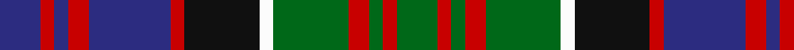

This page is one **sett** — a single exact thread-count. It belongs to the [tartan](/tartans/db6r2db2r3db12r2k11w2g11r3g2r2g6/)
(the same proportion at any scale), whose colour order is pattern [BRBRBRKWGRGRG](/stripes/brbrbrkwgrgrg/).

Sourced from register-of-tartans.  It is a [13 stripe tartan](/stripes/stripes13/).

Original link https://www.tartanregister.gov.uk/tartanDetails.aspx?ref=2354

## Also known as

This cloth is also recorded under:

- MacDonald of Clanranald #3
- MacDonald of Clanranald 4

4 attestations — the source records this cloth was collapsed from (oldest owns this page)

<ul>
<li>01/01/1819 — MacDonald of Clanranald #3 (register-of-tartans, <a href="https://www.tartanregister.gov.uk/tartanDetails.aspx?ref=2354">record</a>)</li>
<li>1819 — MacDonald of Clanranald - 1819 (Clan (tartans-authority, <a href="http://www.tartansauthority.com/tartan-ferret/display/427/">record</a>)</li>
<li>undated — MacDonald of Clanranald 4 (weddslist, <a href="http://www.weddslist.com/cgi-bin/tartans/pg.pl?source=sts">record</a>)</li>
<li>undated — MacDonald of Clanranald Clan Tartan Tartan Number: 427. Earliest known date: 1850 This is the count from the Lord Lyons records multiplied by four. It corresponds to the sett given by A. and W. Smith in 'The Authenticated Tartans of the Clans and Families of Scotland' (1850) and in the work of J.Grant (1886). The tartan is distinguished by the two white lines. There is a certified example in the Highland Society of London collection. See products available Copyright © Blair Urquhart, Comrie, 2015 (house-of-tartan, <a href="http://www.house-of-tartan.scotland.net/house/TartanViewjs.asp?colr=Def&tnam=427">record</a>)</li>
</ul>

## Register references

External register numbers recorded for this tartan.

- Scottish Register of Tartans: [2354](https://www.tartanregister.gov.uk/tartanDetails.aspx?ref=2354)
- Scottish Tartans Authority (ITI): 427
- Scottish Tartans World Register: 427

## Thread count
DB/12 R4 DB4 R6 DB24 R4 K22 W4 G22 R6 G4 R4 G/12

## Palette
Each colour and the base-6 reference it is a variant of.

| Colour | Shade | Base |
|---|---|---|
| DB | <code style="background-color:#2C2C80;">#2C2C80</code> `oklch(35.0% 0.138 276.6)` <small>#2C2C80</small> | B <code style="background-color:#2A418A;">#2A418A</code> |
| G | <code style="background-color:#006818;">#006818</code> `oklch(45.0% 0.142 145.0)` <small>#006818</small> | G <code style="background-color:#006100;">#006100</code> |
| K | <code style="background-color:#101010;">#101010</code> `oklch(17.3% 0.000 89.9)` <small>#101010</small> | K <code style="background-color:#000000;">#000000</code> |
| R | <code style="background-color:#C80000;">#C80000</code> `oklch(52.3% 0.215 29.2)` <small>#C80000</small> | R <code style="background-color:#CC0000;">#CC0000</code> |
| W | <code style="background-color:#FCFCFC;">#FCFCFC</code> `oklch(99.1% 0.000 89.9)` <small>#FCFCFC</small> | W <code style="background-color:#F7F7F7;">#F7F7F7</code> |

## Nearest tartans

The nearest existing variants by ΔTartan distance, with this tartan at the top so the swatches line up against it.

ΔTartan

Tartan

Sett

—

<a href="/ttd/edit/#slug=db6r2db2r3db12r2k11w2g11r3g2r2g6~x2">MacDonald of Clanranald #3</a> <a class="nn-out" href="/setts/s13/db6r2db2r3db12r2k11w2g11r3g2r2g6~x2/" title="open its dictionary page">↗</a>

0.29

<a href="/ttd/edit/#slug=db3r1db1r2db6r1k6g6r2g1r1g2ly1~x6">Carnegie</a> <a class="nn-out" href="/setts/s13/db3r1db1r2db6r1k6g6r2g1r1g2ly1~x6/" title="open its dictionary page">↗</a>

0.61

<a href="/ttd/edit/#slug=o8w1o1n1o1k7n7k1n3k1n7k7o7k1n3~x2">Black Scottish National Tartan Tartan Number: 6622. Earliest known date: Marton Mills./Threadcount and colours aren't 100% original. Generated manually./ See products available Copyright © Blair Urquhart, Comrie, 2015</a> <a class="nn-out" href="/setts/s15/o8w1o1n1o1k7n7k1n3k1n7k7o7k1n3~x2/" title="open its dictionary page">↗</a>

0.63

<a href="/ttd/edit/#slug=dt17r3dt4r5dt20r3k20dg20r5dg4r3k3ly11~x2">MacSporran Clan Tartan Tartan Number: 495. Earliest known date: 1978 Adopted by the Clan MacSporran Association in 1978 See products available Copyright © Blair Urquhart, Comrie, 2015</a> <a class="nn-out" href="/setts/s13/dt17r3dt4r5dt20r3k20dg20r5dg4r3k3ly11~x2/" title="open its dictionary page">↗</a>

0.67

<a href="/ttd/edit/#slug=r3lr3r3lr12k6y3k4db16k4y3k6lr3~x2">Trinity Presbyterian Church (Corpora</a> <a class="nn-out" href="/setts/s12/r3lr3r3lr12k6y3k4db16k4y3k6lr3~x2/" title="open its dictionary page">↗</a>

0.71

<a href="/ttd/edit/#slug=db12r2w2r2w2k12g11k2w2k2g11k12db11k2r2~x2">MacLeods Highlanders</a> <a class="nn-out" href="/setts/s15/db12r2w2r2w2k12g11k2w2k2g11k12db11k2r2~x2/" title="open its dictionary page">↗</a>

0.71

<a href="/ttd/edit/#slug=r6k20y4dy10b21k4b21dy10y4k20r6b3~x2">Swankie (Personal)</a> <a class="nn-out" href="/setts/s12/r6k20y4dy10b21k4b21dy10y4k20r6b3~x2/" title="open its dictionary page">↗</a>

0.75

<a href="/ttd/edit/#slug=db10p2db3r4db14r2k14g14r4g3p2g10~x2">Denovan, The Lairdship of..</a> <a class="nn-out" href="/setts/s12/db10p2db3r4db14r2k14g14r4g3p2g10~x2/" title="open its dictionary page">↗</a>

0.77

<a href="/ttd/edit/#slug=m3db14g14db2m14db2m14db2g14db2ly3~x2">Clare</a> <a class="nn-out" href="/setts/s11/m3db14g14db2m14db2m14db2g14db2ly3~x2/" title="open its dictionary page">↗</a>

0.78

<a href="/ttd/edit/#slug=k3t5r5k3t5k3r5k3g20k3t10k3r5w3~x2">Schneidersohne Centenary (Corporate)</a> <a class="nn-out" href="/setts/s14/k3t5r5k3t5k3r5k3g20k3t10k3r5w3~x2/" title="open its dictionary page">↗</a>

0.79

<a href="/ttd/edit/#slug=m4g14o2g4o2k6g3k6db14m2db4m4~x2">Kinloch Anderson, hunting</a> <a class="nn-out" href="/setts/s12/m4g14o2g4o2k6g3k6db14m2db4m4~x2/" title="open its dictionary page">↗</a>

## Neighbour map

Every grey dot is one of 14299 variants placed by the first two principal components of the ΔTartan feature space (44% of its variance). Red is this tartan; blue dots are its nearest — click one to open its page.

<svg viewBox="0 0 640 380" role="img" style="max-width:100%;height:auto;border:1px solid #e0e0e0;border-radius:4px;display:block" xmlns="http://www.w3.org/2000/svg"><image href="/nn/cloud.v1.png" width="640" height="380"/><a href="/setts/s13/db3r1db1r2db6r1k6g6r2g1r1g2ly1~x6/"><circle cx="103.2" cy="183.7" r="4" fill="#3465a4"><title>Carnegie</title></circle></a><a href="/setts/s15/o8w1o1n1o1k7n7k1n3k1n7k7o7k1n3~x2/"><circle cx="118.2" cy="168.2" r="4" fill="#3465a4"><title>Black Scottish National Tartan Tartan Number: 6622. Earliest known date: Marton Mills./Threadcount and colours aren't 100% original. Generated manually./ See products available Copyright © Blair Urquhart, Comrie, 2015</title></circle></a><a href="/setts/s13/dt17r3dt4r5dt20r3k20dg20r5dg4r3k3ly11~x2/"><circle cx="116.8" cy="178.3" r="4" fill="#3465a4"><title>MacSporran Clan Tartan Tartan Number: 495. Earliest known date: 1978 Adopted by the Clan MacSporran Association in 1978 See products available Copyright © Blair Urquhart, Comrie, 2015</title></circle></a><a href="/setts/s12/r3lr3r3lr12k6y3k4db16k4y3k6lr3~x2/"><circle cx="85.9" cy="192.1" r="4" fill="#3465a4"><title>Trinity Presbyterian Church (Corpora</title></circle></a><a href="/setts/s15/db12r2w2r2w2k12g11k2w2k2g11k12db11k2r2~x2/"><circle cx="109.5" cy="177.1" r="4" fill="#3465a4"><title>MacLeods Highlanders</title></circle></a><a href="/setts/s12/r6k20y4dy10b21k4b21dy10y4k20r6b3~x2/"><circle cx="126.8" cy="196.9" r="4" fill="#3465a4"><title>Swankie (Personal)</title></circle></a><a href="/setts/s12/db10p2db3r4db14r2k14g14r4g3p2g10~x2/"><circle cx="100.9" cy="184.3" r="4" fill="#3465a4"><title>Denovan, The Lairdship of..</title></circle></a><a href="/setts/s11/m3db14g14db2m14db2m14db2g14db2ly3~x2/"><circle cx="122.1" cy="181.4" r="4" fill="#3465a4"><title>Clare</title></circle></a><a href="/setts/s14/k3t5r5k3t5k3r5k3g20k3t10k3r5w3~x2/"><circle cx="83.9" cy="168.8" r="4" fill="#3465a4"><title>Schneidersohne Centenary (Corporate)</title></circle></a><a href="/setts/s12/m4g14o2g4o2k6g3k6db14m2db4m4~x2/"><circle cx="92.4" cy="180.2" r="4" fill="#3465a4"><title>Kinloch Anderson, hunting</title></circle></a><circle cx="101.2" cy="183.8" r="5" fill="#c00000"/></svg>

ID: /setts/s13/db6r2db2r3db12r2k11w2g11r3g2r2g6~x2/
