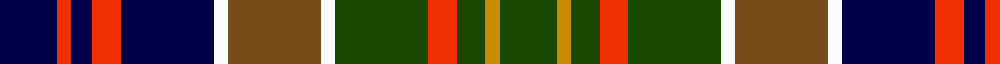

**Bands:** [BRBRBWGWGRGYG](/stripes/brbrbwgwgrgyg/) · **Stripes:** [DB R DB R DB W Y W DG R DG LO DG](/stripes/stripes13/) DB R DB R DB W Y W DG R DG LO DG

This was sourced from tartans-authority.  It is a [13 band tartan](/bands/bands13/).

Original link http://www.tartansauthority.com/tartan-ferret/display/434/

## Thread count
DB/16 R4 DB6 R8 DB26 W4 T26 W4 G26 R8 G8 DY4 G/16

## Palette
Each colour and its ΔE from the base-6 reference it is a variant of.

| Colour | Shade | Base | ΔE (OKLab) |
|---|---|---|---|
| DB | <code style="background-color:#000048;">#000048</code> `#000048` | B <code style="background-color:#2A418A;">#2A418A</code> | 0.22 |
| DY | <code style="background-color:#C88C00;">#C88C00</code> `#C88C00` | Y <code style="background-color:#F2BF00;">#F2BF00</code> | 0.15 |
| G | <code style="background-color:#184800;">#184800</code> `#184800` | G <code style="background-color:#006100;">#006100</code> | 0.08 |
| R | <code style="background-color:#F03000;">#F03000</code> `#F03000` | R <code style="background-color:#CC0000;">#CC0000</code> | 0.09 |
| T | <code style="background-color:#784C18;">#784C18</code> `#784C18` | G <code style="background-color:#006100;">#006100</code> | 0.15 |
| W | <code style="background-color:#FCFCFC;">#FCFCFC</code> `#FCFCFC` | W <code style="background-color:#F7F7F7;">#F7F7F7</code> | 0.01 |

## Nearest tartans

The nearest existing variants by ΔTartan distance.

1. [Watt (Personal)](/setts/s13/db9k2w4db4lo2k10g12k3g12k8r11k2lo4~x2/) — ΔT 0.59
1. [Bowie (Dalgety) Family Tartan Tartan Number: 434. Earliest known date: 1970-80 The name Bowie or Buie is associated with Argyllshire and the islands of Jura, Uist and Bute. The design comes from J. Dalgety, a weaving manufacturer who specializes in tartan. The date of the tartan is assumed. See products available Copyright © Blair Urquhart, Comrie, 2015](/setts/s13/db8r2db3r4db13w2dr13w2g13r4g4ly2g8~x2/) — ΔT 0.62
1. [Gordonstoun](/setts/s12/ly4g20r3db11t3r11g11r3k20r3k3t3~x2/) — ΔT 0.69
1. [Farquharson Dress (Fashion)](/setts/s13/lb6k1lb1k1lb1k8g8lo2g8k8db8k1r2~x2/) — ΔT 0.73
1. [Langston (Personal)](/setts/s18/k14g2t14g3t14g2k14g14w2g14k14r2g2r10ly4r10g2r2~x2/) — ΔT 0.82
1. [Festival Celtique de Québec](/setts/s14/g5k1g5k1db5w1db5g2w1lo2db1r3lo1r3~x4/) — ΔT 0.85
1. [North of Scotland Tartan Army](/setts/s13/dp3k3dp10k11g14db3g14k11w3lr3db15lr2w2~x2/) — ΔT 0.90
1. [Festival Celtique de Qubecc](/setts/s14/g5k1g5k1db5w1db5g2w1ly2db1r3ly1r3~x4/) — ΔT 0.90
1. [Carnegie](/setts/s13/db3r1db1r2db6r1k6g6r2g1r1g2ly1~x2/) — ΔT 0.92
1. [Hislop Hunting (Name)](/setts/s11/r2db8g9k2w3k1ly1k7ly2k8r2~x2/) — ΔT 0.93

## Neighbour map

Every grey dot is one of 14313 variants placed by the first two principal components of the ΔTartan feature space (44% of its variance). Red is this tartan; blue dots are its nearest — click one to open its page.

<svg viewBox="0 0 640 380" role="img" style="max-width:100%;height:auto;border:1px solid #e0e0e0;border-radius:4px;display:block" xmlns="http://www.w3.org/2000/svg"><image href="/nn/cloud.v1.png" width="640" height="380"/><a href="/setts/s13/db9k2w4db4lo2k10g12k3g12k8r11k2lo4~x2/"><circle cx="42.5" cy="178.5" r="4" fill="#3465a4"><title>Watt (Personal)</title></circle></a><a href="/setts/s13/db8r2db3r4db13w2dr13w2g13r4g4ly2g8~x2/"><circle cx="82.9" cy="168.8" r="4" fill="#3465a4"><title>Bowie (Dalgety) Family Tartan Tartan Number: 434. Earliest known date: 1970-80 The name Bowie or Buie is associated with Argyllshire and the islands of Jura, Uist and Bute. The design comes from J. Dalgety, a weaving manufacturer who specializes in tartan. The date of the tartan is assumed. See products available Copyright © Blair Urquhart, Comrie, 2015</title></circle></a><a href="/setts/s12/ly4g20r3db11t3r11g11r3k20r3k3t3~x2/"><circle cx="65.4" cy="155.7" r="4" fill="#3465a4"><title>Gordonstoun</title></circle></a><a href="/setts/s13/lb6k1lb1k1lb1k8g8lo2g8k8db8k1r2~x2/"><circle cx="86.1" cy="155.3" r="4" fill="#3465a4"><title>Farquharson Dress (Fashion)</title></circle></a><a href="/setts/s18/k14g2t14g3t14g2k14g14w2g14k14r2g2r10ly4r10g2r2~x2/"><circle cx="60.1" cy="148.9" r="4" fill="#3465a4"><title>Langston (Personal)</title></circle></a><a href="/setts/s14/g5k1g5k1db5w1db5g2w1lo2db1r3lo1r3~x4/"><circle cx="46.3" cy="171.0" r="4" fill="#3465a4"><title>Festival Celtique de Québec</title></circle></a><a href="/setts/s13/dp3k3dp10k11g14db3g14k11w3lr3db15lr2w2~x2/"><circle cx="65.8" cy="168.3" r="4" fill="#3465a4"><title>North of Scotland Tartan Army</title></circle></a><a href="/setts/s14/g5k1g5k1db5w1db5g2w1ly2db1r3ly1r3~x4/"><circle cx="50.1" cy="169.9" r="4" fill="#3465a4"><title>Festival Celtique de Qubecc</title></circle></a><a href="/setts/s13/db3r1db1r2db6r1k6g6r2g1r1g2ly1~x2/"><circle cx="79.7" cy="173.2" r="4" fill="#3465a4"><title>Carnegie</title></circle></a><a href="/setts/s11/r2db8g9k2w3k1ly1k7ly2k8r2~x2/"><circle cx="105.2" cy="154.9" r="4" fill="#3465a4"><title>Hislop Hunting (Name)</title></circle></a><circle cx="69.5" cy="163.9" r="5" fill="#c00000"/></svg>

ID: /setts/s13/db8r2db3r4db13w2y13w2dg13r4dg4lo2dg8~x2/
