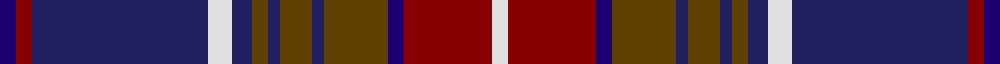

This page is one **sett** — a single exact thread-count. It belongs to the [tartan](/tartans/dbi4r4db44w6db5dy4db3dy8db3dy16dbi4r22w4/)
(the same proportion at any scale), whose colour order is pattern [BRBWBGBGBGBRW](/stripes/brbwbgbgbgbrw/).

Sourced from house-of-tartan.  It is a [13 stripe tartan](/stripes/stripes13/).

Original link http://www.house-of-tartan.scotland.net/house/TartanViewjs.asp?colr=Def&tnam=478

## Thread count
DBa/4 DR4 DB44 LN6 DB5 T4 DB3 T8 DB3 T16 DBa4 DR22 LN/4

## Palette

Palette: <strong>Tartan Register</strong>
<table><thead><tr><th>Colour</th><th>Threads</th><th>Shade</th><th>Base</th><th>OKLCh</th></tr></thead><tbody><tr><td>DBa/</td><td style="text-align:right;font-variant-numeric:tabular-nums">4</td><td><code style="background-color:#1C0070;">#1C0070</code> <small style="color:#888">#1C0070</small></td><td>B <code style="background-color:#2A418A;">#2A418A</code></td><td><small style="color:#888">oklch(26.3% 0.162 277.1)</small></td></tr><tr><td>DR</td><td style="text-align:right;font-variant-numeric:tabular-nums">4</td><td><code style="background-color:#880000;">#880000</code> <small style="color:#888">#880000</small></td><td>R <code style="background-color:#CC0000;">#CC0000</code></td><td><small style="color:#888">oklch(39.4% 0.162 29.2)</small></td></tr><tr><td>DB</td><td style="text-align:right;font-variant-numeric:tabular-nums">44</td><td><code style="background-color:#202060;">#202060</code> <small style="color:#888">#202060</small></td><td>B <code style="background-color:#2A418A;">#2A418A</code></td><td><small style="color:#888">oklch(28.9% 0.111 276.9)</small></td></tr><tr><td>LN</td><td style="text-align:right;font-variant-numeric:tabular-nums">6</td><td><code style="background-color:#E0E0E0;">#E0E0E0</code> <small style="color:#888">#E0E0E0</small></td><td>W <code style="background-color:#F7F7F7;">#F7F7F7</code></td><td><small style="color:#888">oklch(90.7% 0.000 89.9)</small></td></tr><tr><td>DB</td><td style="text-align:right;font-variant-numeric:tabular-nums">5</td><td><code style="background-color:#202060;">#202060</code> <small style="color:#888">#202060</small></td><td>B <code style="background-color:#2A418A;">#2A418A</code></td><td><small style="color:#888">oklch(28.9% 0.111 276.9)</small></td></tr><tr><td>T</td><td style="text-align:right;font-variant-numeric:tabular-nums">4</td><td><code style="background-color:#604000;">#604000</code> <small style="color:#888">#604000</small></td><td>G <code style="background-color:#006100;">#006100</code></td><td><small style="color:#888">oklch(39.8% 0.083 76.8)</small></td></tr><tr><td>DB</td><td style="text-align:right;font-variant-numeric:tabular-nums">3</td><td><code style="background-color:#202060;">#202060</code> <small style="color:#888">#202060</small></td><td>B <code style="background-color:#2A418A;">#2A418A</code></td><td><small style="color:#888">oklch(28.9% 0.111 276.9)</small></td></tr><tr><td>T</td><td style="text-align:right;font-variant-numeric:tabular-nums">8</td><td><code style="background-color:#604000;">#604000</code> <small style="color:#888">#604000</small></td><td>G <code style="background-color:#006100;">#006100</code></td><td><small style="color:#888">oklch(39.8% 0.083 76.8)</small></td></tr><tr><td>DB</td><td style="text-align:right;font-variant-numeric:tabular-nums">3</td><td><code style="background-color:#202060;">#202060</code> <small style="color:#888">#202060</small></td><td>B <code style="background-color:#2A418A;">#2A418A</code></td><td><small style="color:#888">oklch(28.9% 0.111 276.9)</small></td></tr><tr><td>T</td><td style="text-align:right;font-variant-numeric:tabular-nums">16</td><td><code style="background-color:#604000;">#604000</code> <small style="color:#888">#604000</small></td><td>G <code style="background-color:#006100;">#006100</code></td><td><small style="color:#888">oklch(39.8% 0.083 76.8)</small></td></tr><tr><td>DBa</td><td style="text-align:right;font-variant-numeric:tabular-nums">4</td><td><code style="background-color:#1C0070;">#1C0070</code> <small style="color:#888">#1C0070</small></td><td>B <code style="background-color:#2A418A;">#2A418A</code></td><td><small style="color:#888">oklch(26.3% 0.162 277.1)</small></td></tr><tr><td>DR</td><td style="text-align:right;font-variant-numeric:tabular-nums">22</td><td><code style="background-color:#880000;">#880000</code> <small style="color:#888">#880000</small></td><td>R <code style="background-color:#CC0000;">#CC0000</code></td><td><small style="color:#888">oklch(39.4% 0.162 29.2)</small></td></tr><tr><td>LN/</td><td style="text-align:right;font-variant-numeric:tabular-nums">4</td><td><code style="background-color:#E0E0E0;">#E0E0E0</code> <small style="color:#888">#E0E0E0</small></td><td>W <code style="background-color:#F7F7F7;">#F7F7F7</code></td><td><small style="color:#888">oklch(90.7% 0.000 89.9)</small></td></tr></tbody></table>

## Nearest tartans

The nearest existing variants by ΔTartan distance, with this tartan at the top so the swatches line up against it.

ΔTartan

Tartan

Sett

—

<a href="/ttd/edit/#slug=dbi4r4db44w6db5dy4db3dy8db3dy16dbi4r22w4">Largs District Tartan Tartan Number: 478. Earliest known date: 1981 The Largs tartan is a new design created for the town and officially adopted in 1981. There is also a dress version. See products available Copyright © Blair Urquhart, Comrie, 2015</a> <a class="nn-out" href="/setts/s13/dbi4r4db44w6db5dy4db3dy8db3dy16dbi4r22w4/" title="open its dictionary page">↗</a>

0.79

<a href="/ttd/edit/#slug=w2db2r18db2dg20r2db40r2dg12db3r9ly2~x2">Kormylo (Personal)</a> <a class="nn-out" href="/setts/s12/w2db2r18db2dg20r2db40r2dg12db3r9ly2~x2/" title="open its dictionary page">↗</a>

0.87

<a href="/ttd/edit/#slug=r1db1r8lb1k2db16k2lb1g8db1g1~x4">MacMichael</a> <a class="nn-out" href="/setts/s11/r1db1r8lb1k2db16k2lb1g8db1g1~x4/" title="open its dictionary page">↗</a>

1.04

<a href="/ttd/edit/#slug=r4k1db8k1lo3k2db4lo6db4w3k2db20k4r21k1lo3~x2">Westmeath County Crest (Fashion)</a> <a class="nn-out" href="/setts/s16/r4k1db8k1lo3k2db4lo6db4w3k2db20k4r21k1lo3~x2/" title="open its dictionary page">↗</a>

1.09

<a href="/ttd/edit/#slug=db40k8r4k4r8k4r4k8dg40k8r4k4r8k4r4k8db40ly3~x2">Griffiths of Llangynin (Personal)</a> <a class="nn-out" href="/setts/s18/db40k8r4k4r8k4r4k8dg40k8r4k4r8k4r4k8db40ly3~x2/" title="open its dictionary page">↗</a>

1.12

<a href="/ttd/edit/#slug=n20r2db4lb2db4r2db4k1db1k1db1k4~x4">Broz Sanz Elementary School</a> <a class="nn-out" href="/setts/s12/n20r2db4lb2db4r2db4k1db1k1db1k4~x4/" title="open its dictionary page">↗</a>

1.12

<a href="/ttd/edit/#slug=db20r2db2r5db30r2k32w2dg30r5dg4r2dg4w2">MacDonald of Clanranald #5</a> <a class="nn-out" href="/setts/s14/db20r2db2r5db30r2k32w2dg30r5dg4r2dg4w2/" title="open its dictionary page">↗</a>

1.16

<a href="/ttd/edit/#slug=g4r4db44w6db5o4db3o8db3o16g4r22w4">Largs</a> <a class="nn-out" href="/setts/s13/g4r4db44w6db5o4db3o8db3o16g4r22w4/" title="open its dictionary page">↗</a>

1.18

<a href="/ttd/edit/#slug=r12lo2db3k3db30k20dr6k10lo2dr4~x2">KPMG (Corporate)</a> <a class="nn-out" href="/setts/s10/r12lo2db3k3db30k20dr6k10lo2dr4~x2/" title="open its dictionary page">↗</a>

1.20

<a href="/ttd/edit/#slug=r16db2r2db2r2db16dg16ly1r16db16r2lr2~x2">Army Medical Services</a> <a class="nn-out" href="/setts/s12/r16db2r2db2r2db16dg16ly1r16db16r2lr2~x2/" title="open its dictionary page">↗</a>

1.24

<a href="/ttd/edit/#slug=k2db2g2db22r4g3r3g2r22k2r2ly2~x2">Harris, Jeffrey S (Personal)</a> <a class="nn-out" href="/setts/s12/k2db2g2db22r4g3r3g2r22k2r2ly2~x2/" title="open its dictionary page">↗</a>

## Neighbour map

Every grey dot is one of 14359 variants placed by the first two principal components of the ΔTartan feature space (44% of its variance). Red is this tartan; blue dots are its nearest — click one to open its page.

<svg viewBox="0 0 640 380" role="img" style="max-width:100%;height:auto;border:1px solid #e0e0e0;border-radius:4px;display:block" xmlns="http://www.w3.org/2000/svg"><image href="/nn/cloud.v1.png" width="640" height="380"/><a href="/setts/s12/w2db2r18db2dg20r2db40r2dg12db3r9ly2~x2/"><circle cx="248.8" cy="120.8" r="4" fill="#3465a4"><title>Kormylo (Personal)</title></circle></a><a href="/setts/s11/r1db1r8lb1k2db16k2lb1g8db1g1~x4/"><circle cx="232.6" cy="133.6" r="4" fill="#3465a4"><title>MacMichael</title></circle></a><a href="/setts/s16/r4k1db8k1lo3k2db4lo6db4w3k2db20k4r21k1lo3~x2/"><circle cx="223.5" cy="106.7" r="4" fill="#3465a4"><title>Westmeath County Crest (Fashion)</title></circle></a><a href="/setts/s18/db40k8r4k4r8k4r4k8dg40k8r4k4r8k4r4k8db40ly3~x2/"><circle cx="212.4" cy="130.4" r="4" fill="#3465a4"><title>Griffiths of Llangynin (Personal)</title></circle></a><a href="/setts/s12/n20r2db4lb2db4r2db4k1db1k1db1k4~x4/"><circle cx="279.7" cy="127.1" r="4" fill="#3465a4"><title>Broz Sanz Elementary School</title></circle></a><a href="/setts/s14/db20r2db2r5db30r2k32w2dg30r5dg4r2dg4w2/"><circle cx="203.3" cy="132.1" r="4" fill="#3465a4"><title>MacDonald of Clanranald #5</title></circle></a><a href="/setts/s13/g4r4db44w6db5o4db3o8db3o16g4r22w4/"><circle cx="200.8" cy="118.4" r="4" fill="#3465a4"><title>Largs</title></circle></a><a href="/setts/s10/r12lo2db3k3db30k20dr6k10lo2dr4~x2/"><circle cx="217.7" cy="164.7" r="4" fill="#3465a4"><title>KPMG (Corporate)</title></circle></a><a href="/setts/s12/r16db2r2db2r2db16dg16ly1r16db16r2lr2~x2/"><circle cx="229.2" cy="147.5" r="4" fill="#3465a4"><title>Army Medical Services</title></circle></a><a href="/setts/s12/k2db2g2db22r4g3r3g2r22k2r2ly2~x2/"><circle cx="269.3" cy="134.9" r="4" fill="#3465a4"><title>Harris, Jeffrey S (Personal)</title></circle></a><circle cx="232.5" cy="131.8" r="5" fill="#c00000"/></svg>

ID: /setts/s13/dbi4r4db44w6db5dy4db3dy8db3dy16dbi4r22w4/
