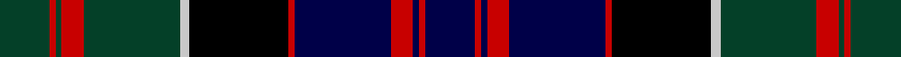

This page is one **sett** — a single exact thread-count. It belongs to the [tartan](/tartans/dg16r2dg2r7dg31lb3k32r2db31r7db2r2db16/)
(the same proportion at any scale), whose colour order is pattern [BRBRBRKWGRGRG](/stripes/brbrbrkwgrgrg/).

Sourced from register-of-tartans.  It is a [13 stripe tartan](/stripes/stripes13/).

Original link https://www.tartanregister.gov.uk/tartanDetails.aspx?ref=661

2 attestations — the source records this cloth was collapsed from (oldest owns this page)

<ul>
<li>01/01/1819 — Clanranald, MacDonald of (register-of-tartans, <a href="https://www.tartanregister.gov.uk/tartanDetails.aspx?ref=661">record</a>)</li>
<li>1819 — Clanranald, MacDonald of (Clan) (tartans-authority, <a href="http://www.tartansauthority.com/tartan-ferret/display/4521/">record</a>)</li>
</ul>

## Register references

External register numbers recorded for this tartan.

- Scottish Register of Tartans: [661](https://www.tartanregister.gov.uk/tartanDetails.aspx?ref=661)
- Scottish Tartans Authority (ITI): 4521

## Thread count
DG/32 R4 DG4 R14 DG62 N6 K64 R4 DB62 R14 DB4 R4 DB/32

## Palette

Palette: <strong>Tartan Register</strong> <small style="color:#888">(4 of 5 colours)</small>
<table><thead><tr><th>Colour</th><th>Threads</th><th>Shade</th><th>Base</th><th>OKLCh</th></tr></thead><tbody><tr><td>DG/</td><td style="text-align:right;font-variant-numeric:tabular-nums">32</td><td><code style="background-color:#044028;">#044028</code> <small style="color:#888">#044028</small></td><td>G <code style="background-color:#006100;">#006100</code></td><td><small style="color:#888">oklch(32.9% 0.072 160.0)</small></td></tr><tr><td>R</td><td style="text-align:right;font-variant-numeric:tabular-nums">4</td><td><code style="background-color:#C80000;">#C80000</code> <small style="color:#888">#C80000</small></td><td>R <code style="background-color:#CC0000;">#CC0000</code></td><td><small style="color:#888">oklch(52.3% 0.215 29.2)</small></td></tr><tr><td>DG</td><td style="text-align:right;font-variant-numeric:tabular-nums">4</td><td><code style="background-color:#044028;">#044028</code> <small style="color:#888">#044028</small></td><td>G <code style="background-color:#006100;">#006100</code></td><td><small style="color:#888">oklch(32.9% 0.072 160.0)</small></td></tr><tr><td>R</td><td style="text-align:right;font-variant-numeric:tabular-nums">14</td><td><code style="background-color:#C80000;">#C80000</code> <small style="color:#888">#C80000</small></td><td>R <code style="background-color:#CC0000;">#CC0000</code></td><td><small style="color:#888">oklch(52.3% 0.215 29.2)</small></td></tr><tr><td>DG</td><td style="text-align:right;font-variant-numeric:tabular-nums">62</td><td><code style="background-color:#044028;">#044028</code> <small style="color:#888">#044028</small></td><td>G <code style="background-color:#006100;">#006100</code></td><td><small style="color:#888">oklch(32.9% 0.072 160.0)</small></td></tr><tr><td>N</td><td style="text-align:right;font-variant-numeric:tabular-nums">6</td><td><code style="background-color:#C8C8C8;">#C8C8C8</code> <small style="color:#888">#C8C8C8</small></td><td>W <code style="background-color:#F7F7F7;">#F7F7F7</code></td><td><small style="color:#888">oklch(83.3% 0.000 89.9)</small></td></tr><tr><td>K</td><td style="text-align:right;font-variant-numeric:tabular-nums">64</td><td><code style="background-color:#000000;">#000000</code> <small style="color:#888">#000000</small></td><td>K <code style="background-color:#000000;">#000000</code></td><td><small style="color:#888">oklch(0.0% 0.000 0.0)</small></td></tr><tr><td>R</td><td style="text-align:right;font-variant-numeric:tabular-nums">4</td><td><code style="background-color:#C80000;">#C80000</code> <small style="color:#888">#C80000</small></td><td>R <code style="background-color:#CC0000;">#CC0000</code></td><td><small style="color:#888">oklch(52.3% 0.215 29.2)</small></td></tr><tr><td>DB</td><td style="text-align:right;font-variant-numeric:tabular-nums">62</td><td><code style="background-color:#000048;">#000048</code> <small style="color:#888">#000048</small></td><td>B <code style="background-color:#2A418A;">#2A418A</code></td><td><small style="color:#888">oklch(18.2% 0.126 264.1)</small></td></tr><tr><td>R</td><td style="text-align:right;font-variant-numeric:tabular-nums">14</td><td><code style="background-color:#C80000;">#C80000</code> <small style="color:#888">#C80000</small></td><td>R <code style="background-color:#CC0000;">#CC0000</code></td><td><small style="color:#888">oklch(52.3% 0.215 29.2)</small></td></tr><tr><td>DB</td><td style="text-align:right;font-variant-numeric:tabular-nums">4</td><td><code style="background-color:#000048;">#000048</code> <small style="color:#888">#000048</small></td><td>B <code style="background-color:#2A418A;">#2A418A</code></td><td><small style="color:#888">oklch(18.2% 0.126 264.1)</small></td></tr><tr><td>R</td><td style="text-align:right;font-variant-numeric:tabular-nums">4</td><td><code style="background-color:#C80000;">#C80000</code> <small style="color:#888">#C80000</small></td><td>R <code style="background-color:#CC0000;">#CC0000</code></td><td><small style="color:#888">oklch(52.3% 0.215 29.2)</small></td></tr><tr><td>DB/</td><td style="text-align:right;font-variant-numeric:tabular-nums">32</td><td><code style="background-color:#000048;">#000048</code> <small style="color:#888">#000048</small></td><td>B <code style="background-color:#2A418A;">#2A418A</code></td><td><small style="color:#888">oklch(18.2% 0.126 264.1)</small></td></tr></tbody></table>

## Nearest tartans

The nearest existing variants by ΔTartan distance, with this tartan at the top so the swatches line up against it.

ΔTartan

Tartan

Sett

—

<a href="/ttd/edit/#slug=dg16r2dg2r7dg31lb3k32r2db31r7db2r2db16~x2">Clanranald, MacDonald of</a> <a class="nn-out" href="/setts/s13/dg16r2dg2r7dg31lb3k32r2db31r7db2r2db16~x2/" title="open its dictionary page">↗</a>

0.60

<a href="/ttd/edit/#slug=db8r1db2r3db12r1k12dg12r3dg2r1dg4lr1~x2">MacDonell of Glengarry D</a> <a class="nn-out" href="/setts/s13/db8r1db2r3db12r1k12dg12r3dg2r1dg4lr1~x2/" title="open its dictionary page">↗</a>

0.60

<a href="/ttd/edit/#slug=db8r1db2r3db12r1k12dg12r3dg2r1dg4lr1">MacDonell of Glengarry D</a> <a class="nn-out" href="/setts/s13/db8r1db2r3db12r1k12dg12r3dg2r1dg4lr1/" title="open its dictionary page">↗</a>

0.60

<a href="/ttd/edit/#slug=dg8r1dg1r3dg16k16r1db16r3db8ly2~x2">Cameron of Erracht</a> <a class="nn-out" href="/setts/s11/dg8r1dg1r3dg16k16r1db16r3db8ly2~x2/" title="open its dictionary page">↗</a>

0.67

<a href="/ttd/edit/#slug=dg8r1dg2r3dg12lr1k12r1db12r3db2r1db8~x2">MacDonald of Clanranald</a> <a class="nn-out" href="/setts/s13/dg8r1dg2r3dg12lr1k12r1db12r3db2r1db8~x2/" title="open its dictionary page">↗</a>

0.67

<a href="/ttd/edit/#slug=dg8r1dg2r3dg12lr1k12r1db12r3db2r1db8">MacDonald of Clanranald</a> <a class="nn-out" href="/setts/s13/dg8r1dg2r3dg12lr1k12r1db12r3db2r1db8/" title="open its dictionary page">↗</a>

0.70

<a href="/ttd/edit/#slug=db8r1db2r3db12r1k12dg12r3dg2r1dg4lb1">MacDonell of Glengarry D</a> <a class="nn-out" href="/setts/s13/db8r1db2r3db12r1k12dg12r3dg2r1dg4lb1/" title="open its dictionary page">↗</a>

0.75

<a href="/ttd/edit/#slug=dg8r1dg2r3dg12lb1k12r1db12r3db2r1db8~x2">MacDonald of Clanranald</a> <a class="nn-out" href="/setts/s13/dg8r1dg2r3dg12lb1k12r1db12r3db2r1db8~x2/" title="open its dictionary page">↗</a>

0.75

<a href="/ttd/edit/#slug=dg8r1dg1r3dg16k16r1db16r3db8ly2">Cameron of Erracht</a> <a class="nn-out" href="/setts/s11/dg8r1dg1r3dg16k16r1db16r3db8ly2/" title="open its dictionary page">↗</a>

0.83

<a href="/ttd/edit/#slug=db8r4db12r1k12dg12r3dg2r1dg4lr1~x2">MacDonell of Glengarry</a> <a class="nn-out" href="/setts/s11/db8r4db12r1k12dg12r3dg2r1dg4lr1~x2/" title="open its dictionary page">↗</a>

0.84

<a href="/ttd/edit/#slug=db12k2db2k2db2k12dg16k1r3k1dg16k12db12k1lr3~x2">Robertson of Kindeace</a> <a class="nn-out" href="/setts/s15/db12k2db2k2db2k12dg16k1r3k1dg16k12db12k1lr3~x2/" title="open its dictionary page">↗</a>

## Neighbour map

Every grey dot is one of 14359 variants placed by the first two principal components of the ΔTartan feature space (44% of its variance). Red is this tartan; blue dots are its nearest — click one to open its page.

<svg viewBox="0 0 640 380" role="img" style="max-width:100%;height:auto;border:1px solid #e0e0e0;border-radius:4px;display:block" xmlns="http://www.w3.org/2000/svg"><image href="/nn/cloud.v1.png" width="640" height="380"/><a href="/setts/s13/db8r1db2r3db12r1k12dg12r3dg2r1dg4lr1~x2/"><circle cx="168.5" cy="163.2" r="4" fill="#3465a4"><title>MacDonell of Glengarry D</title></circle></a><a href="/setts/s13/db8r1db2r3db12r1k12dg12r3dg2r1dg4lr1/"><circle cx="168.5" cy="163.2" r="4" fill="#3465a4"><title>MacDonell of Glengarry D</title></circle></a><a href="/setts/s11/dg8r1dg1r3dg16k16r1db16r3db8ly2~x2/"><circle cx="173.1" cy="162.4" r="4" fill="#3465a4"><title>Cameron of Erracht</title></circle></a><a href="/setts/s13/dg8r1dg2r3dg12lr1k12r1db12r3db2r1db8~x2/"><circle cx="161.6" cy="167.6" r="4" fill="#3465a4"><title>MacDonald of Clanranald</title></circle></a><a href="/setts/s13/dg8r1dg2r3dg12lr1k12r1db12r3db2r1db8/"><circle cx="161.6" cy="167.6" r="4" fill="#3465a4"><title>MacDonald of Clanranald</title></circle></a><a href="/setts/s13/db8r1db2r3db12r1k12dg12r3dg2r1dg4lb1/"><circle cx="153.4" cy="154.9" r="4" fill="#3465a4"><title>MacDonell of Glengarry D</title></circle></a><a href="/setts/s13/dg8r1dg2r3dg12lb1k12r1db12r3db2r1db8~x2/"><circle cx="146.3" cy="159.3" r="4" fill="#3465a4"><title>MacDonald of Clanranald</title></circle></a><a href="/setts/s11/dg8r1dg1r3dg16k16r1db16r3db8ly2/"><circle cx="159.6" cy="154.9" r="4" fill="#3465a4"><title>Cameron of Erracht</title></circle></a><a href="/setts/s11/db8r4db12r1k12dg12r3dg2r1dg4lr1~x2/"><circle cx="154.3" cy="177.3" r="4" fill="#3465a4"><title>MacDonell of Glengarry</title></circle></a><a href="/setts/s15/db12k2db2k2db2k12dg16k1r3k1dg16k12db12k1lr3~x2/"><circle cx="177.4" cy="155.9" r="4" fill="#3465a4"><title>Robertson of Kindeace</title></circle></a><circle cx="168.2" cy="144.3" r="5" fill="#c00000"/></svg>

ID: /setts/s13/dg16r2dg2r7dg31lb3k32r2db31r7db2r2db16~x2/
