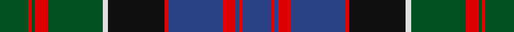

In pattern [BRBRBRKWGRGRG](/stripes/brbrbrkwgrgrg/).

This was sourced from register-of-tartans.  It is a [13 stripe tartan](/stripes/stripes13/).

Original link https://www.tartanregister.gov.uk/tartanDetails.aspx?ref=2353

## Also known as

This cloth is also recorded under:

- MacDonald of Clanranald #2

## Register references

External register numbers recorded for this tartan.

- Scottish Register of Tartans: [2353](https://www.tartanregister.gov.uk/tartanDetails.aspx?ref=2353)
- Scottish Tartans World Register: 426

## Thread count
G/32 R4 G4 R14 G62 LN6 K64 R4 B62 R14 B4 R4 B/32

## Palette
Each colour and the base-6 reference it is a variant of.

| Colour | Shade | Base |
|---|---|---|
| B | <code style="background-color:#2C4084;">#2C4084</code> `oklch(39.4% 0.117 268.3)` <small>#2C4084</small> | B <code style="background-color:#2A418A;">#2A418A</code> |
| G | <code style="background-color:#005020;">#005020</code> `oklch(37.7% 0.105 149.6)` <small>#005020</small> | G <code style="background-color:#006100;">#006100</code> |
| K | <code style="background-color:#101010;">#101010</code> `oklch(17.3% 0.000 89.9)` <small>#101010</small> | K <code style="background-color:#000000;">#000000</code> |
| LN | <code style="background-color:#E0E0E0;">#E0E0E0</code> `oklch(90.7% 0.000 89.9)` <small>#E0E0E0</small> | W <code style="background-color:#F7F7F7;">#F7F7F7</code> |
| R | <code style="background-color:#DC0000;">#DC0000</code> `oklch(56.2% 0.230 29.2)` <small>#DC0000</small> | R <code style="background-color:#CC0000;">#CC0000</code> |

## Nearest tartans

The nearest existing variants by ΔTartan distance, with this tartan at the top so the swatches line up against it.

ΔTartan

Tartan

Sett

—

<a href="/ttd/edit/#slug=dg16r2dg2r7dg31w3k32r2db31r7db2r2db16~x2">MacDonald of Clanranald #2</a> <a class="nn-out" href="/setts/s13/dg16r2dg2r7dg31w3k32r2db31r7db2r2db16~x2/" title="open its dictionary page">↗</a>

0.46

<a href="/ttd/edit/#slug=dg16k5dg4k8dg44k40dg4db52r10db4r4db10w6">MacNeil of Colonsay (Highland Society of London)</a> <a class="nn-out" href="/setts/s13/dg16k5dg4k8dg44k40dg4db52r10db4r4db10w6/" title="open its dictionary page">↗</a>

0.51

<a href="/ttd/edit/#slug=dg13r2dg2r6dg25ly2k27r2db25r6db2r2db13~x2">Unnamed C20th - Unregistered Error</a> <a class="nn-out" href="/setts/s13/dg13r2dg2r6dg25ly2k27r2db25r6db2r2db13~x2/" title="open its dictionary page">↗</a>

0.56

<a href="/ttd/edit/#slug=db16r5db30r2k33g30r5g2r2g7w4">MacDonell of Glengarry #3</a> <a class="nn-out" href="/setts/s11/db16r5db30r2k33g30r5g2r2g7w4/" title="open its dictionary page">↗</a>

0.59

<a href="/ttd/edit/#slug=db8r1db2r3db12r1k12dg12r3dg2r1dg4w1~x2">MacDonell of Glengarry</a> <a class="nn-out" href="/setts/s13/db8r1db2r3db12r1k12dg12r3dg2r1dg4w1~x2/" title="open its dictionary page">↗</a>

0.60

<a href="/ttd/edit/#slug=dg8r1dg2r3dg12w1k12r1db12r3db2r1db8~x2">MacDonald of Clanranald</a> <a class="nn-out" href="/setts/s13/dg8r1dg2r3dg12w1k12r1db12r3db2r1db8~x2/" title="open its dictionary page">↗</a>

0.60

<a href="/ttd/edit/#slug=db20r2db2r5db30r2k32w2dg30r5dg4r2dg4w2">MacDonald of Clanranald #5</a> <a class="nn-out" href="/setts/s14/db20r2db2r5db30r2k32w2dg30r5dg4r2dg4w2/" title="open its dictionary page">↗</a>

0.61

<a href="/ttd/edit/#slug=g8r1g1r3g16k16r1db16r3db8ly2~x2">Cameron of Erracht (Clan)</a> <a class="nn-out" href="/setts/s11/g8r1g1r3g16k16r1db16r3db8ly2~x2/" title="open its dictionary page">↗</a>

0.66

<a href="/ttd/edit/#slug=r6db3r2db2r2db16k12dg16r1k1ly2~x2">MacLennan</a> <a class="nn-out" href="/setts/s11/r6db3r2db2r2db16k12dg16r1k1ly2~x2/" title="open its dictionary page">↗</a>

0.69

<a href="/ttd/edit/#slug=r6db3r2db2r2db16k12g16r1k1ly2~x2">Logan #7</a> <a class="nn-out" href="/setts/s11/r6db3r2db2r2db16k12g16r1k1ly2~x2/" title="open its dictionary page">↗</a>

0.78

<a href="/ttd/edit/#slug=db8r1db2r3db12r1k12g12r3g2r1g4lb1~x2">MacDonell of Glengarry - 1914 (Clan)</a> <a class="nn-out" href="/setts/s13/db8r1db2r3db12r1k12g12r3g2r1g4lb1~x2/" title="open its dictionary page">↗</a>

## Neighbour map

Every grey dot is one of 14299 variants placed by the first two principal components of the ΔTartan feature space (44% of its variance). Red is this tartan; blue dots are its nearest — click one to open its page.

<svg viewBox="0 0 640 380" role="img" style="max-width:100%;height:auto;border:1px solid #e0e0e0;border-radius:4px;display:block" xmlns="http://www.w3.org/2000/svg"><image href="/nn/cloud.v1.png" width="640" height="380"/><a href="/setts/s13/dg16k5dg4k8dg44k40dg4db52r10db4r4db10w6/"><circle cx="183.7" cy="151.0" r="4" fill="#3465a4"><title>MacNeil of Colonsay (Highland Society of London)</title></circle></a><a href="/setts/s13/dg13r2dg2r6dg25ly2k27r2db25r6db2r2db13~x2/"><circle cx="175.5" cy="154.0" r="4" fill="#3465a4"><title>Unnamed C20th - Unregistered Error</title></circle></a><a href="/setts/s11/db16r5db30r2k33g30r5g2r2g7w4/"><circle cx="182.0" cy="150.1" r="4" fill="#3465a4"><title>MacDonell of Glengarry #3</title></circle></a><a href="/setts/s13/db8r1db2r3db12r1k12dg12r3dg2r1dg4w1~x2/"><circle cx="178.1" cy="160.7" r="4" fill="#3465a4"><title>MacDonell of Glengarry</title></circle></a><a href="/setts/s13/dg8r1dg2r3dg12w1k12r1db12r3db2r1db8~x2/"><circle cx="172.3" cy="166.2" r="4" fill="#3465a4"><title>MacDonald of Clanranald</title></circle></a><a href="/setts/s14/db20r2db2r5db30r2k32w2dg30r5dg4r2dg4w2/"><circle cx="203.5" cy="131.4" r="4" fill="#3465a4"><title>MacDonald of Clanranald #5</title></circle></a><a href="/setts/s11/g8r1g1r3g16k16r1db16r3db8ly2~x2/"><circle cx="175.1" cy="156.4" r="4" fill="#3465a4"><title>Cameron of Erracht (Clan)</title></circle></a><a href="/setts/s11/r6db3r2db2r2db16k12dg16r1k1ly2~x2/"><circle cx="177.2" cy="144.1" r="4" fill="#3465a4"><title>MacLennan</title></circle></a><a href="/setts/s11/r6db3r2db2r2db16k12g16r1k1ly2~x2/"><circle cx="171.3" cy="141.9" r="4" fill="#3465a4"><title>Logan #7</title></circle></a><a href="/setts/s13/db8r1db2r3db12r1k12g12r3g2r1g4lb1~x2/"><circle cx="177.7" cy="164.5" r="4" fill="#3465a4"><title>MacDonell of Glengarry - 1914 (Clan)</title></circle></a><circle cx="182.1" cy="145.3" r="5" fill="#c00000"/></svg>

ID: /setts/s13/dg16r2dg2r7dg31w3k32r2db31r7db2r2db16~x2/
