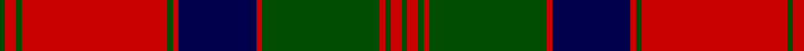

**Bands:** [GRGRGRBRGRGRG](/stripes/grgrgrbrgrgrg/) · **Stripes:** [DG R DG R DG R DB R DG R DG R DG](/stripes/stripes13/) DG R DG R DG R DB R DG R DG R DG

This was sourced from weddslist.  It is a [13 band tartan](/bands/bands13/).

Original link http://www.weddslist.com/cgi-bin/tartans/pg.pl?source=rb

## Register references

External register numbers recorded for this tartan.

- Scottish Register of Tartans: [1166](https://www.tartanregister.gov.uk/tartanDetails.aspx?ref=1166)
- Scottish Register of Tartans: [1758](https://www.tartanregister.gov.uk/tartanDetails.aspx?ref=1758)
- Scottish Register of Tartans: [2307](https://www.tartanregister.gov.uk/tartanDetails.aspx?ref=2307)
- Scottish Register of Tartans: [2540](https://www.tartanregister.gov.uk/tartanDetails.aspx?ref=2540)
- Scottish Register of Tartans: [2666](https://www.tartanregister.gov.uk/tartanDetails.aspx?ref=2666)
- Scottish Register of Tartans: [2862](https://www.tartanregister.gov.uk/tartanDetails.aspx?ref=2862)
- Scottish Register of Tartans: [3808](https://www.tartanregister.gov.uk/tartanDetails.aspx?ref=3808)
- Scottish Register of Tartans: [982](https://www.tartanregister.gov.uk/tartanDetails.aspx?ref=982)
- Scottish Tartans Authority (ITI): 218
- Scottish Tartans World Register: 1010
- Scottish Tartans World Register: 1042
- Scottish Tartans World Register: 127
- Scottish Tartans World Register: 1585
- Scottish Tartans World Register: 218
- Scottish Tartans World Register: 2218
- Scottish Tartans World Register: 737
- Scottish Tartans World Register: 897

## Variants

Other setts woven to the same stripe pattern.

- [MacQuarrie #3](/setts/s13/dg2r3dg2r52dg2r2db28r2dg42r2dg2r3dg2~x2/)
- [MacQuarrie 1815](/setts/s13/dg2r3dg2r52dg2r2db28r2dg42r2dg2r3dg2/)

## Thread count
G/1 R2 G1 R26 G1 R1 DB14 R1 G21 R1 G1 R2 G/1

## Palette
Each colour and its ΔE from the base-6 reference it is a variant of.

| Colour | Shade | Base | ΔE (OKLab) |
|---|---|---|---|
| DB | <code style="background-color:#00004C;">#00004C</code> `#00004C` | B <code style="background-color:#2A418A;">#2A418A</code> | 0.21 |
| G | <code style="background-color:#004C00;">#004C00</code> `#004C00` | G <code style="background-color:#006100;">#006100</code> | 0.07 |
| R | <code style="background-color:#C80000;">#C80000</code> `#C80000` | R <code style="background-color:#CC0000;">#CC0000</code> | 0.01 |

## Nearest tartans

The nearest existing variants by ΔTartan distance.

1. [MacQuarrie #4](/setts/s13/k1r1dg1r21dg1r1k10r1dg14r1dg1r1dg1~x2/) — ΔT 0.72
1. [MacQuarrie #3](/setts/s13/dg2r3dg2r52dg2r2db28r2dg42r2dg2r3dg2~x2/) — ΔT 0.74
1. [MacQuarrie 1815](/setts/s13/dg2r3dg2r52dg2r2db28r2dg42r2dg2r3dg2/) — ΔT 0.79
1. [Stewart/Stuart of Atholl](/setts/s16/dg22k1dg2k1dg3k8r20k1r3~x4/) — ΔT 0.89
1. [Stewart of Appin](/setts/s16/r3db2lb1r2dg24r4dg2r2db8r2dg2r24db2lb1r2dg2~x2/) — ΔT 1.01
1. [Fraser of Altyre](/setts/s14/r4db2r45db2r2db40r4db4r2db2r2g40r2db2~x2/) — ΔT 1.07
1. [MacQuarrie 3](/setts/s13/g2r3g2r52g2r2db28r2g42r2g2r3g2~x2/) — ΔT 1.10
1. [MacQuarrie 6](/setts/s13/k1r1g1r21g1r1k10r1g14r1g1r1g1~x2/) — ΔT 1.11
1. [Fraser of Altyre](/setts/s14/r9db4r89db4r4db80r9db9r4db4r4g80r4db4/) — ΔT 1.14
1. [Matheson](/setts/s21/dg8r4dg1r1dg1r24db8dg4r1dg1r1dg4r8dg1r1dg1r1db8dg8r2dg4/) — ΔT 1.19

## Neighbour map

Every grey dot is one of 14299 variants placed by the first two principal components of the ΔTartan feature space (44% of its variance). Red is this tartan; blue dots are its nearest — click one to open its page.

<svg viewBox="0 0 640 380" role="img" style="max-width:100%;height:auto;border:1px solid #e0e0e0;border-radius:4px;display:block" xmlns="http://www.w3.org/2000/svg"><image href="/nn/cloud.v1.png" width="640" height="380"/><a href="/setts/s13/k1r1dg1r21dg1r1k10r1dg14r1dg1r1dg1~x2/"><circle cx="331.8" cy="116.8" r="4" fill="#3465a4"><title>MacQuarrie #4</title></circle></a><a href="/setts/s13/dg2r3dg2r52dg2r2db28r2dg42r2dg2r3dg2~x2/"><circle cx="342.0" cy="114.9" r="4" fill="#3465a4"><title>MacQuarrie #3</title></circle></a><a href="/setts/s13/dg2r3dg2r52dg2r2db28r2dg42r2dg2r3dg2/"><circle cx="349.7" cy="126.0" r="4" fill="#3465a4"><title>MacQuarrie 1815</title></circle></a><a href="/setts/s16/dg22k1dg2k1dg3k8r20k1r3~x4/"><circle cx="310.9" cy="129.1" r="4" fill="#3465a4"><title>Stewart/Stuart of Atholl</title></circle></a><a href="/setts/s16/r3db2lb1r2dg24r4dg2r2db8r2dg2r24db2lb1r2dg2~x2/"><circle cx="309.3" cy="94.5" r="4" fill="#3465a4"><title>Stewart of Appin</title></circle></a><a href="/setts/s14/r4db2r45db2r2db40r4db4r2db2r2g40r2db2~x2/"><circle cx="311.5" cy="123.0" r="4" fill="#3465a4"><title>Fraser of Altyre</title></circle></a><a href="/setts/s13/g2r3g2r52g2r2db28r2g42r2g2r3g2~x2/"><circle cx="342.5" cy="118.0" r="4" fill="#3465a4"><title>MacQuarrie 3</title></circle></a><a href="/setts/s13/k1r1g1r21g1r1k10r1g14r1g1r1g1~x2/"><circle cx="308.5" cy="109.9" r="4" fill="#3465a4"><title>MacQuarrie 6</title></circle></a><a href="/setts/s14/r9db4r89db4r4db80r9db9r4db4r4g80r4db4/"><circle cx="310.4" cy="124.7" r="4" fill="#3465a4"><title>Fraser of Altyre</title></circle></a><a href="/setts/s21/dg8r4dg1r1dg1r24db8dg4r1dg1r1dg4r8dg1r1dg1r1db8dg8r2dg4/"><circle cx="313.4" cy="112.5" r="4" fill="#3465a4"><title>Matheson</title></circle></a><circle cx="331.8" cy="113.9" r="5" fill="#c00000"/></svg>

ID: /setts/s13/dg1r2dg1r26dg1r1db14r1dg21r1dg1r2dg1/
