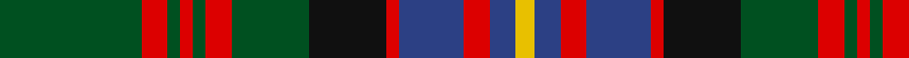

**Bands:** [GRGRGRGKRBRBY](/stripes/grgrgrgkrbrby/) · **Stripes:** [DG R DG R DG R DG K R DB R DB LY](/stripes/stripes13/) DG R DG R DG R DG K R DB R DB LY

This was sourced from register-of-tartans.  It is a [13 band tartan](/bands/bands13/).

Original link https://www.tartanregister.gov.uk/tartanDetails.aspx?ref=696

## Attestations

This cloth appears in 2 source records; the oldest owns this page.

- undated — Cochrane (1974) (register-of-tartans, [record](https://www.tartanregister.gov.uk/tartanDetails.aspx?ref=696))
- undated — Cochrane LC (weddslist, [record](http://www.weddslist.com/cgi-bin/tartans/pg.pl?source=tinsel))

## Register references

External register numbers recorded for this tartan.

- Scottish Register of Tartans: [1166](https://www.tartanregister.gov.uk/tartanDetails.aspx?ref=1166)
- Scottish Register of Tartans: [1510](https://www.tartanregister.gov.uk/tartanDetails.aspx?ref=1510)
- Scottish Register of Tartans: [1758](https://www.tartanregister.gov.uk/tartanDetails.aspx?ref=1758)
- Scottish Register of Tartans: [2307](https://www.tartanregister.gov.uk/tartanDetails.aspx?ref=2307)
- Scottish Register of Tartans: [2349](https://www.tartanregister.gov.uk/tartanDetails.aspx?ref=2349)
- Scottish Register of Tartans: [2540](https://www.tartanregister.gov.uk/tartanDetails.aspx?ref=2540)
- Scottish Register of Tartans: [2582](https://www.tartanregister.gov.uk/tartanDetails.aspx?ref=2582)
- Scottish Register of Tartans: [2585](https://www.tartanregister.gov.uk/tartanDetails.aspx?ref=2585)
- Scottish Register of Tartans: [2625](https://www.tartanregister.gov.uk/tartanDetails.aspx?ref=2625)
- Scottish Register of Tartans: [2730](https://www.tartanregister.gov.uk/tartanDetails.aspx?ref=2730)
- Scottish Register of Tartans: [2862](https://www.tartanregister.gov.uk/tartanDetails.aspx?ref=2862)
- Scottish Register of Tartans: [3072](https://www.tartanregister.gov.uk/tartanDetails.aspx?ref=3072)
- Scottish Register of Tartans: [3555](https://www.tartanregister.gov.uk/tartanDetails.aspx?ref=3555)
- Scottish Register of Tartans: [4925](https://www.tartanregister.gov.uk/tartanDetails.aspx?ref=4925)
- Scottish Register of Tartans: [696](https://www.tartanregister.gov.uk/tartanDetails.aspx?ref=696)
- Scottish Register of Tartans: [697](https://www.tartanregister.gov.uk/tartanDetails.aspx?ref=697)
- Scottish Register of Tartans: [982](https://www.tartanregister.gov.uk/tartanDetails.aspx?ref=982)
- Scottish Tartans Authority (ITI): 1277
- Scottish Tartans Authority (ITI): 1429
- Scottish Tartans Authority (ITI): 218
- Scottish Tartans Authority (ITI): 977
- Scottish Tartans World Register: 1042
- Scottish Tartans World Register: 127
- Scottish Tartans World Register: 1277
- Scottish Tartans World Register: 1399
- Scottish Tartans World Register: 1429
- Scottish Tartans World Register: 1593
- Scottish Tartans World Register: 218
- Scottish Tartans World Register: 2218
- Scottish Tartans World Register: 3061
- Scottish Tartans World Register: 441
- Scottish Tartans World Register: 737
- Scottish Tartans World Register: 858
- Scottish Tartans World Register: 864
- Scottish Tartans World Register: 873
- Scottish Tartans World Register: 897
- Scottish Tartans World Register: 977
- Scottish Tartans World Register: 978

## Variants

Other setts woven to the same stripe pattern.

- [Cochrane LC](/setts/s13/dg22r4dg2r2dg2r4dg12k12r2db10r4db4ly3/)

## Thread count
G/44 R8 G4 R4 G4 R8 G24 K24 R4 B20 R8 B8 Y/6

## Palette
Each colour and its ΔE from the base-6 reference it is a variant of.

| Colour | Shade | Base | ΔE (OKLab) |
|---|---|---|---|
| B | <code style="background-color:#2C4084;">#2C4084</code> `#2C4084` | B <code style="background-color:#2A418A;">#2A418A</code> | 0.01 |
| G | <code style="background-color:#005020;">#005020</code> `#005020` | G <code style="background-color:#006100;">#006100</code> | 0.07 |
| K | <code style="background-color:#101010;">#101010</code> `#101010` | K <code style="background-color:#000000;">#000000</code> | 0.17 |
| R | <code style="background-color:#DC0000;">#DC0000</code> `#DC0000` | R <code style="background-color:#CC0000;">#CC0000</code> | 0.03 |
| Y | <code style="background-color:#E8C000;">#E8C000</code> `#E8C000` | Y <code style="background-color:#F2BF00;">#F2BF00</code> | 0.02 |

## Nearest tartans

The nearest existing variants by ΔTartan distance.

1. [Reid Family Tartan Tartan Number: 2066. Earliest known date: 1991 Designed for Mr. William Reid, President of DELCO Scottish games. See products available Copyright © Blair Urquhart, Comrie, 2015](/setts/s13/w1r2g10r2g2db8g2k8g2r2g10r2w1~x2/) — ΔT 0.75
1. [Reid, Green](/setts/s13/w1r2g10r2g2db8g2k8g2r2g10r2w1~x4/) — ΔT 0.82
1. [Connolly Hunting (Name)](/setts/s10/k6r2k2r2k6db7g20ly2g3r2~x2/) — ΔT 0.89
1. [Dama Resort](/setts/s11/p3k2n6k2n2k18y13lb2y2k6p2~x2/) — ΔT 0.90
1. [Fraser Hunting](/setts/s11/r3dy18g10dy2db10dy2db10dy2g10dy18w3~x2/) — ΔT 0.96
1. [California Firefighters (Corporate)](/setts/s12/o4k2r2k1r1k1r2db3o1dg4o9dg1~x4/) — ΔT 0.97
1. [Royal College of Physicians Corporate Tartan Tartan Number: 2350. Earliest known date: September 1996 Full name is Royal College of Physicians, Edinburgh. Designed for the Royal College of Physicians (founded in 1681 for post graduate students), by Donald Fraser Weavers as a corporate tartan. Woven by Lochcarron, May 1997. Silk sample in STA Johnston Collection. See products available Copyright © Blair Urquhart, Comrie, 2015](/setts/s10/g23r3k9r3db18r3k9r3g23ly3~x2/) — ΔT 0.99
1. [Cochrane LC](/setts/s13/dg22r4dg2r2dg2r4dg12k12r2db10r4db4ly3/) — ΔT 1.02
1. [Ogilvie of Inverarity (Wilson) / Ochterlonie](/setts/s16/db20ly3k7g11k2g3k2g3r4g3k2g3k2g11k7ly3~x2/) — ΔT 1.03
1. [Dama Resort (Fashion)](/setts/s11/dp3k2n6k2n2k18g13lb2g2k6dp2~x2/) — ΔT 1.03

## Neighbour map

Every grey dot is one of 14313 variants placed by the first two principal components of the ΔTartan feature space (44% of its variance). Red is this tartan; blue dots are its nearest — click one to open its page.

<svg viewBox="0 0 640 380" role="img" style="max-width:100%;height:auto;border:1px solid #e0e0e0;border-radius:4px;display:block" xmlns="http://www.w3.org/2000/svg"><image href="/nn/cloud.v1.png" width="640" height="380"/><a href="/setts/s13/w1r2g10r2g2db8g2k8g2r2g10r2w1~x2/"><circle cx="214.5" cy="165.1" r="4" fill="#3465a4"><title>Reid Family Tartan Tartan Number: 2066. Earliest known date: 1991 Designed for Mr. William Reid, President of DELCO Scottish games. See products available Copyright © Blair Urquhart, Comrie, 2015</title></circle></a><a href="/setts/s13/w1r2g10r2g2db8g2k8g2r2g10r2w1~x4/"><circle cx="208.9" cy="162.8" r="4" fill="#3465a4"><title>Reid, Green</title></circle></a><a href="/setts/s10/k6r2k2r2k6db7g20ly2g3r2~x2/"><circle cx="207.7" cy="165.5" r="4" fill="#3465a4"><title>Connolly Hunting (Name)</title></circle></a><a href="/setts/s11/p3k2n6k2n2k18y13lb2y2k6p2~x2/"><circle cx="230.2" cy="171.4" r="4" fill="#3465a4"><title>Dama Resort</title></circle></a><a href="/setts/s11/r3dy18g10dy2db10dy2db10dy2g10dy18w3~x2/"><circle cx="220.7" cy="195.6" r="4" fill="#3465a4"><title>Fraser Hunting</title></circle></a><a href="/setts/s12/o4k2r2k1r1k1r2db3o1dg4o9dg1~x4/"><circle cx="174.3" cy="157.4" r="4" fill="#3465a4"><title>California Firefighters (Corporate)</title></circle></a><a href="/setts/s10/g23r3k9r3db18r3k9r3g23ly3~x2/"><circle cx="201.2" cy="191.0" r="4" fill="#3465a4"><title>Royal College of Physicians Corporate Tartan Tartan Number: 2350. Earliest known date: September 1996 Full name is Royal College of Physicians, Edinburgh. Designed for the Royal College of Physicians (founded in 1681 for post graduate students), by Donald Fraser Weavers as a corporate tartan. Woven by Lochcarron, May 1997. Silk sample in STA Johnston Collection. See products available Copyright © Blair Urquhart, Comrie, 2015</title></circle></a><a href="/setts/s13/dg22r4dg2r2dg2r4dg12k12r2db10r4db4ly3/"><circle cx="187.3" cy="151.3" r="4" fill="#3465a4"><title>Cochrane LC</title></circle></a><a href="/setts/s16/db20ly3k7g11k2g3k2g3r4g3k2g3k2g11k7ly3~x2/"><circle cx="166.3" cy="157.0" r="4" fill="#3465a4"><title>Ogilvie of Inverarity (Wilson) / Ochterlonie</title></circle></a><a href="/setts/s11/dp3k2n6k2n2k18g13lb2g2k6dp2~x2/"><circle cx="233.1" cy="176.5" r="4" fill="#3465a4"><title>Dama Resort (Fashion)</title></circle></a><circle cx="209.2" cy="158.7" r="5" fill="#c00000"/></svg>

ID: /setts/s13/dg22r4dg2r2dg2r4dg12k12r2db10r4db4ly3~x2/
