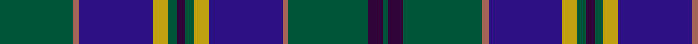

This page is one **sett** — a single exact thread-count. It belongs to the [tartan](/tartans/dg25o2db25ly5dg3dp3dg3ly5db25o2dg27dp5dg2/)
(the same proportion at any scale), whose colour order is pattern [GBGRBYGBGYBRG](/stripes/gbgrbygbgybrg/).

Sourced from house-of-tartan.  It is a [13 stripe tartan](/stripes/stripes13/).

Original link http://www.house-of-tartan.scotland.net/house/TartanViewjs.asp?colr=Def&tnam=2280

## Thread count
G/50 LT4 DB50 DY10 G6 DP6 G6 DY10 DB50 LT4 G54 DP10 G/4

## Palette

Palette: <strong>custom</strong>
<table><thead><tr><th>Colour</th><th>Threads</th><th>Shade</th><th>Base</th><th>OKLCh</th></tr></thead><tbody><tr><td>G/</td><td style="text-align:right;font-variant-numeric:tabular-nums">50</td><td><code style="background-color:#005438;">#005438</code> <small style="color:#888">#005438</small></td><td>G <code style="background-color:#006100;">#006100</code></td><td><small style="color:#888">oklch(39.4% 0.086 162.5)</small></td></tr><tr><td>LT</td><td style="text-align:right;font-variant-numeric:tabular-nums">4</td><td><code style="background-color:#A46458;">#A46458</code> <small style="color:#888">#A46458</small></td><td>R <code style="background-color:#CC0000;">#CC0000</code></td><td><small style="color:#888">oklch(57.1% 0.086 31.3)</small></td></tr><tr><td>DB</td><td style="text-align:right;font-variant-numeric:tabular-nums">50</td><td><code style="background-color:#2C1084;">#2C1084</code> <small style="color:#888">#2C1084</small></td><td>B <code style="background-color:#2A418A;">#2A418A</code></td><td><small style="color:#888">oklch(31.6% 0.172 281.2)</small></td></tr><tr><td>DY</td><td style="text-align:right;font-variant-numeric:tabular-nums">10</td><td><code style="background-color:#C0A010;">#C0A010</code> <small style="color:#888">#C0A010</small></td><td>Y <code style="background-color:#F2BF00;">#F2BF00</code></td><td><small style="color:#888">oklch(71.4% 0.143 94.2)</small></td></tr><tr><td>G</td><td style="text-align:right;font-variant-numeric:tabular-nums">6</td><td><code style="background-color:#005438;">#005438</code> <small style="color:#888">#005438</small></td><td>G <code style="background-color:#006100;">#006100</code></td><td><small style="color:#888">oklch(39.4% 0.086 162.5)</small></td></tr><tr><td>DP</td><td style="text-align:right;font-variant-numeric:tabular-nums">6</td><td><code style="background-color:#300438;">#300438</code> <small style="color:#888">#300438</small></td><td>B <code style="background-color:#2A418A;">#2A418A</code></td><td><small style="color:#888">oklch(22.9% 0.100 320.9)</small></td></tr><tr><td>G</td><td style="text-align:right;font-variant-numeric:tabular-nums">6</td><td><code style="background-color:#005438;">#005438</code> <small style="color:#888">#005438</small></td><td>G <code style="background-color:#006100;">#006100</code></td><td><small style="color:#888">oklch(39.4% 0.086 162.5)</small></td></tr><tr><td>DY</td><td style="text-align:right;font-variant-numeric:tabular-nums">10</td><td><code style="background-color:#C0A010;">#C0A010</code> <small style="color:#888">#C0A010</small></td><td>Y <code style="background-color:#F2BF00;">#F2BF00</code></td><td><small style="color:#888">oklch(71.4% 0.143 94.2)</small></td></tr><tr><td>DB</td><td style="text-align:right;font-variant-numeric:tabular-nums">50</td><td><code style="background-color:#2C1084;">#2C1084</code> <small style="color:#888">#2C1084</small></td><td>B <code style="background-color:#2A418A;">#2A418A</code></td><td><small style="color:#888">oklch(31.6% 0.172 281.2)</small></td></tr><tr><td>LT</td><td style="text-align:right;font-variant-numeric:tabular-nums">4</td><td><code style="background-color:#A46458;">#A46458</code> <small style="color:#888">#A46458</small></td><td>R <code style="background-color:#CC0000;">#CC0000</code></td><td><small style="color:#888">oklch(57.1% 0.086 31.3)</small></td></tr><tr><td>G</td><td style="text-align:right;font-variant-numeric:tabular-nums">54</td><td><code style="background-color:#005438;">#005438</code> <small style="color:#888">#005438</small></td><td>G <code style="background-color:#006100;">#006100</code></td><td><small style="color:#888">oklch(39.4% 0.086 162.5)</small></td></tr><tr><td>DP</td><td style="text-align:right;font-variant-numeric:tabular-nums">10</td><td><code style="background-color:#300438;">#300438</code> <small style="color:#888">#300438</small></td><td>B <code style="background-color:#2A418A;">#2A418A</code></td><td><small style="color:#888">oklch(22.9% 0.100 320.9)</small></td></tr><tr><td>G/</td><td style="text-align:right;font-variant-numeric:tabular-nums">4</td><td><code style="background-color:#005438;">#005438</code> <small style="color:#888">#005438</small></td><td>G <code style="background-color:#006100;">#006100</code></td><td><small style="color:#888">oklch(39.4% 0.086 162.5)</small></td></tr></tbody></table>

## Nearest tartans

The nearest existing variants by ΔTartan distance, with this tartan at the top so the swatches line up against it.

ΔTartan

Tartan

Sett

—

<a href="/ttd/edit/#slug=dg25o2db25ly5dg3dp3dg3ly5db25o2dg27dp5dg2~x2">Kilkenny Irish County Tartan Tartan Number: 2280. Earliest known date: 1995 One of a series of Irish District tartans designed by Polly Wittering of the House of Edgar, with colours reminiscent of the Country with soft warm colours dominating. See products available Copyright © Blair Urquhart, Comrie, 2015</a> <a class="nn-out" href="/setts/s13/dg25o2db25ly5dg3dp3dg3ly5db25o2dg27dp5dg2~x2/" title="open its dictionary page">↗</a>

0.80

<a href="/ttd/edit/#slug=db6k2db24k10g2m2g2m2g10k2lb3~x2">Scottish Rugby Union (Sports)</a> <a class="nn-out" href="/setts/s11/db6k2db24k10g2m2g2m2g10k2lb3~x2/" title="open its dictionary page">↗</a>

0.87

<a href="/ttd/edit/#slug=db18dp2k2db2dp2k1db2k8g1ly1g6k8db14k2g2~x2">Angove, the Black Swan</a> <a class="nn-out" href="/setts/s15/db18dp2k2db2dp2k1db2k8g1ly1g6k8db14k2g2~x2/" title="open its dictionary page">↗</a>

0.88

<a href="/ttd/edit/#slug=w2n4dy3dt3dy3dt20dy3n16dt8lt2~x2">Sverker</a> <a class="nn-out" href="/setts/s10/w2n4dy3dt3dy3dt20dy3n16dt8lt2~x2/" title="open its dictionary page">↗</a>

0.90

<a href="/ttd/edit/#slug=db36dg10r2dg10w2dg10r2dg10k14r2db12r3db2r2db4w2~x2">Rankin</a> <a class="nn-out" href="/setts/s16/db36dg10r2dg10w2dg10r2dg10k14r2db12r3db2r2db4w2~x2/" title="open its dictionary page">↗</a>

0.97

<a href="/ttd/edit/#slug=db4y32db4y4db32m6db32dg4db3dg32w4">American Society of Travel Agents, The (2001)</a> <a class="nn-out" href="/setts/s11/db4y32db4y4db32m6db32dg4db3dg32w4/" title="open its dictionary page">↗</a>

0.99

<a href="/ttd/edit/#slug=db4k3db23k9g2t2g2t2g8k2ly3~x2">Forth</a> <a class="nn-out" href="/setts/s11/db4k3db23k9g2t2g2t2g8k2ly3~x2/" title="open its dictionary page">↗</a>

1.05

<a href="/ttd/edit/#slug=g3db2r1db17r2g8r4t1db8r2g17r2r1db3t1~x2">Glenorchy - National Archives</a> <a class="nn-out" href="/setts/s15/g3db2r1db17r2g8r4t1db8r2g17r2r1db3t1~x2/" title="open its dictionary page">↗</a>

1.05

<a href="/ttd/edit/#slug=dg30ly2dg5ly2dg4k15db29r2db29k15dg5ly2dg4ly2dg17~x2">Unidentified (Teddy Bear)</a> <a class="nn-out" href="/setts/s15/dg30ly2dg5ly2dg4k15db29r2db29k15dg5ly2dg4ly2dg17~x2/" title="open its dictionary page">↗</a>

1.08

<a href="/setts/s16/k4b4k2b4k2b22dy27ly2r3~x2/">Falkirk District Tartan Tartan Number: 2347. Earliest known date: 1989 The original Falkirk &quot;Tartan&quot; , now in the National Museum of Scotland, has a place in history as one of the earliest examples of Scottish cloth in existence. It is a direct link back to the Roman occupation of the area around 250 A.D.and was found stuffed into a pot filled with over 2000 silver coins. This early Celtic tweed used undyed yarn to give a herringbone pattern in brown hues and is considered to be a &quot;poor man's plaid&quot;. The Falkirk District Tartan is alive with vibrant colour to reflect that part of Scotland as it is seen today. It was the winning entry by Jim McGeorge (aided by Tony Murray of Stirling) in a public competition run by Falkirk Town Centre Management to create a new image for an area that was rising from the ashes of its former industrial glory. Brown - represents the dominant colour of the original cloth; blue - links Falkirk district with sea via the River Forth and the canals. It is also the colour of the Falkirk &quot;Bairns.&quot; Red - is the colour of the blast furnace flames from the Falkirk foundries and yellow - signifies wealth and prosperity. Black - the black lines intersect on blue to show Falkirk at the crossroads of all roads through the region. See products available Copyright © Blair Urquhart, Comrie, 2015</a>

1.08

<a href="/ttd/edit/#slug=r2dt6g15db6dt4db4dt28db4dt4db6g6ly2~x2">Los Angeles Police Bagpipe Band</a> <a class="nn-out" href="/setts/s12/r2dt6g15db6dt4db4dt28db4dt4db6g6ly2~x2/" title="open its dictionary page">↗</a>

## Neighbour map

Every grey dot is one of 14299 variants placed by the first two principal components of the ΔTartan feature space (44% of its variance). Red is this tartan; blue dots are its nearest — click one to open its page.

<svg viewBox="0 0 640 380" role="img" style="max-width:100%;height:auto;border:1px solid #e0e0e0;border-radius:4px;display:block" xmlns="http://www.w3.org/2000/svg"><image href="/nn/cloud.v1.png" width="640" height="380"/><a href="/setts/s11/db6k2db24k10g2m2g2m2g10k2lb3~x2/"><circle cx="240.1" cy="158.9" r="4" fill="#3465a4"><title>Scottish Rugby Union (Sports)</title></circle></a><a href="/setts/s15/db18dp2k2db2dp2k1db2k8g1ly1g6k8db14k2g2~x2/"><circle cx="302.4" cy="145.3" r="4" fill="#3465a4"><title>Angove, the Black Swan</title></circle></a><a href="/setts/s10/w2n4dy3dt3dy3dt20dy3n16dt8lt2~x2/"><circle cx="255.6" cy="183.7" r="4" fill="#3465a4"><title>Sverker</title></circle></a><a href="/setts/s16/db36dg10r2dg10w2dg10r2dg10k14r2db12r3db2r2db4w2~x2/"><circle cx="251.0" cy="131.2" r="4" fill="#3465a4"><title>Rankin</title></circle></a><a href="/setts/s11/db4y32db4y4db32m6db32dg4db3dg32w4/"><circle cx="234.4" cy="170.3" r="4" fill="#3465a4"><title>American Society of Travel Agents, The (2001)</title></circle></a><a href="/setts/s11/db4k3db23k9g2t2g2t2g8k2ly3~x2/"><circle cx="225.3" cy="156.5" r="4" fill="#3465a4"><title>Forth</title></circle></a><a href="/setts/s15/g3db2r1db17r2g8r4t1db8r2g17r2r1db3t1~x2/"><circle cx="249.4" cy="131.9" r="4" fill="#3465a4"><title>Glenorchy - National Archives</title></circle></a><a href="/setts/s15/dg30ly2dg5ly2dg4k15db29r2db29k15dg5ly2dg4ly2dg17~x2/"><circle cx="230.5" cy="157.6" r="4" fill="#3465a4"><title>Unidentified (Teddy Bear)</title></circle></a><a href="/setts/s16/k4b4k2b4k2b22dy27ly2r3~x2/"><circle cx="268.3" cy="136.7" r="4" fill="#3465a4"><title>Falkirk District Tartan Tartan Number: 2347. Earliest known date: 1989 The original Falkirk &quot;Tartan&quot; , now in the National Museum of Scotland, has a place in history as one of the earliest examples of Scottish cloth in existence. It is a direct link back to the Roman occupation of the area around 250 A.D.and was found stuffed into a pot filled with over 2000 silver coins. This early Celtic tweed used undyed yarn to give a herringbone pattern in brown hues and is considered to be a &quot;poor man's plaid&quot;. The Falkirk District Tartan is alive with vibrant colour to reflect that part of Scotland as it is seen today. It was the winning entry by Jim McGeorge (aided by Tony Murray of Stirling) in a public competition run by Falkirk Town Centre Management to create a new image for an area that was rising from the ashes of its former industrial glory. Brown - represents the dominant colour of the original cloth; blue - links Falkirk district with sea via the River Forth and the canals. It is also the colour of the Falkirk &quot;Bairns.&quot; Red - is the colour of the blast furnace flames from the Falkirk foundries and yellow - signifies wealth and prosperity. Black - the black lines intersect on blue to show Falkirk at the crossroads of all roads through the region. See products available Copyright © Blair Urquhart, Comrie, 2015</title></circle></a><a href="/setts/s12/r2dt6g15db6dt4db4dt28db4dt4db6g6ly2~x2/"><circle cx="289.5" cy="181.5" r="4" fill="#3465a4"><title>Los Angeles Police Bagpipe Band</title></circle></a><circle cx="263.7" cy="161.5" r="5" fill="#c00000"/></svg>

ID: /setts/s13/dg25o2db25ly5dg3dp3dg3ly5db25o2dg27dp5dg2~x2/
