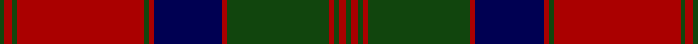

In pattern [GRGRGRBRGRGRG](/stripes/grgrgrbrgrgrg/).

This was sourced from weddslist.  It is a [13 stripe tartan](/stripes/stripes13/).

Original link http://www.weddslist.com/cgi-bin/tartans/pg.pl?source=x

## Thread count
DG/2 DR3 DG2 DR52 DG2 DR2 DB28 DR2 DG42 DR2 DG2 DR3 DG/2

## Palette
Each colour and the base-6 reference it is a variant of.

| Colour | Shade | Base |
|---|---|---|
| DB | <code style="background-color:#000052;">#000052</code> `oklch(19.8% 0.137 264.1)` <small>#000052</small> | B <code style="background-color:#2A418A;">#2A418A</code> |
| DG | <code style="background-color:#11450D;">#11450D</code> `oklch(34.4% 0.101 142.1)` <small>#11450D</small> | G <code style="background-color:#006100;">#006100</code> |
| DR | <code style="background-color:#AA0000;">#AA0000</code> `oklch(46.3% 0.190 29.2)` <small>#AA0000</small> | R <code style="background-color:#CC0000;">#CC0000</code> |

## Nearest tartans

The nearest existing variants by ΔTartan distance.

1. [MacQuarrie 1815](/setts/s13/dg1r2dg1r26dg1r1db14r1dg21r1dg1r2dg1/) — ΔT 0.79
1. [Fraser of Altyre](/setts/s14/r4db2r45db2r2db40r4db4r2db2r2g40r2db2~x2/) — ΔT 0.87
1. [MacQuarrie #3](/setts/s13/dg2r3dg2r52dg2r2db28r2dg42r2dg2r3dg2~x2/) — ΔT 0.89
1. [Stewart of Appin](/setts/s16/r3db2b1r2dg24r4dg2r2db8r2dg2r24db2b1r2dg2~x2/) — ΔT 1.03
1. [Fraser of Altyre](/setts/s14/r9db4r89db4r4db80r9db9r4db4r4g80r4db4/) — ΔT 1.03
1. [Stewart/Stuart of Atholl](/setts/s16/dg22k1dg2k1dg3k8r20k1r3~x4/) — ΔT 1.07
1. [MacQuarrie 3](/setts/s13/g2r3g2r52g2r2db28r2g42r2g2r3g2~x2/) — ΔT 1.18
1. [Harbor Club (Corporate)](/setts/s10/r47g14k5ly2k3g7~x2/) — ΔT 1.19
1. [Drumbeg](/setts/s12/o12n3o3dt4o16r3o3r3o3r16dt52o4/) — ΔT 1.21
1. [Matheson](/setts/s21/dg8r4dg1r1dg1r24db8dg4r1dg1r1dg4r8dg1r1dg1r1db8dg8r2dg4~x2/) — ΔT 1.23

## Neighbour map

Every grey dot is one of 14299 variants placed by the first two principal components of the ΔTartan feature space (44% of its variance). Red is this tartan; blue dots are its nearest — click one to open its page.

<svg viewBox="0 0 640 380" role="img" style="max-width:100%;height:auto;border:1px solid #e0e0e0;border-radius:4px;display:block" xmlns="http://www.w3.org/2000/svg"><image href="/nn/cloud.v1.png" width="640" height="380"/><a href="/setts/s13/dg1r2dg1r26dg1r1db14r1dg21r1dg1r2dg1/"><circle cx="331.8" cy="113.9" r="4" fill="#3465a4"><title>MacQuarrie 1815</title></circle></a><a href="/setts/s14/r4db2r45db2r2db40r4db4r2db2r2g40r2db2~x2/"><circle cx="311.5" cy="123.0" r="4" fill="#3465a4"><title>Fraser of Altyre</title></circle></a><a href="/setts/s13/dg2r3dg2r52dg2r2db28r2dg42r2dg2r3dg2~x2/"><circle cx="342.0" cy="114.9" r="4" fill="#3465a4"><title>MacQuarrie #3</title></circle></a><a href="/setts/s16/r3db2b1r2dg24r4dg2r2db8r2dg2r24db2b1r2dg2~x2/"><circle cx="334.3" cy="110.8" r="4" fill="#3465a4"><title>Stewart of Appin</title></circle></a><a href="/setts/s14/r9db4r89db4r4db80r9db9r4db4r4g80r4db4/"><circle cx="310.4" cy="124.7" r="4" fill="#3465a4"><title>Fraser of Altyre</title></circle></a><a href="/setts/s16/dg22k1dg2k1dg3k8r20k1r3~x4/"><circle cx="310.9" cy="129.1" r="4" fill="#3465a4"><title>Stewart/Stuart of Atholl</title></circle></a><a href="/setts/s13/g2r3g2r52g2r2db28r2g42r2g2r3g2~x2/"><circle cx="342.5" cy="118.0" r="4" fill="#3465a4"><title>MacQuarrie 3</title></circle></a><a href="/setts/s10/r47g14k5ly2k3g7~x2/"><circle cx="324.6" cy="138.9" r="4" fill="#3465a4"><title>Harbor Club (Corporate)</title></circle></a><a href="/setts/s12/o12n3o3dt4o16r3o3r3o3r16dt52o4/"><circle cx="308.8" cy="136.0" r="4" fill="#3465a4"><title>Drumbeg</title></circle></a><a href="/setts/s21/dg8r4dg1r1dg1r24db8dg4r1dg1r1dg4r8dg1r1dg1r1db8dg8r2dg4~x2/"><circle cx="333.9" cy="125.9" r="4" fill="#3465a4"><title>Matheson</title></circle></a><circle cx="349.7" cy="126.0" r="5" fill="#c00000"/></svg>

ID: /setts/s13/dg2r3dg2r52dg2r2db28r2dg42r2dg2r3dg2/
