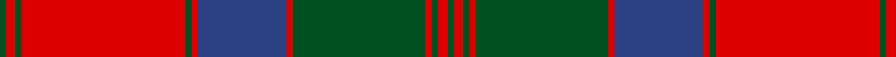

**Bands:** [GRGRGRBRGRGRG](/stripes/grgrgrbrgrgrg/) · **Stripes:** [DG R DG R DG R DB R DG R DG R DG](/stripes/stripes13/) DG R DG R DG R DB R DG R DG R DG

This was sourced from register-of-tartans.  It is a [13 band tartan](/bands/bands13/).

Original link https://www.tartanregister.gov.uk/tartanDetails.aspx?ref=2730

## Also known as

This cloth is also recorded under:

- MacQuarrie #3
- MacQuarrie 3

## Attestations

This cloth appears in 2 source records; the oldest owns this page.

- undated — MacQuarrie #3 (register-of-tartans, [record](https://www.tartanregister.gov.uk/tartanDetails.aspx?ref=2730))
- undated — MacQuarrie 1815 (weddslist, [record](http://www.weddslist.com/cgi-bin/tartans/pg.pl?source=tinsel))

## Register references

External register numbers recorded for this tartan.

- Scottish Register of Tartans: [1166](https://www.tartanregister.gov.uk/tartanDetails.aspx?ref=1166)
- Scottish Register of Tartans: [1510](https://www.tartanregister.gov.uk/tartanDetails.aspx?ref=1510)
- Scottish Register of Tartans: [1758](https://www.tartanregister.gov.uk/tartanDetails.aspx?ref=1758)
- Scottish Register of Tartans: [2307](https://www.tartanregister.gov.uk/tartanDetails.aspx?ref=2307)
- Scottish Register of Tartans: [2349](https://www.tartanregister.gov.uk/tartanDetails.aspx?ref=2349)
- Scottish Register of Tartans: [2540](https://www.tartanregister.gov.uk/tartanDetails.aspx?ref=2540)
- Scottish Register of Tartans: [2582](https://www.tartanregister.gov.uk/tartanDetails.aspx?ref=2582)
- Scottish Register of Tartans: [2585](https://www.tartanregister.gov.uk/tartanDetails.aspx?ref=2585)
- Scottish Register of Tartans: [2625](https://www.tartanregister.gov.uk/tartanDetails.aspx?ref=2625)
- Scottish Register of Tartans: [2730](https://www.tartanregister.gov.uk/tartanDetails.aspx?ref=2730)
- Scottish Register of Tartans: [2862](https://www.tartanregister.gov.uk/tartanDetails.aspx?ref=2862)
- Scottish Register of Tartans: [3072](https://www.tartanregister.gov.uk/tartanDetails.aspx?ref=3072)
- Scottish Register of Tartans: [3555](https://www.tartanregister.gov.uk/tartanDetails.aspx?ref=3555)
- Scottish Register of Tartans: [4925](https://www.tartanregister.gov.uk/tartanDetails.aspx?ref=4925)
- Scottish Register of Tartans: [696](https://www.tartanregister.gov.uk/tartanDetails.aspx?ref=696)
- Scottish Register of Tartans: [697](https://www.tartanregister.gov.uk/tartanDetails.aspx?ref=697)
- Scottish Register of Tartans: [982](https://www.tartanregister.gov.uk/tartanDetails.aspx?ref=982)
- Scottish Tartans Authority (ITI): 1277
- Scottish Tartans Authority (ITI): 1429
- Scottish Tartans Authority (ITI): 218
- Scottish Tartans Authority (ITI): 977
- Scottish Tartans World Register: 1042
- Scottish Tartans World Register: 127
- Scottish Tartans World Register: 1277
- Scottish Tartans World Register: 1399
- Scottish Tartans World Register: 1429
- Scottish Tartans World Register: 1593
- Scottish Tartans World Register: 218
- Scottish Tartans World Register: 2218
- Scottish Tartans World Register: 3061
- Scottish Tartans World Register: 441
- Scottish Tartans World Register: 737
- Scottish Tartans World Register: 858
- Scottish Tartans World Register: 864
- Scottish Tartans World Register: 873
- Scottish Tartans World Register: 897
- Scottish Tartans World Register: 977
- Scottish Tartans World Register: 978

## Variants

Other setts woven to the same stripe pattern.

- [MacQuarrie 1815](/setts/s13/dg1r2dg1r26dg1r1db14r1dg21r1dg1r2dg1/)
- [MacQuarrie 1815](/setts/s13/dg2r3dg2r52dg2r2db28r2dg42r2dg2r3dg2/)

## Thread count
G/4 R6 G4 R104 G4 R4 B56 R4 G84 R4 G4 R6 G/4

## Palette
Each colour and its ΔE from the base-6 reference it is a variant of.

| Colour | Shade | Base | ΔE (OKLab) |
|---|---|---|---|
| B | <code style="background-color:#2C4084;">#2C4084</code> `#2C4084` | B <code style="background-color:#2A418A;">#2A418A</code> | 0.01 |
| G | <code style="background-color:#005020;">#005020</code> `#005020` | G <code style="background-color:#006100;">#006100</code> | 0.07 |
| R | <code style="background-color:#DC0000;">#DC0000</code> `#DC0000` | R <code style="background-color:#CC0000;">#CC0000</code> | 0.03 |

## Nearest tartans

The nearest existing variants by ΔTartan distance.

1. [MacQuarrie 3](/setts/s13/g2r3g2r52g2r2db28r2g42r2g2r3g2~x2/) — ΔT 0.71
1. [MacQuarrie 1815](/setts/s13/dg1r2dg1r26dg1r1db14r1dg21r1dg1r2dg1/) — ΔT 0.74
1. [Fraser of Altyre](/setts/s14/r9db4r89db4r4db80r9db9r4db4r4g80r4db4/) — ΔT 0.77
1. [Fraser of Altyre](/setts/s14/r4db2r45db2r2db40r4db4r2db2r2g40r2db2~x2/) — ΔT 0.89
1. [MacQuarrie 1815](/setts/s13/dg2r3dg2r52dg2r2db28r2dg42r2dg2r3dg2/) — ΔT 0.89
1. [MacQuarrie #4](/setts/s13/k1r1dg1r21dg1r1k10r1dg14r1dg1r1dg1~x2/) — ΔT 0.91
1. [Unidentified Coat](/setts/s14/dg6r2dg2r24t1db1r2db12r2db1t1r2dg24r2~x2/) — ΔT 0.98
1. [Stewart/Stuart of Atholl](/setts/s16/dg22k1dg2k1dg3k8r20k1r3~x4/) — ΔT 1.04
1. [Stewart of Appin - 1906](/setts/s16/r3db2t1r2g24r4g2r2db8r2g2r24db2t1r2g2~x2/) — ΔT 1.06
1. [Drummond #2](/setts/s12/db24r7dg7r39db4r2db2r5dg42r7db6r7~x2/) — ΔT 1.07

## Neighbour map

Every grey dot is one of 14299 variants placed by the first two principal components of the ΔTartan feature space (44% of its variance). Red is this tartan; blue dots are its nearest — click one to open its page.

<svg viewBox="0 0 640 380" role="img" style="max-width:100%;height:auto;border:1px solid #e0e0e0;border-radius:4px;display:block" xmlns="http://www.w3.org/2000/svg"><image href="/nn/cloud.v1.png" width="640" height="380"/><a href="/setts/s13/g2r3g2r52g2r2db28r2g42r2g2r3g2~x2/"><circle cx="342.5" cy="118.0" r="4" fill="#3465a4"><title>MacQuarrie 3</title></circle></a><a href="/setts/s13/dg1r2dg1r26dg1r1db14r1dg21r1dg1r2dg1/"><circle cx="331.8" cy="113.9" r="4" fill="#3465a4"><title>MacQuarrie 1815</title></circle></a><a href="/setts/s14/r9db4r89db4r4db80r9db9r4db4r4g80r4db4/"><circle cx="310.4" cy="124.7" r="4" fill="#3465a4"><title>Fraser of Altyre</title></circle></a><a href="/setts/s14/r4db2r45db2r2db40r4db4r2db2r2g40r2db2~x2/"><circle cx="311.5" cy="123.0" r="4" fill="#3465a4"><title>Fraser of Altyre</title></circle></a><a href="/setts/s13/dg2r3dg2r52dg2r2db28r2dg42r2dg2r3dg2/"><circle cx="349.7" cy="126.0" r="4" fill="#3465a4"><title>MacQuarrie 1815</title></circle></a><a href="/setts/s13/k1r1dg1r21dg1r1k10r1dg14r1dg1r1dg1~x2/"><circle cx="331.8" cy="116.8" r="4" fill="#3465a4"><title>MacQuarrie #4</title></circle></a><a href="/setts/s14/dg6r2dg2r24t1db1r2db12r2db1t1r2dg24r2~x2/"><circle cx="298.1" cy="108.8" r="4" fill="#3465a4"><title>Unidentified Coat</title></circle></a><a href="/setts/s16/dg22k1dg2k1dg3k8r20k1r3~x4/"><circle cx="310.9" cy="129.1" r="4" fill="#3465a4"><title>Stewart/Stuart of Atholl</title></circle></a><a href="/setts/s16/r3db2t1r2g24r4g2r2db8r2g2r24db2t1r2g2~x2/"><circle cx="326.7" cy="101.9" r="4" fill="#3465a4"><title>Stewart of Appin - 1906</title></circle></a><a href="/setts/s12/db24r7dg7r39db4r2db2r5dg42r7db6r7~x2/"><circle cx="306.7" cy="149.6" r="4" fill="#3465a4"><title>Drummond #2</title></circle></a><circle cx="342.0" cy="114.9" r="5" fill="#c00000"/></svg>

ID: /setts/s13/dg2r3dg2r52dg2r2db28r2dg42r2dg2r3dg2~x2/
