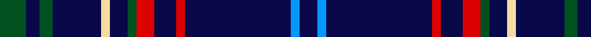

In pattern [BBBRBRGBWBGBG](/stripes/bbbrbrgbwbgbg/).

This was sourced from register-of-tartans.  It is a [13 stripe tartan](/stripes/stripes13/).

Original link https://www.tartanregister.gov.uk/tartanDetails.aspx?ref=2851

## Register references

External register numbers recorded for this tartan.

- Scottish Register of Tartans: [2851](https://www.tartanregister.gov.uk/tartanDetails.aspx?ref=2851)
- Scottish Tartans World Register: 2138

## Thread count
G/12 DB6 G6 DB22 LY4 DB8 G4 R8 DB10 R4 DB48 B4 DB/8

## Palette
Each colour and the base-6 reference it is a variant of.

| Colour | Shade | Base |
|---|---|---|
| B | <code style="background-color:#0596FA;">#0596FA</code> `oklch(66.0% 0.180 248.9)` <small>#0596FA</small> | B <code style="background-color:#2A418A;">#2A418A</code> |
| DB | <code style="background-color:#080848;">#080848</code> `oklch(20.2% 0.112 270.4)` <small>#080848</small> | B <code style="background-color:#2A418A;">#2A418A</code> |
| G | <code style="background-color:#005020;">#005020</code> `oklch(37.7% 0.105 149.6)` <small>#005020</small> | G <code style="background-color:#006100;">#006100</code> |
| LY | <code style="background-color:#F5DCA0;">#F5DCA0</code> `oklch(90.1% 0.082 88.0)` <small>#F5DCA0</small> | W <code style="background-color:#F7F7F7;">#F7F7F7</code> |
| R | <code style="background-color:#DC0000;">#DC0000</code> `oklch(56.2% 0.230 29.2)` <small>#DC0000</small> | R <code style="background-color:#CC0000;">#CC0000</code> |

## Nearest tartans

The nearest existing variants by ΔTartan distance, with this tartan at the top so the swatches line up against it.

ΔTartan

Tartan

Sett

—

<a href="/ttd/edit/#slug=dg6db3dg3db11w2db4dg2r4db5r2db24b2db4~x2">Massachusetts-The Bay State</a> <a class="nn-out" href="/setts/s13/dg6db3dg3db11w2db4dg2r4db5r2db24b2db4~x2/" title="open its dictionary page">↗</a>

0.95

<a href="/setts/s14/g20lr6db20ly3db48r6db4r6~x2/">Warren Wilson College</a>

0.98

<a href="/ttd/edit/#slug=g12db6g6db22lb4db8g4r8db10r3db48t4db8">Massachusetts - The Bay State (Dist)</a> <a class="nn-out" href="/setts/s13/g12db6g6db22lb4db8g4r8db10r3db48t4db8/" title="open its dictionary page">↗</a>

1.04

<a href="/ttd/edit/#slug=g12db6g6db22lb4db8g4r8db10r3db48b4db8">Massachusetts - The Bay State</a> <a class="nn-out" href="/setts/s13/g12db6g6db22lb4db8g4r8db10r3db48b4db8/" title="open its dictionary page">↗</a>

1.39

<a href="/ttd/edit/#slug=db15g2db2w1db1w1db1w1db2g2db15r10~x4">Ikelman #5 (Personal)</a> <a class="nn-out" href="/setts/s12/db15g2db2w1db1w1db1w1db2g2db15r10~x4/" title="open its dictionary page">↗</a>

1.43

<a href="/ttd/edit/#slug=r2k4w1k4db18g1db18k6db3ly1db2ly1db2ly2~x2">Wupper Pipes &amp; Drums (Corporate)</a> <a class="nn-out" href="/setts/s14/r2k4w1k4db18g1db18k6db3ly1db2ly1db2ly2~x2/" title="open its dictionary page">↗</a>

1.44

<a href="/ttd/edit/#slug=db5ly1db1ly1k4db15w1db2ly1db2w1db15k4ly1db1ly1db5w1~x4">SPA Association</a> <a class="nn-out" href="/setts/s18/db5ly1db1ly1k4db15w1db2ly1db2w1db15k4ly1db1ly1db5w1~x4/" title="open its dictionary page">↗</a>

1.47

<a href="/ttd/edit/#slug=w1db5ly1db1ly1k4db15w1db2ly1~x4">SPA Association (Corporate)</a> <a class="nn-out" href="/setts/s10/w1db5ly1db1ly1k4db15w1db2ly1~x4/" title="open its dictionary page">↗</a>

1.54

<a href="/ttd/edit/#slug=r3db21r3db3k13db13t3db3w2~x2">Fitzgerald, Blue</a> <a class="nn-out" href="/setts/s9/r3db21r3db3k13db13t3db3w2~x2/" title="open its dictionary page">↗</a>

1.54

<a href="/ttd/edit/#slug=g20lr6db20ly3db48r6db4r6~x2">Warren Wilson College (Corporate)</a> <a class="nn-out" href="/setts/s8/g20lr6db20ly3db48r6db4r6~x2/" title="open its dictionary page">↗</a>

1.54

<a href="/ttd/edit/#slug=db4r14dp6r5db12dg8db70m4">Loretto School</a> <a class="nn-out" href="/setts/s8/db4r14dp6r5db12dg8db70m4/" title="open its dictionary page">↗</a>

## Neighbour map

Every grey dot is one of 14299 variants placed by the first two principal components of the ΔTartan feature space (44% of its variance). Red is this tartan; blue dots are its nearest — click one to open its page.

<svg viewBox="0 0 640 380" role="img" style="max-width:100%;height:auto;border:1px solid #e0e0e0;border-radius:4px;display:block" xmlns="http://www.w3.org/2000/svg"><image href="/nn/cloud.v1.png" width="640" height="380"/><a href="/setts/s14/g20lr6db20ly3db48r6db4r6~x2/"><circle cx="405.0" cy="143.1" r="4" fill="#3465a4"><title>Warren Wilson College</title></circle></a><a href="/setts/s13/g12db6g6db22lb4db8g4r8db10r3db48t4db8/"><circle cx="418.3" cy="151.8" r="4" fill="#3465a4"><title>Massachusetts - The Bay State (Dist)</title></circle></a><a href="/setts/s13/g12db6g6db22lb4db8g4r8db10r3db48b4db8/"><circle cx="421.3" cy="153.3" r="4" fill="#3465a4"><title>Massachusetts - The Bay State</title></circle></a><a href="/setts/s12/db15g2db2w1db1w1db1w1db2g2db15r10~x4/"><circle cx="403.0" cy="152.3" r="4" fill="#3465a4"><title>Ikelman #5 (Personal)</title></circle></a><a href="/setts/s14/r2k4w1k4db18g1db18k6db3ly1db2ly1db2ly2~x2/"><circle cx="361.1" cy="113.5" r="4" fill="#3465a4"><title>Wupper Pipes &amp; Drums (Corporate)</title></circle></a><a href="/setts/s18/db5ly1db1ly1k4db15w1db2ly1db2w1db15k4ly1db1ly1db5w1~x4/"><circle cx="433.1" cy="132.3" r="4" fill="#3465a4"><title>SPA Association</title></circle></a><a href="/setts/s10/w1db5ly1db1ly1k4db15w1db2ly1~x4/"><circle cx="420.7" cy="148.5" r="4" fill="#3465a4"><title>SPA Association (Corporate)</title></circle></a><a href="/setts/s9/r3db21r3db3k13db13t3db3w2~x2/"><circle cx="306.4" cy="174.3" r="4" fill="#3465a4"><title>Fitzgerald, Blue</title></circle></a><a href="/setts/s8/g20lr6db20ly3db48r6db4r6~x2/"><circle cx="351.1" cy="165.1" r="4" fill="#3465a4"><title>Warren Wilson College (Corporate)</title></circle></a><a href="/setts/s8/db4r14dp6r5db12dg8db70m4/"><circle cx="411.4" cy="137.7" r="4" fill="#3465a4"><title>Loretto School</title></circle></a><circle cx="385.5" cy="157.5" r="5" fill="#c00000"/></svg>

ID: /setts/s13/dg6db3dg3db11w2db4dg2r4db5r2db24b2db4~x2/
