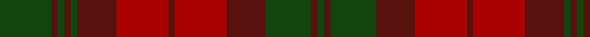

**Bands:** [GBGBRBRBGBGBG](/stripes/gbgbrbrbgbgbg/) · **Stripes:** [DG DR DG DR R DR R DR DG DR DG DR DG](/stripes/stripes13/) DG DR DG DR R DR R DR DG DR DG DR DG

This was sourced from weddslist.  It is a [13 band tartan](/bands/bands13/).

Original link http://www.weddslist.com/cgi-bin/tartans/pg.pl?source=x

## Register references

External register numbers recorded for this tartan.

- Scottish Register of Tartans: [1166](https://www.tartanregister.gov.uk/tartanDetails.aspx?ref=1166)
- Scottish Register of Tartans: [1758](https://www.tartanregister.gov.uk/tartanDetails.aspx?ref=1758)
- Scottish Register of Tartans: [2307](https://www.tartanregister.gov.uk/tartanDetails.aspx?ref=2307)
- Scottish Register of Tartans: [2540](https://www.tartanregister.gov.uk/tartanDetails.aspx?ref=2540)
- Scottish Register of Tartans: [2625](https://www.tartanregister.gov.uk/tartanDetails.aspx?ref=2625)
- Scottish Register of Tartans: [2862](https://www.tartanregister.gov.uk/tartanDetails.aspx?ref=2862)
- Scottish Register of Tartans: [982](https://www.tartanregister.gov.uk/tartanDetails.aspx?ref=982)
- Scottish Tartans Authority (ITI): 1429
- Scottish Tartans Authority (ITI): 218
- Scottish Tartans World Register: 1042
- Scottish Tartans World Register: 127
- Scottish Tartans World Register: 1429
- Scottish Tartans World Register: 218
- Scottish Tartans World Register: 2218
- Scottish Tartans World Register: 737
- Scottish Tartans World Register: 897

## Variants

Other setts woven to the same stripe pattern.

- [MacNab](/setts/s13/dg8dr1dg1dr1dg1dr6r8dr1r8dr6dg7dr1dg1~x2/)

## Thread count
DG/8 DRa1 DG1 DRa1 DG1 DRa6 DR8 DRa1 DR8 DRa6 DG7 DRa1 DG/1

## Palette
Each colour and its ΔE from the base-6 reference it is a variant of.

| Colour | Shade | Base | ΔE (OKLab) |
|---|---|---|---|
| DG | <code style="background-color:#11450D;">#11450D</code> `#11450D` | G <code style="background-color:#006100;">#006100</code> | 0.09 |
| DR | <code style="background-color:#AA0000;">#AA0000</code> `#AA0000` | R <code style="background-color:#CC0000;">#CC0000</code> | 0.07 |
| DRa | <code style="background-color:#59110D;">#59110D</code> `#59110D` | B <code style="background-color:#2A418A;">#2A418A</code> | 0.22 |

## Nearest tartans

The nearest existing variants by ΔTartan distance.

1. [MacNab](/setts/s13/dg8dr1dg1dr1dg1dr6r8dr1r8dr6dg7dr1dg1~x2/) — ΔT 0.00
1. [Wcwm 1155](/setts/s10/do7do2do2do2do2do6r14do2r2do2~x4/) — ΔT 1.27
1. [MacNab](/setts/s13/dg8r1dg1r1dg1r6r8r1r8r6dg7r1dg1/) — ΔT 1.36
1. [Poulter SG 101 (Fashion)](/setts/s13/lo25r8lo8r8lo8r46dy46r8dy46r46lo46r8lo8/) — ΔT 1.42
1. [Dewar](/setts/s10/dy1r7dy4g7dy1g1~x4/) — ΔT 1.49
1. [78th Highlanders (Fraser) (Mil.)](/setts/s12/dg26r2dg2r2r19r28r3r28r19dg22r2dg2~x2/) — ΔT 1.52
1. [MacNab (Logan)](/setts/s13/g8m1g1m1g1m6r8m1r8m6g7m1g1~x4/) — ΔT 1.57
1. [MacNab Clan Tartan Tartan Number: 857. Earliest known date: c.1816 The structure of the MacNab is identical with that of the Black Watch; but, by a translation of colours, the most subdued of tartans becomes one of the most striking. D.C.Stewart suggests looking at the pattern through a green filter to see the effect. James Logan recorded ths pattern in his book, 'The Scottish Gael' in 1831, despite receiving a different sett from the largest weaving company of the time, William Wilson and Company, Bannockburn. Wilson's MacNab survives as an alternative tartan for the clan. James Charles MacNab of MacNab, Wester Kilmany, Fife, was recognised as chief in 1970. See products available Copyright © Blair Urquhart, Comrie, 2015](/setts/s13/g8m1g1m1g1m6r8m1r8m6g7m1g1~x2/) — ΔT 1.57
1. [Chindecella Gorse (Kemete Heil)](/setts/s8/o9do4o4do4o24dy19do19dy4~x2/) — ΔT 1.64
1. [Mauthe Unidentified (Name?)](/setts/s15/r20dy2r2dy2r2dy15g13dy2w2dy2g13dy15r14dy2r2~x2/) — ΔT 1.65

## Neighbour map

Every grey dot is one of 14299 variants placed by the first two principal components of the ΔTartan feature space (44% of its variance). Red is this tartan; blue dots are its nearest — click one to open its page.

<svg viewBox="0 0 640 380" role="img" style="max-width:100%;height:auto;border:1px solid #e0e0e0;border-radius:4px;display:block" xmlns="http://www.w3.org/2000/svg"><image href="/nn/cloud.v1.png" width="640" height="380"/><a href="/setts/s13/dg8dr1dg1dr1dg1dr6r8dr1r8dr6dg7dr1dg1~x2/"><circle cx="284.6" cy="238.7" r="4" fill="#3465a4"><title>MacNab</title></circle></a><a href="/setts/s10/do7do2do2do2do2do6r14do2r2do2~x4/"><circle cx="298.9" cy="233.8" r="4" fill="#3465a4"><title>Wcwm 1155</title></circle></a><a href="/setts/s13/dg8r1dg1r1dg1r6r8r1r8r6dg7r1dg1/"><circle cx="258.1" cy="215.9" r="4" fill="#3465a4"><title>MacNab</title></circle></a><a href="/setts/s13/lo25r8lo8r8lo8r46dy46r8dy46r46lo46r8lo8/"><circle cx="237.4" cy="227.3" r="4" fill="#3465a4"><title>Poulter SG 101 (Fashion)</title></circle></a><a href="/setts/s10/dy1r7dy4g7dy1g1~x4/"><circle cx="252.8" cy="254.3" r="4" fill="#3465a4"><title>Dewar</title></circle></a><a href="/setts/s12/dg26r2dg2r2r19r28r3r28r19dg22r2dg2~x2/"><circle cx="316.9" cy="208.8" r="4" fill="#3465a4"><title>78th Highlanders (Fraser) (Mil.)</title></circle></a><a href="/setts/s13/g8m1g1m1g1m6r8m1r8m6g7m1g1~x4/"><circle cx="249.7" cy="211.2" r="4" fill="#3465a4"><title>MacNab (Logan)</title></circle></a><a href="/setts/s13/g8m1g1m1g1m6r8m1r8m6g7m1g1~x2/"><circle cx="249.7" cy="211.2" r="4" fill="#3465a4"><title>MacNab Clan Tartan Tartan Number: 857. Earliest known date: c.1816 The structure of the MacNab is identical with that of the Black Watch; but, by a translation of colours, the most subdued of tartans becomes one of the most striking. D.C.Stewart suggests looking at the pattern through a green filter to see the effect. James Logan recorded ths pattern in his book, 'The Scottish Gael' in 1831, despite receiving a different sett from the largest weaving company of the time, William Wilson and Company, Bannockburn. Wilson's MacNab survives as an alternative tartan for the clan. James Charles MacNab of MacNab, Wester Kilmany, Fife, was recognised as chief in 1970. See products available Copyright © Blair Urquhart, Comrie, 2015</title></circle></a><a href="/setts/s8/o9do4o4do4o24dy19do19dy4~x2/"><circle cx="281.3" cy="273.8" r="4" fill="#3465a4"><title>Chindecella Gorse (Kemete Heil)</title></circle></a><a href="/setts/s15/r20dy2r2dy2r2dy15g13dy2w2dy2g13dy15r14dy2r2~x2/"><circle cx="252.3" cy="180.8" r="4" fill="#3465a4"><title>Mauthe Unidentified (Name?)</title></circle></a><circle cx="284.6" cy="238.7" r="5" fill="#c00000"/></svg>

ID: /setts/s13/dg8dr1dg1dr1dg1dr6r8dr1r8dr6dg7dr1dg1/
