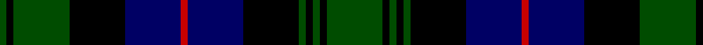

**Bands:** [GKGKBRBKGKGKG](/stripes/gkgkbrbkgkgkg/) · **Stripes:** [DG K DG K DB R DB K DG K DG K DG](/stripes/stripes13/) DG K DG K DB R DB K DG K DG K DG

This was sourced from weddslist.  It is a [13 band tartan](/bands/bands13/).

Original link http://www.weddslist.com/cgi-bin/tartans/pg.pl?source=rb

## Attestations

This cloth appears in 2 source records; the oldest owns this page.

- undated — Urquhart L (weddslist, [record](http://www.weddslist.com/cgi-bin/tartans/pg.pl?source=rb))
- undated — Urquhart L (weddslist, [record](http://www.weddslist.com/cgi-bin/tartans/pg.pl?source=x))

## Register references

External register numbers recorded for this tartan.

- Scottish Register of Tartans: [2540](https://www.tartanregister.gov.uk/tartanDetails.aspx?ref=2540)
- Scottish Register of Tartans: [2625](https://www.tartanregister.gov.uk/tartanDetails.aspx?ref=2625)
- Scottish Register of Tartans: [2666](https://www.tartanregister.gov.uk/tartanDetails.aspx?ref=2666)
- Scottish Register of Tartans: [3555](https://www.tartanregister.gov.uk/tartanDetails.aspx?ref=3555)
- Scottish Register of Tartans: [3808](https://www.tartanregister.gov.uk/tartanDetails.aspx?ref=3808)
- Scottish Tartans Authority (ITI): 1429
- Scottish Tartans Authority (ITI): 218
- Scottish Tartans World Register: 1010
- Scottish Tartans World Register: 1429
- Scottish Tartans World Register: 1585
- Scottish Tartans World Register: 218
- Scottish Tartans World Register: 864

## Variants

Other setts woven to the same stripe pattern.

- [Urquhart L](/setts/s13/dg8k1dg1k1dg1k8db8r1db8k8dg8k1dg1~x2/)

## Thread count
G/1 K1 G8 K8 DB8 R1 DB8 K8 G1 K1 G1 K1 G/8

## Palette
Each colour and its ΔE from the base-6 reference it is a variant of.

| Colour | Shade | Base | ΔE (OKLab) |
|---|---|---|---|
| DB | <code style="background-color:#000064;">#000064</code> `#000064` | B <code style="background-color:#2A418A;">#2A418A</code> | 0.18 |
| G | <code style="background-color:#004C00;">#004C00</code> `#004C00` | G <code style="background-color:#006100;">#006100</code> | 0.07 |
| K | <code style="background-color:#000000;">#000000</code> `#000000` | K <code style="background-color:#000000;">#000000</code> | 0.00 |
| R | <code style="background-color:#C80000;">#C80000</code> `#C80000` | R <code style="background-color:#CC0000;">#CC0000</code> | 0.01 |

## Nearest tartans

The nearest existing variants by ΔTartan distance.

1. [Urquhart L](/setts/s13/dg8k1dg1k1dg1k8db8r1db8k8dg8k1dg1~x2/) — ΔT 0.49
1. [Gordon](/setts/s13/db12k2db2k2db2k12dg12ly2dg12k12db11k2db2/) — ΔT 0.56
1. [Forbes](/setts/s15/db8k1db2k1db2k6dg8k1lb2k1dg8k6db8k1db2/) — ΔT 0.59
1. [Forbes](/setts/s15/db8k1db2k1db2k6dg8k1lr2k1dg8k6db8k1db2~x2/) — ΔT 0.62
1. [Forbes](/setts/s15/db8k1db2k1db2k6dg8k1lr2k1dg8k6db8k1db2/) — ΔT 0.62
1. [Gordon](/setts/s13/db12k2db2k2db2k12dg12ly2dg12k12db11k2db2~x2/) — ΔT 0.62
1. [92nd Regiment (Gordon) (Mil.)](/setts/s13/db16k3db3k3db3k16dg19lo3dg19k16db15k3db3~x2/) — ΔT 0.68
1. [Dewar, Highlander](/setts/s13/dg46k5dg6k5dg6k30db38ly6db38k30dg36k6dg6/) — ΔT 0.72
1. [Murray](/setts/s13/db6k1db1k1db1k6dg6r2dg6k6db6k1db2/) — ΔT 0.77
1. [Murray of Atholl](/setts/s13/db12k2db2k2db2k12dg12r3dg12k12db12k1r3/) — ΔT 0.87

## Neighbour map

Every grey dot is one of 14313 variants placed by the first two principal components of the ΔTartan feature space (44% of its variance). Red is this tartan; blue dots are its nearest — click one to open its page.

<svg viewBox="0 0 640 380" role="img" style="max-width:100%;height:auto;border:1px solid #e0e0e0;border-radius:4px;display:block" xmlns="http://www.w3.org/2000/svg"><image href="/nn/cloud.v1.png" width="640" height="380"/><a href="/setts/s13/dg8k1dg1k1dg1k8db8r1db8k8dg8k1dg1~x2/"><circle cx="197.5" cy="216.4" r="4" fill="#3465a4"><title>Urquhart L</title></circle></a><a href="/setts/s13/db12k2db2k2db2k12dg12ly2dg12k12db11k2db2/"><circle cx="164.2" cy="224.7" r="4" fill="#3465a4"><title>Gordon</title></circle></a><a href="/setts/s15/db8k1db2k1db2k6dg8k1lb2k1dg8k6db8k1db2/"><circle cx="179.5" cy="203.4" r="4" fill="#3465a4"><title>Forbes</title></circle></a><a href="/setts/s15/db8k1db2k1db2k6dg8k1lr2k1dg8k6db8k1db2~x2/"><circle cx="190.9" cy="208.8" r="4" fill="#3465a4"><title>Forbes</title></circle></a><a href="/setts/s15/db8k1db2k1db2k6dg8k1lr2k1dg8k6db8k1db2/"><circle cx="190.9" cy="208.8" r="4" fill="#3465a4"><title>Forbes</title></circle></a><a href="/setts/s13/db12k2db2k2db2k12dg12ly2dg12k12db11k2db2~x2/"><circle cx="175.1" cy="230.1" r="4" fill="#3465a4"><title>Gordon</title></circle></a><a href="/setts/s13/db16k3db3k3db3k16dg19lo3dg19k16db15k3db3~x2/"><circle cx="149.4" cy="216.7" r="4" fill="#3465a4"><title>92nd Regiment (Gordon) (Mil.)</title></circle></a><a href="/setts/s13/dg46k5dg6k5dg6k30db38ly6db38k30dg36k6dg6/"><circle cx="192.1" cy="200.4" r="4" fill="#3465a4"><title>Dewar, Highlander</title></circle></a><a href="/setts/s13/db6k1db1k1db1k6dg6r2dg6k6db6k1db2/"><circle cx="163.1" cy="232.8" r="4" fill="#3465a4"><title>Murray</title></circle></a><a href="/setts/s13/db12k2db2k2db2k12dg12r3dg12k12db12k1r3/"><circle cx="170.0" cy="195.9" r="4" fill="#3465a4"><title>Murray of Atholl</title></circle></a><circle cx="183.4" cy="209.6" r="5" fill="#c00000"/></svg>

ID: /setts/s13/dg8k1dg1k1dg1k8db8r1db8k8dg8k1dg1/
