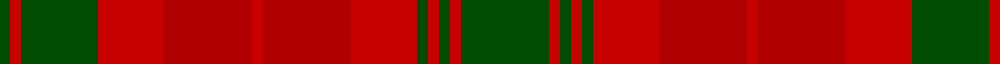

**Bands:** [GRGRGRRRRRGRG](/stripes/grgrgrrrrrgrg/) · **Stripes:** [DG R DG R DG R R R R R DG R DG](/stripes/stripes13/) DG R DG R DG R R R R R DG R DG

This was sourced from weddslist.  It is a [13 band tartan](/bands/bands13/).

Original link http://www.weddslist.com/cgi-bin/tartans/pg.pl?source=rb

## Register references

External register numbers recorded for this tartan.

- Scottish Register of Tartans: [2540](https://www.tartanregister.gov.uk/tartanDetails.aspx?ref=2540)
- Scottish Register of Tartans: [2666](https://www.tartanregister.gov.uk/tartanDetails.aspx?ref=2666)
- Scottish Register of Tartans: [3808](https://www.tartanregister.gov.uk/tartanDetails.aspx?ref=3808)
- Scottish Tartans Authority (ITI): 218
- Scottish Tartans World Register: 1010
- Scottish Tartans World Register: 1585
- Scottish Tartans World Register: 218

## Thread count
G/2 R2 G14 R12 DR16 R2 DR16 R12 G2 R2 G2 R2 G/16

## Palette
Each colour and its ΔE from the base-6 reference it is a variant of.

| Colour | Shade | Base | ΔE (OKLab) |
|---|---|---|---|
| DR | <code style="background-color:#B00000;">#B00000</code> `#B00000` | R <code style="background-color:#CC0000;">#CC0000</code> | 0.06 |
| G | <code style="background-color:#004C00;">#004C00</code> `#004C00` | G <code style="background-color:#006100;">#006100</code> | 0.07 |
| R | <code style="background-color:#C80000;">#C80000</code> `#C80000` | R <code style="background-color:#CC0000;">#CC0000</code> | 0.01 |

## Nearest tartans

The nearest existing variants by ΔTartan distance.

1. [MacNab (Logan)](/setts/s13/g8m1g1m1g1m6r8m1r8m6g7m1g1~x4/) — ΔT 0.64
1. [MacNab Clan Tartan Tartan Number: 857. Earliest known date: c.1816 The structure of the MacNab is identical with that of the Black Watch; but, by a translation of colours, the most subdued of tartans becomes one of the most striking. D.C.Stewart suggests looking at the pattern through a green filter to see the effect. James Logan recorded ths pattern in his book, 'The Scottish Gael' in 1831, despite receiving a different sett from the largest weaving company of the time, William Wilson and Company, Bannockburn. Wilson's MacNab survives as an alternative tartan for the clan. James Charles MacNab of MacNab, Wester Kilmany, Fife, was recognised as chief in 1970. See products available Copyright © Blair Urquhart, Comrie, 2015](/setts/s13/g8m1g1m1g1m6r8m1r8m6g7m1g1~x2/) — ΔT 0.64
1. [MacNab 3](/setts/s13/g8r1g1r1g1r6r8r1r8r6g7r1g1~x2/) — ΔT 0.82
1. [Mauthe Unidentified (Name?)](/setts/s15/r20dy2r2dy2r2dy15g13dy2w2dy2g13dy15r14dy2r2~x2/) — ΔT 1.18
1. [Wcwm 1155](/setts/s10/do7do2do2do2do2do6r14do2r2do2~x4/) — ΔT 1.20
1. [Mauthe Unidentified](/setts/s17/r2dy2r20dy2r2dy2r2dy15g13dy2w2dy2g13dy15r14dy2r2~x2/) — ΔT 1.30
1. [Poulter SG 101 (Fashion)](/setts/s13/lo25r8lo8r8lo8r46dy46r8dy46r46lo46r8lo8/) — ΔT 1.31
1. [MacNab](/setts/s13/dg8dr1dg1dr1dg1dr6r8dr1r8dr6dg7dr1dg1~x2/) — ΔT 1.36
1. [MacNab](/setts/s13/dg8dr1dg1dr1dg1dr6r8dr1r8dr6dg7dr1dg1/) — ΔT 1.36
1. [78th Highlanders (Fraser) (Mil.)](/setts/s12/dg26r2dg2r2r19r28r3r28r19dg22r2dg2~x2/) — ΔT 1.40

## Neighbour map

Every grey dot is one of 14313 variants placed by the first two principal components of the ΔTartan feature space (44% of its variance). Red is this tartan; blue dots are its nearest — click one to open its page.

<svg viewBox="0 0 640 380" role="img" style="max-width:100%;height:auto;border:1px solid #e0e0e0;border-radius:4px;display:block" xmlns="http://www.w3.org/2000/svg"><image href="/nn/cloud.v1.png" width="640" height="380"/><a href="/setts/s13/g8m1g1m1g1m6r8m1r8m6g7m1g1~x4/"><circle cx="249.9" cy="211.1" r="4" fill="#3465a4"><title>MacNab (Logan)</title></circle></a><a href="/setts/s13/g8m1g1m1g1m6r8m1r8m6g7m1g1~x2/"><circle cx="249.9" cy="211.1" r="4" fill="#3465a4"><title>MacNab Clan Tartan Tartan Number: 857. Earliest known date: c.1816 The structure of the MacNab is identical with that of the Black Watch; but, by a translation of colours, the most subdued of tartans becomes one of the most striking. D.C.Stewart suggests looking at the pattern through a green filter to see the effect. James Logan recorded ths pattern in his book, 'The Scottish Gael' in 1831, despite receiving a different sett from the largest weaving company of the time, William Wilson and Company, Bannockburn. Wilson's MacNab survives as an alternative tartan for the clan. James Charles MacNab of MacNab, Wester Kilmany, Fife, was recognised as chief in 1970. See products available Copyright © Blair Urquhart, Comrie, 2015</title></circle></a><a href="/setts/s13/g8r1g1r1g1r6r8r1r8r6g7r1g1~x2/"><circle cx="240.1" cy="208.0" r="4" fill="#3465a4"><title>MacNab 3</title></circle></a><a href="/setts/s15/r20dy2r2dy2r2dy15g13dy2w2dy2g13dy15r14dy2r2~x2/"><circle cx="252.6" cy="180.6" r="4" fill="#3465a4"><title>Mauthe Unidentified (Name?)</title></circle></a><a href="/setts/s10/do7do2do2do2do2do6r14do2r2do2~x4/"><circle cx="299.1" cy="233.7" r="4" fill="#3465a4"><title>Wcwm 1155</title></circle></a><a href="/setts/s17/r2dy2r20dy2r2dy2r2dy15g13dy2w2dy2g13dy15r14dy2r2~x2/"><circle cx="258.0" cy="171.4" r="4" fill="#3465a4"><title>Mauthe Unidentified</title></circle></a><a href="/setts/s13/lo25r8lo8r8lo8r46dy46r8dy46r46lo46r8lo8/"><circle cx="237.7" cy="227.2" r="4" fill="#3465a4"><title>Poulter SG 101 (Fashion)</title></circle></a><a href="/setts/s13/dg8dr1dg1dr1dg1dr6r8dr1r8dr6dg7dr1dg1~x2/"><circle cx="284.7" cy="238.6" r="4" fill="#3465a4"><title>MacNab</title></circle></a><a href="/setts/s13/dg8dr1dg1dr1dg1dr6r8dr1r8dr6dg7dr1dg1/"><circle cx="284.7" cy="238.6" r="4" fill="#3465a4"><title>MacNab</title></circle></a><a href="/setts/s12/dg26r2dg2r2r19r28r3r28r19dg22r2dg2~x2/"><circle cx="317.3" cy="208.7" r="4" fill="#3465a4"><title>78th Highlanders (Fraser) (Mil.)</title></circle></a><circle cx="258.4" cy="215.8" r="5" fill="#c00000"/></svg>

ID: /setts/s13/dg8r1dg1r1dg1r6r8r1r8r6dg7r1dg1~x2/
