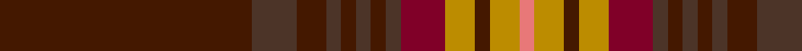

This page is one **sett** — a single exact thread-count. It belongs to the [tartan](/tartans/dr17t3dr2t1dr1t1dr1t1dra3dy2dr1dy2lr1/)
(the same proportion at any scale), whose colour order is pattern [BBBBBBBBRYBYR](/stripes/bbbbbbbbrybyr/).

Sourced from register-of-tartans.  It is a [13 stripe tartan](/stripes/stripes13/).

Original link https://www.tartanregister.gov.uk/tartanDetails.aspx?ref=1992

2 attestations — the source records this cloth was collapsed from (oldest owns this page)

<ul>
<li>01/01/1984 — Kinnaird (1984) (register-of-tartans, <a href="https://www.tartanregister.gov.uk/tartanDetails.aspx?ref=1992">record</a>)</li>
<li>1984 — Kinnaird - 1984 (Fashion) (tartans-authority, <a href="http://www.tartansauthority.com/tartan-ferret/display/5356/">record</a>)</li>
</ul>

## Register references

External register numbers recorded for this tartan.

- Scottish Register of Tartans: [1992](https://www.tartanregister.gov.uk/tartanDetails.aspx?ref=1992)
- Scottish Tartans Authority (ITI): 5356

## Thread count
DR/68 T12 DR8 T4 DR4 T4 DR4 T4 DRa12 DY8 DR4 DY8 LR/4

## Palette
Each colour and the base-6 reference it is a variant of.

| Colour | Shade | Base |
|---|---|---|
| DR | <code style="background-color:#441800;">#441800</code> `oklch(27.3% 0.076 46.3)` <small>#441800</small> | B <code style="background-color:#2A418A;">#2A418A</code> |
| DRa | <code style="background-color:#800028;">#800028</code> `oklch(38.2% 0.152 14.5)` <small>#800028</small> | R <code style="background-color:#CC0000;">#CC0000</code> |
| DY | <code style="background-color:#BC8C00;">#BC8C00</code> `oklch(66.8% 0.137 84.1)` <small>#BC8C00</small> | Y <code style="background-color:#F2BF00;">#F2BF00</code> |
| LR | <code style="background-color:#E87878;">#E87878</code> `oklch(70.0% 0.139 21.2)` <small>#E87878</small> | R <code style="background-color:#CC0000;">#CC0000</code> |
| T | <code style="background-color:#4C3428;">#4C3428</code> `oklch(34.9% 0.040 47.5)` <small>#4C3428</small> | B <code style="background-color:#2A418A;">#2A418A</code> |

## Nearest tartans

The nearest existing variants by ΔTartan distance, with this tartan at the top so the swatches line up against it.

ΔTartan

Tartan

Sett

—

<a href="/ttd/edit/#slug=do17do3do2do1do1do1do1do1r3lo2do1lo2r1~x4">Kinnaird (1984)</a> <a class="nn-out" href="/setts/s13/do17do3do2do1do1do1do1do1r3lo2do1lo2r1~x4/" title="open its dictionary page">↗</a>

1.16

<a href="/ttd/edit/#slug=dr50o6dy7dg2dy2ly2dy2o14dr8dy2dr9dg3~x2">Tyrone Irish County Tartan Tartan Number: 2264. Earliest known date: 1993 One of a series of Irish District tartans designed by Polly Wittering of the House of Edgar, with colours reminiscent of the Country with soft warm colours dominating. See products available Copyright © Blair Urquhart, Comrie, 2015</a> <a class="nn-out" href="/setts/s12/dr50o6dy7dg2dy2ly2dy2o14dr8dy2dr9dg3~x2/" title="open its dictionary page">↗</a>

1.18

<a href="/ttd/edit/#slug=o4do31o2r2o2r2o2do2do2do4do11o4">Beanpole Brown Trial</a> <a class="nn-out" href="/setts/s12/o4do31o2r2o2r2o2do2do2do4do11o4/" title="open its dictionary page">↗</a>

1.22

<a href="/ttd/edit/#slug=g8ly2dy4dp4g3dp4dy42g4r3g4dy4dp5r3">Sarna (District)</a> <a class="nn-out" href="/setts/s13/g8ly2dy4dp4g3dp4dy42g4r3g4dy4dp5r3/" title="open its dictionary page">↗</a>

1.35

<a href="/ttd/edit/#slug=dy46dy6r3dy3w3dy3dg10dy8dy3dy6w3~x2">Williams</a> <a class="nn-out" href="/setts/s11/dy46dy6r3dy3w3dy3dg10dy8dy3dy6w3~x2/" title="open its dictionary page">↗</a>

1.48

<a href="/ttd/edit/#slug=r6lo1r24dg6db2k1db2k1db12r1~x2">MacEdward (MacGregor Hastie)</a> <a class="nn-out" href="/setts/s10/r6lo1r24dg6db2k1db2k1db12r1~x2/" title="open its dictionary page">↗</a>

1.50

<a href="/ttd/edit/#slug=r50y6do7dg2do2lb2do2y14r8dg2r9dg3~x2">Tyrone, County</a> <a class="nn-out" href="/setts/s12/r50y6do7dg2do2lb2do2y14r8dg2r9dg3~x2/" title="open its dictionary page">↗</a>

1.51

<a href="/ttd/edit/#slug=k2lb1r2dg6r2db4r2k2r15dg2r2k1~x4">MacClure</a> <a class="nn-out" href="/setts/s12/k2lb1r2dg6r2db4r2k2r15dg2r2k1~x4/" title="open its dictionary page">↗</a>

1.54

<a href="/ttd/edit/#slug=m50o6dr7g2dr2w2dr2o16m8dr2m9g3~x2">Tyrone</a> <a class="nn-out" href="/setts/s12/m50o6dr7g2dr2w2dr2o16m8dr2m9g3~x2/" title="open its dictionary page">↗</a>

1.55

<a href="/ttd/edit/#slug=r7r2db2r2dg32r6db12r41dg2r5r2dg5~x2">MacDougall #5</a> <a class="nn-out" href="/setts/s12/r7r2db2r2dg32r6db12r41dg2r5r2dg5~x2/" title="open its dictionary page">↗</a>

1.58

<a href="/ttd/edit/#slug=dg3r1r2dg2r16lb1db4r3dg13r1db1r1r3~x2">MacDonald of Glencoe</a> <a class="nn-out" href="/setts/s13/dg3r1r2dg2r16lb1db4r3dg13r1db1r1r3~x2/" title="open its dictionary page">↗</a>

## Neighbour map

Every grey dot is one of 14299 variants placed by the first two principal components of the ΔTartan feature space (44% of its variance). Red is this tartan; blue dots are its nearest — click one to open its page.

<svg viewBox="0 0 640 380" role="img" style="max-width:100%;height:auto;border:1px solid #e0e0e0;border-radius:4px;display:block" xmlns="http://www.w3.org/2000/svg"><image href="/nn/cloud.v1.png" width="640" height="380"/><a href="/setts/s12/dr50o6dy7dg2dy2ly2dy2o14dr8dy2dr9dg3~x2/"><circle cx="424.7" cy="114.2" r="4" fill="#3465a4"><title>Tyrone Irish County Tartan Tartan Number: 2264. Earliest known date: 1993 One of a series of Irish District tartans designed by Polly Wittering of the House of Edgar, with colours reminiscent of the Country with soft warm colours dominating. See products available Copyright © Blair Urquhart, Comrie, 2015</title></circle></a><a href="/setts/s12/o4do31o2r2o2r2o2do2do2do4do11o4/"><circle cx="395.8" cy="163.8" r="4" fill="#3465a4"><title>Beanpole Brown Trial</title></circle></a><a href="/setts/s13/g8ly2dy4dp4g3dp4dy42g4r3g4dy4dp5r3/"><circle cx="388.2" cy="129.8" r="4" fill="#3465a4"><title>Sarna (District)</title></circle></a><a href="/setts/s11/dy46dy6r3dy3w3dy3dg10dy8dy3dy6w3~x2/"><circle cx="407.9" cy="148.0" r="4" fill="#3465a4"><title>Williams</title></circle></a><a href="/setts/s10/r6lo1r24dg6db2k1db2k1db12r1~x2/"><circle cx="394.4" cy="141.6" r="4" fill="#3465a4"><title>MacEdward (MacGregor Hastie)</title></circle></a><a href="/setts/s12/r50y6do7dg2do2lb2do2y14r8dg2r9dg3~x2/"><circle cx="468.9" cy="131.3" r="4" fill="#3465a4"><title>Tyrone, County</title></circle></a><a href="/setts/s12/k2lb1r2dg6r2db4r2k2r15dg2r2k1~x4/"><circle cx="340.2" cy="150.7" r="4" fill="#3465a4"><title>MacClure</title></circle></a><a href="/setts/s12/m50o6dr7g2dr2w2dr2o16m8dr2m9g3~x2/"><circle cx="455.7" cy="131.5" r="4" fill="#3465a4"><title>Tyrone</title></circle></a><a href="/setts/s12/r7r2db2r2dg32r6db12r41dg2r5r2dg5~x2/"><circle cx="386.0" cy="152.9" r="4" fill="#3465a4"><title>MacDougall #5</title></circle></a><a href="/setts/s13/dg3r1r2dg2r16lb1db4r3dg13r1db1r1r3~x2/"><circle cx="320.8" cy="138.4" r="4" fill="#3465a4"><title>MacDonald of Glencoe</title></circle></a><circle cx="414.4" cy="134.3" r="5" fill="#c00000"/></svg>

ID: /setts/s13/do17do3do2do1do1do1do1do1r3lo2do1lo2r1~x4/
