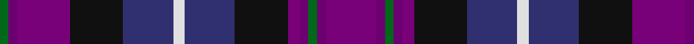

**Bands:** [BBGBBKBWBKBBG](/stripes/bbgbbkbwbkbbg/) · **Stripes:** [DP DP G DP DP K DB W DB K DP DP G](/stripes/stripes13/) DP DP G DP DP K DB W DB K DP DP G

This was sourced from tartans-authority.  It is a [13 band tartan](/bands/bands13/).

Original link http://www.tartansauthority.com/tartan-ferret/display/3105/

## Thread count
G/6 Pa6 P36 K36 DB34 LN8 DB34 K36 P8 Pa6 G6 Pa6 P/34

## Palette
Each colour and its ΔE from the base-6 reference it is a variant of.

| Colour | Shade | Base | ΔE (OKLab) |
|---|---|---|---|
| DB | <code style="background-color:#303070;">#303070</code> `#303070` | B <code style="background-color:#2A418A;">#2A418A</code> | 0.06 |
| G | <code style="background-color:#006818;">#006818</code> `#006818` | G <code style="background-color:#006100;">#006100</code> | 0.02 |
| K | <code style="background-color:#101010;">#101010</code> `#101010` | K <code style="background-color:#000000;">#000000</code> | 0.17 |
| LN | <code style="background-color:#E0E0E0;">#E0E0E0</code> `#E0E0E0` | W <code style="background-color:#F7F7F7;">#F7F7F7</code> | 0.07 |
| P | <code style="background-color:#780078;">#780078</code> `#780078` | B <code style="background-color:#2A418A;">#2A418A</code> | 0.17 |
| Pa | <code style="background-color:#6C0070;">#6C0070</code> `#6C0070` | B <code style="background-color:#2A418A;">#2A418A</code> | 0.16 |

## Nearest tartans

The nearest existing variants by ΔTartan distance.

1. [Scotland Forever](/setts/s11/db6k3dt19k6dt4k3dp12g4dp12w2db5~x2/) — ΔT 0.92
1. [Heart of Scotland (Milne) Fancy Tartan Tartan Number: 3105. Earliest known date: 2000 Designed by Ruthven Milne of Piob Mhor, Blairgowrie. Not recorded or registered with anyone so its existance and its 'duplicated' name were not known until September 2002. See products available Copyright © Blair Urquhart, Comrie, 2015](/setts/s18/dp17dp3g3dp3dp4k18db17w4db17k18dp18dp3g3dp3dp18k18db17w4~x2/) — ΔT 0.94
1. [Westwood MacPoiret (Fashion)](/setts/s13/db21o3db3o3db3k20dp18w3dp18k20db18o3db3~x2/) — ΔT 1.10
1. [Kinloch Anderson Thistle (Fashion)](/setts/s12/db8db8db4db28k12dp7k12dg4dp8dg4dp28m8/) — ΔT 1.23
1. [Heart of Scotland (Milne)](/setts/s24/dp3dp18k18db17w4db17k18dp4dp3g3dp3dp17dp3g3dp3dp4k18db17w4db17k18dp18dp3g3~x2/) — ΔT 1.25
1. [Scotland Forever Fashion Weavers Tartan Tartan Number: 6038. Earliest known date: pre 2003 For Alec Scott. The Lochcarron notes on this tartan say: Scotland Forever! is without doubt the best known war cry of the traditional Scottish regiments. It was most famously used by the Scots Greys on their timely and victorious charge at Waterloo in 1815. It spread throughout the ranks of the other Scottish regiments including the Royals, the 42nd and the Cameron Highlanders. See products available Copyright © Blair Urquhart, Comrie, 2015](/setts/s11/b6k3db19k6db4k3n12g4n12w2b5~x2/) — ΔT 1.25
1. [Pearl O' the Tay (Corporate)](/setts/s11/dt6g3dt3w2dt5k2dt3k2dp16m3k2~x2/) — ΔT 1.26
1. [Pride of Bannockburn Fashion Tartan Tartan Number: 8978. Earliest known date: 2008 Original name was Scotland the Brave (design by Dalgleish) but changed to Spirit of Bannockburn by Lochcarron. Tartan Ribbon subsequently added a white stripe and called it Pride of Bannockburn See products available Copyright © Blair Urquhart, Comrie, 2015](/setts/s15/db20k16g3dp23m7g10m7dp23g3k16db23w2db2w2db3~x2/) — ΔT 1.33
1. [Solberg-Bell Hunting](/setts/s13/k2o1lo2k1db4k1lo2db8db2db4db4w1k2~x4/) — ΔT 1.34
1. [McLion (Corporate)](/setts/s9/lo1r5db4db1g1db1g1db6w1~x4/) — ΔT 1.42

## Neighbour map

Every grey dot is one of 14313 variants placed by the first two principal components of the ΔTartan feature space (44% of its variance). Red is this tartan; blue dots are its nearest — click one to open its page.

<svg viewBox="0 0 640 380" role="img" style="max-width:100%;height:auto;border:1px solid #e0e0e0;border-radius:4px;display:block" xmlns="http://www.w3.org/2000/svg"><image href="/nn/cloud.v1.png" width="640" height="380"/><a href="/setts/s11/db6k3dt19k6dt4k3dp12g4dp12w2db5~x2/"><circle cx="142.2" cy="187.9" r="4" fill="#3465a4"><title>Scotland Forever</title></circle></a><a href="/setts/s18/dp17dp3g3dp3dp4k18db17w4db17k18dp18dp3g3dp3dp18k18db17w4~x2/"><circle cx="117.1" cy="191.1" r="4" fill="#3465a4"><title>Heart of Scotland (Milne) Fancy Tartan Tartan Number: 3105. Earliest known date: 2000 Designed by Ruthven Milne of Piob Mhor, Blairgowrie. Not recorded or registered with anyone so its existance and its 'duplicated' name were not known until September 2002. See products available Copyright © Blair Urquhart, Comrie, 2015</title></circle></a><a href="/setts/s13/db21o3db3o3db3k20dp18w3dp18k20db18o3db3~x2/"><circle cx="172.0" cy="199.2" r="4" fill="#3465a4"><title>Westwood MacPoiret (Fashion)</title></circle></a><a href="/setts/s12/db8db8db4db28k12dp7k12dg4dp8dg4dp28m8/"><circle cx="160.3" cy="205.6" r="4" fill="#3465a4"><title>Kinloch Anderson Thistle (Fashion)</title></circle></a><a href="/setts/s24/dp3dp18k18db17w4db17k18dp4dp3g3dp3dp17dp3g3dp3dp4k18db17w4db17k18dp18dp3g3~x2/"><circle cx="105.3" cy="166.4" r="4" fill="#3465a4"><title>Heart of Scotland (Milne)</title></circle></a><a href="/setts/s11/b6k3db19k6db4k3n12g4n12w2b5~x2/"><circle cx="124.3" cy="179.3" r="4" fill="#3465a4"><title>Scotland Forever Fashion Weavers Tartan Tartan Number: 6038. Earliest known date: pre 2003 For Alec Scott. The Lochcarron notes on this tartan say: Scotland Forever! is without doubt the best known war cry of the traditional Scottish regiments. It was most famously used by the Scots Greys on their timely and victorious charge at Waterloo in 1815. It spread throughout the ranks of the other Scottish regiments including the Royals, the 42nd and the Cameron Highlanders. See products available Copyright © Blair Urquhart, Comrie, 2015</title></circle></a><a href="/setts/s11/dt6g3dt3w2dt5k2dt3k2dp16m3k2~x2/"><circle cx="156.6" cy="162.5" r="4" fill="#3465a4"><title>Pearl O' the Tay (Corporate)</title></circle></a><a href="/setts/s15/db20k16g3dp23m7g10m7dp23g3k16db23w2db2w2db3~x2/"><circle cx="114.9" cy="145.7" r="4" fill="#3465a4"><title>Pride of Bannockburn Fashion Tartan Tartan Number: 8978. Earliest known date: 2008 Original name was Scotland the Brave (design by Dalgleish) but changed to Spirit of Bannockburn by Lochcarron. Tartan Ribbon subsequently added a white stripe and called it Pride of Bannockburn See products available Copyright © Blair Urquhart, Comrie, 2015</title></circle></a><a href="/setts/s13/k2o1lo2k1db4k1lo2db8db2db4db4w1k2~x4/"><circle cx="131.2" cy="181.6" r="4" fill="#3465a4"><title>Solberg-Bell Hunting</title></circle></a><a href="/setts/s9/lo1r5db4db1g1db1g1db6w1~x4/"><circle cx="137.6" cy="185.3" r="4" fill="#3465a4"><title>McLion (Corporate)</title></circle></a><circle cx="118.7" cy="191.6" r="5" fill="#c00000"/></svg>

ID: /setts/s13/dp17dp3g3dp3dp4k18db17w4db17k18dp18dp3g3~x2/
