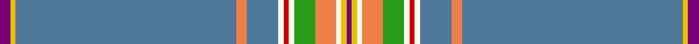

In pattern [BYBYBWRWGYWYB](/stripes/bybybwrwgywyb/).

This was sourced from tartans-authority.  It is a [13 stripe tartan](/stripes/stripes13/).

Original link http://www.tartansauthority.com/tartan-ferret/display/7323/

## Thread count
P/4 Y2 B84 O4 B12 W2 R2 W2 G8 O8 W2 Y2 P/2

## Palette
Each colour and the base-6 reference it is a variant of.

| Colour | Shade | Base |
|---|---|---|
| B | <code style="background-color:#507898;">#507898</code> `oklch(55.6% 0.067 243.5)` <small>#507898</small> | B <code style="background-color:#2A418A;">#2A418A</code> |
| G | <code style="background-color:#289C18;">#289C18</code> `oklch(60.6% 0.191 141.6)` <small>#289C18</small> | G <code style="background-color:#006100;">#006100</code> |
| O | <code style="background-color:#EC8048;">#EC8048</code> `oklch(71.0% 0.150 46.4)` <small>#EC8048</small> | Y <code style="background-color:#F2BF00;">#F2BF00</code> |
| P | <code style="background-color:#780078;">#780078</code> `oklch(40.2% 0.185 328.4)` <small>#780078</small> | B <code style="background-color:#2A418A;">#2A418A</code> |
| R | <code style="background-color:#C80000;">#C80000</code> `oklch(52.3% 0.215 29.2)` <small>#C80000</small> | R <code style="background-color:#CC0000;">#CC0000</code> |
| W | <code style="background-color:#FCFCEC;">#FCFCEC</code> `oklch(98.7% 0.021 106.8)` <small>#FCFCEC</small> | W <code style="background-color:#F7F7F7;">#F7F7F7</code> |
| Y | <code style="background-color:#E8C000;">#E8C000</code> `oklch(81.9% 0.168 93.7)` <small>#E8C000</small> | Y <code style="background-color:#F2BF00;">#F2BF00</code> |

## Nearest tartans

The nearest existing variants by ΔTartan distance, with this tartan at the top so the swatches line up against it.

ΔTartan

Tartan

Sett

—

<a href="/ttd/edit/#slug=dp2ly1t42lo2t6w1r1w1g4lo4w1ly1dp1~x2">Kerr of Ardgowan Dress (Personal)</a> <a class="nn-out" href="/setts/s13/dp2ly1t42lo2t6w1r1w1g4lo4w1ly1dp1~x2/" title="open its dictionary page">↗</a>

1.59

<a href="/ttd/edit/#slug=o60g2db4r1db4g2o3w1dp20w1o5db2~x2">Scottish Parliament Official (Corp)</a> <a class="nn-out" href="/setts/s12/o60g2db4r1db4g2o3w1dp20w1o5db2~x2/" title="open its dictionary page">↗</a>

1.60

<a href="/ttd/edit/#slug=b46ly1dy5ly1g5ly1dp5ly1b16r1ly4~x2">Craven County (Commemorative)</a> <a class="nn-out" href="/setts/s11/b46ly1dy5ly1g5ly1dp5ly1b16r1ly4~x2/" title="open its dictionary page">↗</a>

1.68

<a href="/ttd/edit/#slug=n46lo1do5lo1dg5lo1dp5lo1n16r1lo4~x2">Craven County Commemorative Tartan Tartan Number: 10679. Earliest known date: 21 August 2012 2012 marks the 300th year of Craven County, North Carolina, USA. The 300th Anniversary District 2 Committee, under the leadership of Chairperson, Kelly Beasley, voted for a Craven County Tartan to represent the large number of Craven County residents with Scottish heritage. The colours are drawn from the Craven County Coat of Arms, the waterways, rivers and streams, sky, colonial history, governors, royalty, the military, education, and the agricultural background of the county, as well as forestry, tobacco, indigo, and its many other crops. Brian Dodds designed the tartan, submitting four ideas of which the District 2 committee selected Pattern #2. The tartan has been approved by the Craven County 300th Anniversary Committee and the Craven County Board of Commissioners, with the Board signing a resolution on 16 April, 2012. Ila McIlwean White-Lewis volunteered to pay to register the tartan and to have sufficient tartan woven for a banner to be displayed in the Craven County Courthouse. See products available Copyright © Blair Urquhart, Comrie, 2015</a> <a class="nn-out" href="/setts/s11/n46lo1do5lo1dg5lo1dp5lo1n16r1lo4~x2/" title="open its dictionary page">↗</a>

1.79

<a href="/ttd/edit/#slug=n56db9w2db2r2n9lb4db2lb2ly3~x2">Blue Toon</a> <a class="nn-out" href="/setts/s10/n56db9w2db2r2n9lb4db2lb2ly3~x2/" title="open its dictionary page">↗</a>

1.79

<a href="/ttd/edit/#slug=t49dt11w2dt2lr2dt2t10lg4dt2lg2ly3~x2">Blue Toon (Fashion)</a> <a class="nn-out" href="/setts/s11/t49dt11w2dt2lr2dt2t10lg4dt2lg2ly3~x2/" title="open its dictionary page">↗</a>

1.89

<a href="/ttd/edit/#slug=y60t5y8ly2y4w2y4dg16dy8y2dy4w2~x2">Stuart/Stewart Silver</a> <a class="nn-out" href="/setts/s12/y60t5y8ly2y4w2y4dg16dy8y2dy4w2~x2/" title="open its dictionary page">↗</a>

1.92

<a href="/ttd/edit/#slug=y30db6p1w2p6w2p1db6y30lb1r3~x2">Kuehle Family (Personal)</a> <a class="nn-out" href="/setts/s11/y30db6p1w2p6w2p1db6y30lb1r3~x2/" title="open its dictionary page">↗</a>

1.95

<a href="/ttd/edit/#slug=n57lb3k9ly2k2w3k2g10n6k2n2r3~x2">O'Shaughnessy Memorial</a> <a class="nn-out" href="/setts/s12/n57lb3k9ly2k2w3k2g10n6k2n2r3~x2/" title="open its dictionary page">↗</a>

1.95

<a href="/ttd/edit/#slug=lo30db6m1w2m6w2m1db6lo30lb1r3~x2">Kuehle Hunting (Personal)</a> <a class="nn-out" href="/setts/s11/lo30db6m1w2m6w2m1db6lo30lb1r3~x2/" title="open its dictionary page">↗</a>

2.00

<a href="/ttd/edit/#slug=t27w2t15ly1t1ly1t15k2w2ly16r1~x2">Quigley of Knockcroghery (Hunting) (Personal)</a> <a class="nn-out" href="/setts/s11/t27w2t15ly1t1ly1t15k2w2ly16r1~x2/" title="open its dictionary page">↗</a>

## Neighbour map

Every grey dot is one of 14299 variants placed by the first two principal components of the ΔTartan feature space (44% of its variance). Red is this tartan; blue dots are its nearest — click one to open its page.

<svg viewBox="0 0 640 380" role="img" style="max-width:100%;height:auto;border:1px solid #e0e0e0;border-radius:4px;display:block" xmlns="http://www.w3.org/2000/svg"><image href="/nn/cloud.v1.png" width="640" height="380"/><a href="/setts/s12/o60g2db4r1db4g2o3w1dp20w1o5db2~x2/"><circle cx="428.0" cy="45.2" r="4" fill="#3465a4"><title>Scottish Parliament Official (Corp)</title></circle></a><a href="/setts/s11/b46ly1dy5ly1g5ly1dp5ly1b16r1ly4~x2/"><circle cx="467.3" cy="74.0" r="4" fill="#3465a4"><title>Craven County (Commemorative)</title></circle></a><a href="/setts/s11/n46lo1do5lo1dg5lo1dp5lo1n16r1lo4~x2/"><circle cx="511.5" cy="88.9" r="4" fill="#3465a4"><title>Craven County Commemorative Tartan Tartan Number: 10679. Earliest known date: 21 August 2012 2012 marks the 300th year of Craven County, North Carolina, USA. The 300th Anniversary District 2 Committee, under the leadership of Chairperson, Kelly Beasley, voted for a Craven County Tartan to represent the large number of Craven County residents with Scottish heritage. The colours are drawn from the Craven County Coat of Arms, the waterways, rivers and streams, sky, colonial history, governors, royalty, the military, education, and the agricultural background of the county, as well as forestry, tobacco, indigo, and its many other crops. Brian Dodds designed the tartan, submitting four ideas of which the District 2 committee selected Pattern #2. The tartan has been approved by the Craven County 300th Anniversary Committee and the Craven County Board of Commissioners, with the Board signing a resolution on 16 April, 2012. Ila McIlwean White-Lewis volunteered to pay to register the tartan and to have sufficient tartan woven for a banner to be displayed in the Craven County Courthouse. See products available Copyright © Blair Urquhart, Comrie, 2015</title></circle></a><a href="/setts/s10/n56db9w2db2r2n9lb4db2lb2ly3~x2/"><circle cx="455.3" cy="84.5" r="4" fill="#3465a4"><title>Blue Toon</title></circle></a><a href="/setts/s11/t49dt11w2dt2lr2dt2t10lg4dt2lg2ly3~x2/"><circle cx="424.8" cy="102.9" r="4" fill="#3465a4"><title>Blue Toon (Fashion)</title></circle></a><a href="/setts/s12/y60t5y8ly2y4w2y4dg16dy8y2dy4w2~x2/"><circle cx="448.4" cy="97.6" r="4" fill="#3465a4"><title>Stuart/Stewart Silver</title></circle></a><a href="/setts/s11/y30db6p1w2p6w2p1db6y30lb1r3~x2/"><circle cx="421.7" cy="100.0" r="4" fill="#3465a4"><title>Kuehle Family (Personal)</title></circle></a><a href="/setts/s12/n57lb3k9ly2k2w3k2g10n6k2n2r3~x2/"><circle cx="369.8" cy="56.1" r="4" fill="#3465a4"><title>O'Shaughnessy Memorial</title></circle></a><a href="/setts/s11/lo30db6m1w2m6w2m1db6lo30lb1r3~x2/"><circle cx="412.8" cy="88.8" r="4" fill="#3465a4"><title>Kuehle Hunting (Personal)</title></circle></a><a href="/setts/s11/t27w2t15ly1t1ly1t15k2w2ly16r1~x2/"><circle cx="423.2" cy="111.5" r="4" fill="#3465a4"><title>Quigley of Knockcroghery (Hunting) (Personal)</title></circle></a><circle cx="466.9" cy="36.6" r="5" fill="#c00000"/></svg>

ID: /setts/s13/dp2ly1t42lo2t6w1r1w1g4lo4w1ly1dp1~x2/
