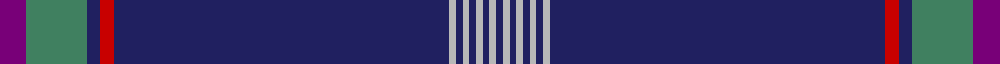

In pattern [BGBRBYBYBYBYB](/stripes/bgbrbybybybyb/).

This was sourced from register-of-tartans.  It is a [13 stripe tartan](/stripes/stripes13/).

Original link https://www.tartanregister.gov.uk/tartanDetails.aspx?ref=1292

## Attestations

This cloth appears in 2 source records; the oldest owns this page.

- 01/12/2004 — G8 Summit (register-of-tartans, [record](https://www.tartanregister.gov.uk/tartanDetails.aspx?ref=1292))
- 2004 December — G8 Summit (Corporate) (tartans-authority, [record](http://www.tartansauthority.com/tartan-ferret/display/6490/))

## Register references

External register numbers recorded for this tartan.

- Scottish Register of Tartans: [1292](https://www.tartanregister.gov.uk/tartanDetails.aspx?ref=1292)
- Scottish Tartans Authority (ITI): 6490

## Thread count
P/8 G18 DB4 R4 DB100 N2 DB2 N2 DB2 N2 DB2 N2 DB/2

## Palette
Each colour and the base-6 reference it is a variant of.

| Colour | Shade | Base |
|---|---|---|
| DB | <code style="background-color:#202060;">#202060</code> `oklch(28.9% 0.111 276.9)` <small>#202060</small> | B <code style="background-color:#2A418A;">#2A418A</code> |
| G | <code style="background-color:#408060;">#408060</code> `oklch(54.8% 0.084 160.1)` <small>#408060</small> | G <code style="background-color:#006100;">#006100</code> |
| N | <code style="background-color:#B8B8B8;">#B8B8B8</code> `oklch(78.3% 0.000 89.9)` <small>#B8B8B8</small> | Y <code style="background-color:#F2BF00;">#F2BF00</code> |
| P | <code style="background-color:#780078;">#780078</code> `oklch(40.2% 0.185 328.4)` <small>#780078</small> | B <code style="background-color:#2A418A;">#2A418A</code> |
| R | <code style="background-color:#C80000;">#C80000</code> `oklch(52.3% 0.215 29.2)` <small>#C80000</small> | R <code style="background-color:#CC0000;">#CC0000</code> |

## Nearest tartans

The nearest existing variants by ΔTartan distance.

1. [Wcwm 9275-1446](/setts/s12/db56r1g4r1g3r1db10g1r10db2r3lb2~x4/) — ΔT 1.16
1. [G8 Summit Corporate Tartan Tartan Number: 6490. Earliest known date: 2004 December Designed on behalf of the Scottish Tartans Authority for a G8 tartan to mark the 2005 G8 Summit hosted by Scotland at Gleneagles Hotel in Perthshire. The Green and Purple represent the 2005 G8 Summit thistle-logo and red is the one colour present in all the G8 nation flags - the common thread that binds them together in their efforts to aid underdeveloped countries. There is one white line for each G8 nation which, together on the dark blue, form the white cross of St Andrew - the flag of the host nation. An independent panel of judges chose what they considered to be the best three designs which were then sent to No. 10 Downing Street where Mrs Cherie Blair (the wife of the British Prime Minister) made the final choice. See products available Copyright © Blair Urquhart, Comrie, 2015](/setts/s24/g9db2r2db50lr1db1lr1db1lr1db1lr1db1lr1db1lr1db1lr1db1lr1db50r2db2g9dp4~x2/) — ΔT 1.29
1. [Jewish (Kosher) (Corporate)](/setts/s11/w3db3w1dt44o1dt2o1r4o1dt5lo2~x2/) — ΔT 1.43
1. [Mingulay (Fashion)](/setts/s11/db45n5o1dt1lb1dt1lb5o3dt1o2lb1~x4/) — ΔT 1.58
1. [Wedding Day](/setts/s9/o4w1dp48r2m3r2dp3w1o4~x2/) — ΔT 1.58
1. [Park](/setts/s10/db62r1db2r1db4k14g4k2g6k4~x2/) — ΔT 1.60
1. [Mohammed, Abu Hassan (Personal)](/setts/s9/db60w1db6g10r1g7k2lo2w2~x2/) — ΔT 1.68
1. [Parr](/setts/s10/db62r1db2r1db4k14g4w2g6k4~x2/) — ΔT 1.70
1. [United States Trade sett Tartan Tartan Number: 2126. Earliest known date: 1989 This design is different in warp and weft. The display gives the general appearance only. Produced to celebrate American tourism is Scotland. The colours are taken from the flags of the two nations and the Atlantic Ocean that separates them. See products available Copyright © Blair Urquhart, Comrie, 2015](/setts/s9/db7dt5lr6dt5r7dt2db2dt70lr2/) — ΔT 1.72
1. [Unidentified #64](/setts/s10/db57ly2db10dg4db4dg9r12db4r4lr2~x2/) — ΔT 1.83

## Neighbour map

Every grey dot is one of 14299 variants placed by the first two principal components of the ΔTartan feature space (44% of its variance). Red is this tartan; blue dots are its nearest — click one to open its page.

<svg viewBox="0 0 640 380" role="img" style="max-width:100%;height:auto;border:1px solid #e0e0e0;border-radius:4px;display:block" xmlns="http://www.w3.org/2000/svg"><image href="/nn/cloud.v1.png" width="640" height="380"/><a href="/setts/s12/db56r1g4r1g3r1db10g1r10db2r3lb2~x4/"><circle cx="538.8" cy="96.5" r="4" fill="#3465a4"><title>Wcwm 9275-1446</title></circle></a><a href="/setts/s24/g9db2r2db50lr1db1lr1db1lr1db1lr1db1lr1db1lr1db1lr1db1lr1db50r2db2g9dp4~x2/"><circle cx="543.3" cy="42.4" r="4" fill="#3465a4"><title>G8 Summit Corporate Tartan Tartan Number: 6490. Earliest known date: 2004 December Designed on behalf of the Scottish Tartans Authority for a G8 tartan to mark the 2005 G8 Summit hosted by Scotland at Gleneagles Hotel in Perthshire. The Green and Purple represent the 2005 G8 Summit thistle-logo and red is the one colour present in all the G8 nation flags - the common thread that binds them together in their efforts to aid underdeveloped countries. There is one white line for each G8 nation which, together on the dark blue, form the white cross of St Andrew - the flag of the host nation. An independent panel of judges chose what they considered to be the best three designs which were then sent to No. 10 Downing Street where Mrs Cherie Blair (the wife of the British Prime Minister) made the final choice. See products available Copyright © Blair Urquhart, Comrie, 2015</title></circle></a><a href="/setts/s11/w3db3w1dt44o1dt2o1r4o1dt5lo2~x2/"><circle cx="505.9" cy="64.8" r="4" fill="#3465a4"><title>Jewish (Kosher) (Corporate)</title></circle></a><a href="/setts/s11/db45n5o1dt1lb1dt1lb5o3dt1o2lb1~x4/"><circle cx="452.5" cy="65.5" r="4" fill="#3465a4"><title>Mingulay (Fashion)</title></circle></a><a href="/setts/s9/o4w1dp48r2m3r2dp3w1o4~x2/"><circle cx="542.1" cy="88.4" r="4" fill="#3465a4"><title>Wedding Day</title></circle></a><a href="/setts/s10/db62r1db2r1db4k14g4k2g6k4~x2/"><circle cx="458.0" cy="82.1" r="4" fill="#3465a4"><title>Park</title></circle></a><a href="/setts/s9/db60w1db6g10r1g7k2lo2w2~x2/"><circle cx="488.3" cy="77.3" r="4" fill="#3465a4"><title>Mohammed, Abu Hassan (Personal)</title></circle></a><a href="/setts/s10/db62r1db2r1db4k14g4w2g6k4~x2/"><circle cx="451.4" cy="78.0" r="4" fill="#3465a4"><title>Parr</title></circle></a><a href="/setts/s9/db7dt5lr6dt5r7dt2db2dt70lr2/"><circle cx="571.8" cy="136.2" r="4" fill="#3465a4"><title>United States Trade sett Tartan Tartan Number: 2126. Earliest known date: 1989 This design is different in warp and weft. The display gives the general appearance only. Produced to celebrate American tourism is Scotland. The colours are taken from the flags of the two nations and the Atlantic Ocean that separates them. See products available Copyright © Blair Urquhart, Comrie, 2015</title></circle></a><a href="/setts/s10/db57ly2db10dg4db4dg9r12db4r4lr2~x2/"><circle cx="459.4" cy="118.1" r="4" fill="#3465a4"><title>Unidentified #64</title></circle></a><circle cx="542.1" cy="67.0" r="5" fill="#c00000"/></svg>

ID: /setts/s13/dp4g9db2r2db50lr1db1lr1db1lr1db1lr1db1~x2/
