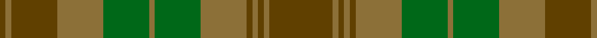

In pattern [GGGGGGGGGGGGG](/stripes/ggggggggggggg/).

This was sourced from register-of-tartans.  It is a [13 stripe tartan](/stripes/stripes13/).

Original link https://www.tartanregister.gov.uk/tartanDetails.aspx?ref=4175

## Attestations

This cloth appears in 2 source records; the oldest owns this page.

- 01/01/1914 — Tyneside Scottish (Green) (register-of-tartans, [record](https://www.tartanregister.gov.uk/tartanDetails.aspx?ref=4175))
- 1914 — Tyneside Scottish (Green) (District) (tartans-authority, [record](http://www.tartansauthority.com/tartan-ferret/display/5084/))

## Register references

External register numbers recorded for this tartan.

- Scottish Register of Tartans: [4175](https://www.tartanregister.gov.uk/tartanDetails.aspx?ref=4175)
- Scottish Tartans Authority (ITI): 5084

## Thread count
T/44 LT4 T4 LT4 T4 LT32 G32 LT4 G32 LT32 T32 LT4 T/4

## Palette
Each colour and the base-6 reference it is a variant of.

| Colour | Shade | Base |
|---|---|---|
| G | <code style="background-color:#006818;">#006818</code> `oklch(45.0% 0.142 145.0)` <small>#006818</small> | G <code style="background-color:#006100;">#006100</code> |
| LT | <code style="background-color:#8C7038;">#8C7038</code> `oklch(56.0% 0.082 83.0)` <small>#8C7038</small> | G <code style="background-color:#006100;">#006100</code> |
| T | <code style="background-color:#604000;">#604000</code> `oklch(39.8% 0.083 76.8)` <small>#604000</small> | G <code style="background-color:#006100;">#006100</code> |

## Nearest tartans

The nearest existing variants by ΔTartan distance, with this tartan at the top so the swatches line up against it.

ΔTartan

Tartan

Sett

—

<a href="/ttd/edit/#slug=dy11y1dy1y1dy1y8g8y1g8y8dy8y1dy1~x4">Tyneside Scottish (Green)</a> <a class="nn-out" href="/setts/s13/dy11y1dy1y1dy1y8g8y1g8y8dy8y1dy1~x4/" title="open its dictionary page">↗</a>

1.52

<a href="/ttd/edit/#slug=do22y26r4y26do22dy3do3dy3do3dy31do3dy3do3dy3~x2">Devarr</a> <a class="nn-out" href="/setts/s14/do22y26r4y26do22dy3do3dy3do3dy31do3dy3do3dy3~x2/" title="open its dictionary page">↗</a>

1.86

<a href="/ttd/edit/#slug=dy31do3dy3do3dy3do22y26r4~x2">Devarr (Fashion)</a> <a class="nn-out" href="/setts/s8/dy31do3dy3do3dy3do22y26r4~x2/" title="open its dictionary page">↗</a>

1.98

<a href="/ttd/edit/#slug=dg1r1dg22dy21dg12r11dg22r1dg1~x2">MacNaughton Htg</a> <a class="nn-out" href="/setts/s9/dg1r1dg22dy21dg12r11dg22r1dg1~x2/" title="open its dictionary page">↗</a>

1.99

<a href="/ttd/edit/#slug=g3y1lo2g3y1lo2dy21g18dy2g3dy2g18dy21y1lo2~x2">Prince David</a> <a class="nn-out" href="/setts/s15/g3y1lo2g3y1lo2dy21g18dy2g3dy2g18dy21y1lo2~x2/" title="open its dictionary page">↗</a>

2.00

<a href="/ttd/edit/#slug=dg10r2y2r6y16r1y2r1y3r6~x4">Nithsdale</a> <a class="nn-out" href="/setts/s10/dg10r2y2r6y16r1y2r1y3r6~x4/" title="open its dictionary page">↗</a>

2.04

<a href="/ttd/edit/#slug=dy8dg20db15dy6dg4dy8db4dy6dg20dy8db6dy4b2dy4db6">Unidentified Fragment #2</a> <a class="nn-out" href="/setts/s15/dy8dg20db15dy6dg4dy8db4dy6dg20dy8db6dy4b2dy4db6/" title="open its dictionary page">↗</a>

2.14

<a href="/ttd/edit/#slug=t22g3t3g3t3g9o28g3o6~x2">Manx Centenary</a> <a class="nn-out" href="/setts/s9/t22g3t3g3t3g9o28g3o6~x2/" title="open its dictionary page">↗</a>

2.14

<a href="/ttd/edit/#slug=o5n3o22r3n6n17r2n4r2n4~x2">Clyde</a> <a class="nn-out" href="/setts/s10/o5n3o22r3n6n17r2n4r2n4~x2/" title="open its dictionary page">↗</a>

2.19

<a href="/ttd/edit/#slug=y9g13dg26dy6dp5dy40dp5dy6dg26g13y9dg3~x2">de Meuron (Family)</a> <a class="nn-out" href="/setts/s12/y9g13dg26dy6dp5dy40dp5dy6dg26g13y9dg3~x2/" title="open its dictionary page">↗</a>

2.24

<a href="/ttd/edit/#slug=dg5k2dg28k10dy26db4dg4~x2">John Telfar Dunbar Hunting</a> <a class="nn-out" href="/setts/s7/dg5k2dg28k10dy26db4dg4~x2/" title="open its dictionary page">↗</a>

## Neighbour map

Every grey dot is one of 14299 variants placed by the first two principal components of the ΔTartan feature space (44% of its variance). Red is this tartan; blue dots are its nearest — click one to open its page.

<svg viewBox="0 0 640 380" role="img" style="max-width:100%;height:auto;border:1px solid #e0e0e0;border-radius:4px;display:block" xmlns="http://www.w3.org/2000/svg"><image href="/nn/cloud.v1.png" width="640" height="380"/><a href="/setts/s14/do22y26r4y26do22dy3do3dy3do3dy31do3dy3do3dy3~x2/"><circle cx="330.0" cy="232.3" r="4" fill="#3465a4"><title>Devarr</title></circle></a><a href="/setts/s8/dy31do3dy3do3dy3do22y26r4~x2/"><circle cx="364.3" cy="266.0" r="4" fill="#3465a4"><title>Devarr (Fashion)</title></circle></a><a href="/setts/s9/dg1r1dg22dy21dg12r11dg22r1dg1~x2/"><circle cx="401.8" cy="242.5" r="4" fill="#3465a4"><title>MacNaughton Htg</title></circle></a><a href="/setts/s15/g3y1lo2g3y1lo2dy21g18dy2g3dy2g18dy21y1lo2~x2/"><circle cx="423.6" cy="196.1" r="4" fill="#3465a4"><title>Prince David</title></circle></a><a href="/setts/s10/dg10r2y2r6y16r1y2r1y3r6~x4/"><circle cx="391.8" cy="231.1" r="4" fill="#3465a4"><title>Nithsdale</title></circle></a><a href="/setts/s15/dy8dg20db15dy6dg4dy8db4dy6dg20dy8db6dy4b2dy4db6/"><circle cx="298.8" cy="264.3" r="4" fill="#3465a4"><title>Unidentified Fragment #2</title></circle></a><a href="/setts/s9/t22g3t3g3t3g9o28g3o6~x2/"><circle cx="370.7" cy="267.2" r="4" fill="#3465a4"><title>Manx Centenary</title></circle></a><a href="/setts/s10/o5n3o22r3n6n17r2n4r2n4~x2/"><circle cx="338.2" cy="236.7" r="4" fill="#3465a4"><title>Clyde</title></circle></a><a href="/setts/s12/y9g13dg26dy6dp5dy40dp5dy6dg26g13y9dg3~x2/"><circle cx="276.2" cy="232.2" r="4" fill="#3465a4"><title>de Meuron (Family)</title></circle></a><a href="/setts/s7/dg5k2dg28k10dy26db4dg4~x2/"><circle cx="392.1" cy="269.1" r="4" fill="#3465a4"><title>John Telfar Dunbar Hunting</title></circle></a><circle cx="355.2" cy="261.7" r="5" fill="#c00000"/></svg>

ID: /setts/s13/dy11y1dy1y1dy1y8g8y1g8y8dy8y1dy1~x4/
