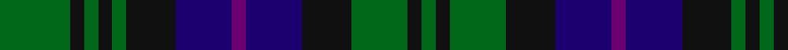

In pattern [GKGKBBBKGKGKG](/stripes/gkgkbbbkgkgkg/).

This was sourced from register-of-tartans.  It is a [13 stripe tartan](/stripes/stripes13/).

Original link https://www.tartanregister.gov.uk/tartanDetails.aspx?ref=2174

## Register references

External register numbers recorded for this tartan.

- Scottish Register of Tartans: [2174](https://www.tartanregister.gov.uk/tartanDetails.aspx?ref=2174)
- Scottish Tartans Authority (ITI): 2102
- Scottish Tartans World Register: 2102

## Thread count
G/20 K4 G4 K4 G4 K14 DB16 P4 DB16 K14 G16 K4 G/4

## Palette
Each colour and its ΔE from the base-6 reference it is a variant of.

| Colour | Shade | Base | ΔE (OKLab) |
|---|---|---|---|
| DB | <code style="background-color:#1C0070;">#1C0070</code> `#1C0070` | B <code style="background-color:#2A418A;">#2A418A</code> | 0.14 |
| G | <code style="background-color:#006818;">#006818</code> `#006818` | G <code style="background-color:#006100;">#006100</code> | 0.02 |
| K | <code style="background-color:#101010;">#101010</code> `#101010` | K <code style="background-color:#000000;">#000000</code> | 0.17 |
| P | <code style="background-color:#6C0070;">#6C0070</code> `#6C0070` | B <code style="background-color:#2A418A;">#2A418A</code> | 0.16 |

## Nearest tartans

The nearest existing variants by ΔTartan distance.

1. [Lamberton (?)](/setts/s13/db30k5db5k5db5k24g24ly6g24k24db24k5db5/) — ΔT 0.57
1. [Cheape of Torosay #2 (Personal)](/setts/s13/db6k1db1k1db1k6g6t2g6k6db6k1g2~x4/) — ΔT 0.61
1. [Cheape of Torosay (Clan)](/setts/s13/db6k1db1k1db1k6g6t2g6k6db6k1db2~x4/) — ΔT 0.62
1. [Murray #2](/setts/s13/db6k1db1k1db1k6g6r2g6k6db6k1db2~x4/) — ΔT 0.63
1. [New South Wales Scottish Rifles](/setts/s13/db6k1db1k1db1k6g6r2g6k6db6k1db2~x2/) — ΔT 0.63
1. [Forbes](/setts/s13/db1k1db6k6g6k1w1k1g6k6db6k1db1~x8/) — ΔT 0.64
1. [Gordon](/setts/s12/db5k1db1k1db1k4dg5ly1dg5k4db6k1~x4/) — ΔT 0.78
1. [Scottish Airports Corporate Tartan Tartan Number: 2510. Earliest known date: November 1988 An archetypal Kinloch Anderson blue design. Scottish Tartan Society notes say that Percy Pilcher (an early aviation pioneer 1866 -1899) had connections to the Gunn tartan (his mother was a Robinson). The design is based on that sett using the colours of the British Airports Authority with the purple line added to represent the Scottish thistle. See products available Copyright © Blair Urquhart, Comrie, 2015](/setts/s10/db18k17db3g18db4g18db3k17db18p4~x2/) — ΔT 0.87
1. [Fletcher](/setts/s15/db11k3db3k3db3k11r3dg13k3dg13r3k11db11k3db3~x2/) — ΔT 0.92
1. [Melville Family Tartan Tartan Number: 1050. Earliest known date: 1847 There is a sample in the Moy Hall collection.(1848). This sett, also known as Oliphant and Melville, appears in one of Wilson's notebooks in 1847. It is mentioned in a letter dated June 1824 but without any means of identification. It is also to be found in the Scott Adie (London) collection and in the MacPherson Museum in Newtonmore. Wilson records the second pivot (between the white lines) as blue. See products available Copyright © Blair Urquhart, Comrie, 2015](/setts/s11/db8k2db12k13g13w2k4w2g13k13db4~x2/) — ΔT 0.92

## Neighbour map

Every grey dot is one of 14299 variants placed by the first two principal components of the ΔTartan feature space (44% of its variance). Red is this tartan; blue dots are its nearest — click one to open its page.

<svg viewBox="0 0 640 380" role="img" style="max-width:100%;height:auto;border:1px solid #e0e0e0;border-radius:4px;display:block" xmlns="http://www.w3.org/2000/svg"><image href="/nn/cloud.v1.png" width="640" height="380"/><a href="/setts/s13/db30k5db5k5db5k24g24ly6g24k24db24k5db5/"><circle cx="187.3" cy="235.5" r="4" fill="#3465a4"><title>Lamberton (?)</title></circle></a><a href="/setts/s13/db6k1db1k1db1k6g6t2g6k6db6k1g2~x4/"><circle cx="165.9" cy="234.3" r="4" fill="#3465a4"><title>Cheape of Torosay #2 (Personal)</title></circle></a><a href="/setts/s13/db6k1db1k1db1k6g6t2g6k6db6k1db2~x4/"><circle cx="177.3" cy="235.4" r="4" fill="#3465a4"><title>Cheape of Torosay (Clan)</title></circle></a><a href="/setts/s13/db6k1db1k1db1k6g6r2g6k6db6k1db2~x4/"><circle cx="177.1" cy="233.1" r="4" fill="#3465a4"><title>Murray #2</title></circle></a><a href="/setts/s13/db6k1db1k1db1k6g6r2g6k6db6k1db2~x2/"><circle cx="177.1" cy="233.1" r="4" fill="#3465a4"><title>New South Wales Scottish Rifles</title></circle></a><a href="/setts/s13/db1k1db6k6g6k1w1k1g6k6db6k1db1~x8/"><circle cx="182.3" cy="223.5" r="4" fill="#3465a4"><title>Forbes</title></circle></a><a href="/setts/s12/db5k1db1k1db1k4dg5ly1dg5k4db6k1~x4/"><circle cx="195.6" cy="245.1" r="4" fill="#3465a4"><title>Gordon</title></circle></a><a href="/setts/s10/db18k17db3g18db4g18db3k17db18p4~x2/"><circle cx="183.5" cy="257.4" r="4" fill="#3465a4"><title>Scottish Airports Corporate Tartan Tartan Number: 2510. Earliest known date: November 1988 An archetypal Kinloch Anderson blue design. Scottish Tartan Society notes say that Percy Pilcher (an early aviation pioneer 1866 -1899) had connections to the Gunn tartan (his mother was a Robinson). The design is based on that sett using the colours of the British Airports Authority with the purple line added to represent the Scottish thistle. See products available Copyright © Blair Urquhart, Comrie, 2015</title></circle></a><a href="/setts/s15/db11k3db3k3db3k11r3dg13k3dg13r3k11db11k3db3~x2/"><circle cx="166.9" cy="246.5" r="4" fill="#3465a4"><title>Fletcher</title></circle></a><a href="/setts/s11/db8k2db12k13g13w2k4w2g13k13db4~x2/"><circle cx="155.9" cy="232.9" r="4" fill="#3465a4"><title>Melville Family Tartan Tartan Number: 1050. Earliest known date: 1847 There is a sample in the Moy Hall collection.(1848). This sett, also known as Oliphant and Melville, appears in one of Wilson's notebooks in 1847. It is mentioned in a letter dated June 1824 but without any means of identification. It is also to be found in the Scott Adie (London) collection and in the MacPherson Museum in Newtonmore. Wilson records the second pivot (between the white lines) as blue. See products available Copyright © Blair Urquhart, Comrie, 2015</title></circle></a><circle cx="175.3" cy="245.2" r="5" fill="#c00000"/></svg>

ID: /setts/s13/g10k2g2k2g2k7db8dp2db8k7g8k2g2~x2/
