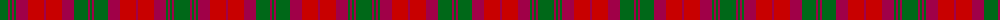

In pattern [GRGRGRRRRRGRG](/patterns/grgrgrrrrrgrg/).

This was sourced from house-of-tartan.  It is a [13 stripes tartan](/stripes/stripes13/).

Original link http://www.house-of-tartan.scotland.net/house/TartanViewjs.asp?colr=Def&tnam=857

## Thread count
G/16 R2 G2 R2 G2 R12 Ra16 R2 Ra16 R12 G14 R2 G/2

## Palette
Each colour and its ΔE from the base-6 reference it is a variant of.

| Colour | Shade | Base | ΔE (OKLab) |
|---|---|---|---|
| G | <code style="background-color:#006818;">#006818</code> `#006818` | G <code style="background-color:#006400;">#006400</code> | 0.02 |
| R | <code style="background-color:#A00048;">#A00048</code> `#A00048` | R <code style="background-color:#C80000;">#C80000</code> | 0.11 |
| Ra | <code style="background-color:#C80000;">#C80000</code> `#C80000` | R <code style="background-color:#C80000;">#C80000</code> | 0.00 |

ID: /setts/s13/g16r2g2r2g2r12ra16r2ra16r12g14r2g2-g006818-ra00048-rac80000/
