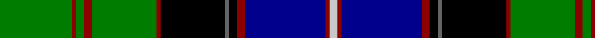

In pattern [GRGRGRKBKRBRW](/patterns/grgrgrkbkrbrw/).

This was sourced from register-of-tartans.  It is a [13 stripes tartan](/stripes/stripes13/).

Original link https://www.tartanregister.gov.uk/tartanDetails.aspx?ref=546

## Thread count
G/72 DR4 G8 DR8 G64 DR4 K64 N4 K8 DR8 DB80 DR4 Na/8

## Palette
Each colour and its ΔE from the base-6 reference it is a variant of.

| Colour | Shade | Base | ΔE (OKLab) |
|---|---|---|---|
| DB | <code style="background-color:#00008C;">#00008C</code> `#00008C` | B <code style="background-color:#2A418A;">#2A418A</code> | 0.13 |
| DR | <code style="background-color:#8C0000;">#8C0000</code> `#8C0000` | R <code style="background-color:#CC0000;">#CC0000</code> | 0.14 |
| G | <code style="background-color:#007C00;">#007C00</code> `#007C00` | G <code style="background-color:#006100;">#006100</code> | 0.09 |
| K | <code style="background-color:#000000;">#000000</code> `#000000` | K <code style="background-color:#000000;">#000000</code> | 0.00 |
| N | <code style="background-color:#646464;">#646464</code> `#646464` | B <code style="background-color:#2A418A;">#2A418A</code> | 0.16 |
| Na | <code style="background-color:#C8C8C8;">#C8C8C8</code> `#C8C8C8` | W <code style="background-color:#F7F7F7;">#F7F7F7</code> | 0.14 |

## Nearest tartans

The nearest existing variants by ΔTartan distance.

1. [Princess Diana](/setts/s12/k14r2k2r2k2g18r2g18w1b12ba1r8~b00008c-ba788cb4-g007800-k000000-r8c0000-wc8c8c8~x2/) — ΔT 0.83
1. [Baron of Greencastle (Personal)](/setts/s13/g4y2g24r2k12b3k2b2k2b12w1b1w3~b2c2c80-g006818-k101010-r880000-wf8f8f8-ye8c000~x2/) — ΔT 0.84
1. [Hunnisett, /Edinchip](/setts/s11/b38w2b2k10g2y2g22k3r3k3r3~b000050-g008000-k000000-rc00000-we0e0e0-yf0c000~x2/) — ΔT 0.99
1. [Strathclyde, University of](/setts/s14/b7k1r3k1b24k1w3k3g3k3g3ga19k2w4~b304080-g607030-ga008000-k000000-rc00000-we0e0e0~x2/) — ΔT 1.02
1. [Sutherland, Old](/setts/s12/g6w2g24k12b3k2b2k2b12r1b1r3~b304080-g008000-k000000-rc00000-we0e0e0~x2/) — ΔT 1.03
1. [Urquhart, White Line](/setts/s12/b4w2b24k3b3k3b8k24g48k3g3r2~b304080-g008000-k000000-rc00000-we0e0e0/) — ΔT 1.03
1. [MacKellar Clan Tartan Tartan Number: 939. Earliest known date: pre 2003 As worn by Kenneth? - D.C.S. See products available Copyright © Blair Urquhart, Comrie, 2015](/setts/s11/g32w2g2y3g2w2g2k16b2ba16w3~b5c8ca8-ba2c2c80-g006818-k101010-we0e0e0-ye8c000~x2/) — ΔT 1.08
1. [California](/setts/s13/b4k1ba28k16g10r2g10r4g10r2g10k1y4~b8080d0-ba304080-g008000-k000000-rc00000-yf0c000~x2/) — ΔT 1.11
1. [Labrador (District)](/setts/s11/w11k2w2k2y2k11g30r2g3k1wa5~g003820-k101010-ra00000-w98c8e8-wae0e0e0-ybc8c00~x2/) — ΔT 1.13
1. [Unidentified 26](/setts/s11/b2r2b2r2b20k24g12y1k2g2ba2~b304080-ba5480b0-g008000-k000000-rc00000-yf0c000~x2/) — ΔT 1.13

## Neighbour map

Every grey dot is one of 15726 variants placed by the first two principal components of the ΔTartan feature space (44% of its variance). Red is this tartan; blue dots are its nearest — click one to open its page.

<svg viewBox="0 0 640 380" role="img" style="max-width:100%;height:auto;border:1px solid #e0e0e0;border-radius:4px;display:block" xmlns="http://www.w3.org/2000/svg"><image href="/nn/cloud.v1.png" width="640" height="380"/><a href="/setts/s12/k14r2k2r2k2g18r2g18w1b12ba1r8~b00008c-ba788cb4-g007800-k000000-r8c0000-wc8c8c8~x2/"><circle cx="172.7" cy="116.0" r="4" fill="#3465a4"><title>Princess Diana</title></circle></a><a href="/setts/s13/g4y2g24r2k12b3k2b2k2b12w1b1w3~b2c2c80-g006818-k101010-r880000-wf8f8f8-ye8c000~x2/"><circle cx="190.0" cy="88.6" r="4" fill="#3465a4"><title>Baron of Greencastle (Personal)</title></circle></a><a href="/setts/s11/b38w2b2k10g2y2g22k3r3k3r3~b000050-g008000-k000000-rc00000-we0e0e0-yf0c000~x2/"><circle cx="203.6" cy="96.4" r="4" fill="#3465a4"><title>Hunnisett, /Edinchip</title></circle></a><a href="/setts/s14/b7k1r3k1b24k1w3k3g3k3g3ga19k2w4~b304080-g607030-ga008000-k000000-rc00000-we0e0e0~x2/"><circle cx="169.4" cy="75.6" r="4" fill="#3465a4"><title>Strathclyde, University of</title></circle></a><a href="/setts/s12/g6w2g24k12b3k2b2k2b12r1b1r3~b304080-g008000-k000000-rc00000-we0e0e0~x2/"><circle cx="208.2" cy="108.8" r="4" fill="#3465a4"><title>Sutherland, Old</title></circle></a><a href="/setts/s12/b4w2b24k3b3k3b8k24g48k3g3r2~b304080-g008000-k000000-rc00000-we0e0e0/"><circle cx="216.7" cy="103.5" r="4" fill="#3465a4"><title>Urquhart, White Line</title></circle></a><a href="/setts/s11/g32w2g2y3g2w2g2k16b2ba16w3~b5c8ca8-ba2c2c80-g006818-k101010-we0e0e0-ye8c000~x2/"><circle cx="203.7" cy="106.0" r="4" fill="#3465a4"><title>MacKellar Clan Tartan Tartan Number: 939. Earliest known date: pre 2003 As worn by Kenneth? - D.C.S. See products available Copyright © Blair Urquhart, Comrie, 2015</title></circle></a><a href="/setts/s13/b4k1ba28k16g10r2g10r4g10r2g10k1y4~b8080d0-ba304080-g008000-k000000-rc00000-yf0c000~x2/"><circle cx="159.5" cy="94.6" r="4" fill="#3465a4"><title>California</title></circle></a><a href="/setts/s11/w11k2w2k2y2k11g30r2g3k1wa5~g003820-k101010-ra00000-w98c8e8-wae0e0e0-ybc8c00~x2/"><circle cx="220.1" cy="77.4" r="4" fill="#3465a4"><title>Labrador (District)</title></circle></a><a href="/setts/s11/b2r2b2r2b20k24g12y1k2g2ba2~b304080-ba5480b0-g008000-k000000-rc00000-yf0c000~x2/"><circle cx="179.5" cy="93.0" r="4" fill="#3465a4"><title>Unidentified 26</title></circle></a><circle cx="179.3" cy="97.2" r="5" fill="#c00000"/></svg>

ID: /setts/s13/g18r1g2r2g16r1k16b1k2r2ba20r1w2~b646464-ba00008c-g007c00-k000000-r8c0000-wc8c8c8~x4/
