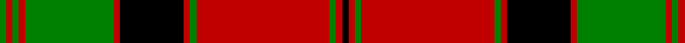

In pattern [GRGRGRKRGRGRK](/patterns/grgrgrkrgrgrk/).

This was sourced from weddslist.  It is a [13 stripes tartan](/stripes/stripes13/).

Original link http://www.weddslist.com/cgi-bin/tartans/pg.pl?source=sts

## Thread count
G/2 R2 G2 R2 G28 R2 K20 R2 G2 R42 G2 R2 K/2

## Palette
Each colour and its ΔE from the base-6 reference it is a variant of.

| Colour | Shade | Base | ΔE (OKLab) |
|---|---|---|---|
| G | <code style="background-color:#008000;">#008000</code> `#008000` | G <code style="background-color:#006100;">#006100</code> | 0.10 |
| K | <code style="background-color:#000000;">#000000</code> `#000000` | K <code style="background-color:#000000;">#000000</code> | 0.00 |
| R | <code style="background-color:#C00000;">#C00000</code> `#C00000` | R <code style="background-color:#CC0000;">#CC0000</code> | 0.03 |

## Nearest tartans

The nearest existing variants by ΔTartan distance.

1. [MacQuarrie #4](/setts/s13/g1r1g1r1g14r1k10r1g1r21g1r1k1~g005020-k101010-rdc0000~x2/) — ΔT 0.95
1. [MacQuarrie 1815](/setts/s13/g1r2g1r26g1r1b14r1g21r1g1r2g1~b00004c-g004c00-rc80000~x2/) — ΔT 1.11
1. [Kerr](/setts/s10/g20k1g2k1g3k14r28k1r2k4~g008000-k000000-rc00000~x2/) — ΔT 1.23
1. [Kerr](/setts/s10/g20k1g2k1g3k14r28k1r2k4~g008b00-k101010-rff0000~x2/) — ΔT 1.26
1. [Stewart of Atholl](/setts/s9/g22k1g2k1g3k8r20k1r6~g004c00-k000000-rc80000~x2/) — ΔT 1.33
1. [Stewart of Athol](/setts/s9/g22k1g2k1g3k8r20k1r6~g008000-k000000-rc00000~x2/) — ΔT 1.34
1. [Kerr](/setts/s10/g20k1g2k1g3k14r28k1r2k4~g004c00-k000000-rc80000~x2/) — ΔT 1.38
1. [Stewart of Appin](/setts/s16/r3b2w1r2g24r4g2r2b8r2g2r24b2w1r2g2~b000064-g004c00-rc80000-wd0d0d0/) — ΔT 1.39
1. [Mordente (Personal)](/setts/s14/g2r1w2g7r1w1g1w1r1g7r16g1w1r2~g006818-rc80000-wfcfcfc~x2/) — ΔT 1.40
1. [Mordente (Personal)](/setts/s14/g2r1w2g7r1w1g1w1r1g7r16g1w1r2~g006818-rc80000-wfcfcfc~x4/) — ΔT 1.40

## Neighbour map

Every grey dot is one of 15726 variants placed by the first two principal components of the ΔTartan feature space (44% of its variance). Red is this tartan; blue dots are its nearest — click one to open its page.

<svg viewBox="0 0 640 380" role="img" style="max-width:100%;height:auto;border:1px solid #e0e0e0;border-radius:4px;display:block" xmlns="http://www.w3.org/2000/svg"><image href="/nn/cloud.v1.png" width="640" height="380"/><a href="/setts/s13/g1r1g1r1g14r1k10r1g1r21g1r1k1~g005020-k101010-rdc0000~x2/"><circle cx="330.9" cy="119.1" r="4" fill="#3465a4"><title>MacQuarrie #4</title></circle></a><a href="/setts/s13/g1r2g1r26g1r1b14r1g21r1g1r2g1~b00004c-g004c00-rc80000~x2/"><circle cx="330.3" cy="115.1" r="4" fill="#3465a4"><title>MacQuarrie 1815</title></circle></a><a href="/setts/s10/g20k1g2k1g3k14r28k1r2k4~g008000-k000000-rc00000~x2/"><circle cx="266.4" cy="129.9" r="4" fill="#3465a4"><title>Kerr</title></circle></a><a href="/setts/s10/g20k1g2k1g3k14r28k1r2k4~g008b00-k101010-rff0000~x2/"><circle cx="269.2" cy="123.5" r="4" fill="#3465a4"><title>Kerr</title></circle></a><a href="/setts/s9/g22k1g2k1g3k8r20k1r6~g004c00-k000000-rc80000~x2/"><circle cx="290.7" cy="156.5" r="4" fill="#3465a4"><title>Stewart of Atholl</title></circle></a><a href="/setts/s9/g22k1g2k1g3k8r20k1r6~g008000-k000000-rc00000~x2/"><circle cx="278.1" cy="151.7" r="4" fill="#3465a4"><title>Stewart of Athol</title></circle></a><a href="/setts/s10/g20k1g2k1g3k14r28k1r2k4~g004c00-k000000-rc80000~x2/"><circle cx="277.2" cy="133.8" r="4" fill="#3465a4"><title>Kerr</title></circle></a><a href="/setts/s16/r3b2w1r2g24r4g2r2b8r2g2r24b2w1r2g2~b000064-g004c00-rc80000-wd0d0d0/"><circle cx="308.0" cy="95.4" r="4" fill="#3465a4"><title>Stewart of Appin</title></circle></a><a href="/setts/s14/g2r1w2g7r1w1g1w1r1g7r16g1w1r2~g006818-rc80000-wfcfcfc~x2/"><circle cx="310.3" cy="127.6" r="4" fill="#3465a4"><title>Mordente (Personal)</title></circle></a><a href="/setts/s14/g2r1w2g7r1w1g1w1r1g7r16g1w1r2~g006818-rc80000-wfcfcfc~x4/"><circle cx="310.3" cy="127.6" r="4" fill="#3465a4"><title>Mordente (Personal)</title></circle></a><circle cx="306.9" cy="113.9" r="5" fill="#c00000"/></svg>

ID: /setts/s13/g1r1g1r1g14r1k10r1g1r21g1r1k1~g008000-k000000-rc00000~x2/
