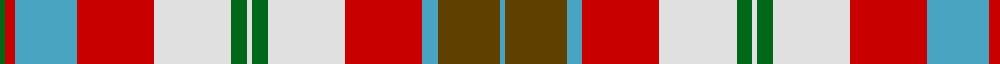

In pattern [GRYRWGWGWRYGY](/stripes/gryrwgwgwrygy/).

This was sourced from tartans-authority.  It is a [13 stripe tartan](/stripes/stripes13/).

Original link http://www.tartansauthority.com/tartan-ferret/display/10132/

## Attestations

This cloth appears in 2 source records; the oldest owns this page.

- 1st Jan. 2010 — St. John New Brunswick (District) (tartans-authority, [record](http://www.tartansauthority.com/tartan-ferret/display/10132/))
- undated — St. John New Brunswick District Tartan Tartan Number: 10132. Earliest known date: 1st Jan. 2010 The Saint John New Brunswick tartan was commissioned by Claudia MacLean of ScotDance New Brunswick as a legacy gift to the City of Saint John, New Brunswick, Canada, following the Highland Games held there in 2006. This tartan can only be woven with the permission of the City of St John New Brunswick. See products available Copyright © Blair Urquhart, Comrie, 2015 (house-of-tartan, [record](http://www.house-of-tartan.scotland.net/house/TartanViewjs.asp?colr=Def&tnam=10132))

## Thread count
G/2 R4 B24 R30 LN30 G6 LN2 G6 LN30 R30 B6 T24 B/2

## Palette
Each colour and its ΔE from the base-6 reference it is a variant of.

| Colour | Shade | Base | ΔE (OKLab) |
|---|---|---|---|
| B | <code style="background-color:#48A4C0;">#48A4C0</code> `#48A4C0` | Y <code style="background-color:#F2BF00;">#F2BF00</code> | 0.29 |
| G | <code style="background-color:#006818;">#006818</code> `#006818` | G <code style="background-color:#006100;">#006100</code> | 0.02 |
| LN | <code style="background-color:#E0E0E0;">#E0E0E0</code> `#E0E0E0` | W <code style="background-color:#F7F7F7;">#F7F7F7</code> | 0.07 |
| R | <code style="background-color:#C80000;">#C80000</code> `#C80000` | R <code style="background-color:#CC0000;">#CC0000</code> | 0.01 |
| T | <code style="background-color:#604000;">#604000</code> `#604000` | G <code style="background-color:#006100;">#006100</code> | 0.14 |

## Nearest tartans

The nearest existing variants by ΔTartan distance.

1. [Saint John New Brunswick](/setts/s13/g1r2t12r15w15g3w1g3w15r15t3dy12t1~x2/) — ΔT 0.71
1. [MacFarlane Dress Clan Tartan Tartan Number: 659. Earliest known date: 1930-40 MacKinlay was a collector of tartans from the period between the wars. He drew out the patterns on strips of paper defining the warp with colouring pencils. Originally listed as MacFadzean MacPhedran. Threadcount corrected in 2005. The B2 in the red was restored. See products available Copyright © Blair Urquhart, Comrie, 2015](/setts/s15/db4w2r6k1db12g4w2r6db1r6w2g8r2w16r4~x2/) — ΔT 0.95
1. [Catalunya Escocia](/setts/s10/ly6r6ly6r6ly6k1db18w2db1w4~x2/) — ΔT 0.95
1. [MacFarlane, dress](/setts/s14/db4w2r6k1db12g4w2r6r6w2g8r2w16r4~x2/) — ΔT 1.14
1. [Anderson Dress](/setts/s17/r3w5r2w12ly1k2ly1w2ly1k2ly2k2r1dg4r2dg4r2~x2/) — ΔT 1.21
1. [Princess Marina (Fashion)](/setts/s12/w2g2r3g2r3g2r3g2r2g3lb13r1~x4/) — ΔT 1.23
1. [Stuart-Houghton Dress (Personal)](/setts/s16/w11y4w4db2w4y4w11r26y4w3y4w2db14dg10w16dg6~x2/) — ΔT 1.23
1. [MacKellar, dress](/setts/s11/o35w4o3ly7o3w4o7dr15y4w36y5~x2/) — ΔT 1.24
1. [Red Hackle Pipe Band (Corporate)](/setts/s16/n30k2r18k3w24n12k3n24k2g26n12g12r12w12r12w2/) — ΔT 1.29
1. [Hudson Bay Company Artifact](/setts/s15/w9o14dr11o3o11ly7w1dr3w1ly7o7dr3w2b2w2~x2/) — ΔT 1.30

## Neighbour map

Every grey dot is one of 14299 variants placed by the first two principal components of the ΔTartan feature space (44% of its variance). Red is this tartan; blue dots are its nearest — click one to open its page.

<svg viewBox="0 0 640 380" role="img" style="max-width:100%;height:auto;border:1px solid #e0e0e0;border-radius:4px;display:block" xmlns="http://www.w3.org/2000/svg"><image href="/nn/cloud.v1.png" width="640" height="380"/><a href="/setts/s13/g1r2t12r15w15g3w1g3w15r15t3dy12t1~x2/"><circle cx="114.4" cy="115.0" r="4" fill="#3465a4"><title>Saint John New Brunswick</title></circle></a><a href="/setts/s15/db4w2r6k1db12g4w2r6db1r6w2g8r2w16r4~x2/"><circle cx="118.2" cy="111.9" r="4" fill="#3465a4"><title>MacFarlane Dress Clan Tartan Tartan Number: 659. Earliest known date: 1930-40 MacKinlay was a collector of tartans from the period between the wars. He drew out the patterns on strips of paper defining the warp with colouring pencils. Originally listed as MacFadzean MacPhedran. Threadcount corrected in 2005. The B2 in the red was restored. See products available Copyright © Blair Urquhart, Comrie, 2015</title></circle></a><a href="/setts/s10/ly6r6ly6r6ly6k1db18w2db1w4~x2/"><circle cx="135.7" cy="116.2" r="4" fill="#3465a4"><title>Catalunya Escocia</title></circle></a><a href="/setts/s14/db4w2r6k1db12g4w2r6r6w2g8r2w16r4~x2/"><circle cx="79.1" cy="103.3" r="4" fill="#3465a4"><title>MacFarlane, dress</title></circle></a><a href="/setts/s17/r3w5r2w12ly1k2ly1w2ly1k2ly2k2r1dg4r2dg4r2~x2/"><circle cx="124.5" cy="102.1" r="4" fill="#3465a4"><title>Anderson Dress</title></circle></a><a href="/setts/s12/w2g2r3g2r3g2r3g2r2g3lb13r1~x4/"><circle cx="183.0" cy="141.6" r="4" fill="#3465a4"><title>Princess Marina (Fashion)</title></circle></a><a href="/setts/s16/w11y4w4db2w4y4w11r26y4w3y4w2db14dg10w16dg6~x2/"><circle cx="124.3" cy="111.0" r="4" fill="#3465a4"><title>Stuart-Houghton Dress (Personal)</title></circle></a><a href="/setts/s11/o35w4o3ly7o3w4o7dr15y4w36y5~x2/"><circle cx="180.0" cy="120.2" r="4" fill="#3465a4"><title>MacKellar, dress</title></circle></a><a href="/setts/s16/n30k2r18k3w24n12k3n24k2g26n12g12r12w12r12w2/"><circle cx="140.5" cy="137.0" r="4" fill="#3465a4"><title>Red Hackle Pipe Band (Corporate)</title></circle></a><a href="/setts/s15/w9o14dr11o3o11ly7w1dr3w1ly7o7dr3w2b2w2~x2/"><circle cx="70.1" cy="112.3" r="4" fill="#3465a4"><title>Hudson Bay Company Artifact</title></circle></a><circle cx="130.2" cy="121.3" r="5" fill="#c00000"/></svg>

ID: /setts/s13/g1r2lg12r15w15g3w1g3w15r15lg3dy12lg1~x2/
