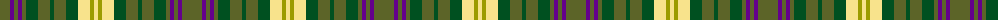

In pattern [GBGBGGGGGGYYY](/patterns/gbgbggggggyyy/).

This was sourced from register-of-tartans.  It is a [13 stripes tartan](/stripes/stripes13/).

Original link https://www.tartanregister.gov.uk/tartanDetails.aspx?ref=11616

## Thread count
Ga/20 P4 Ga4 P4 Ga4 G12 Ga12 G4 Ga12 G12 LY12 LG4 LY/4

## Palette
Each colour and its ΔE from the base-6 reference it is a variant of.

| Colour | Shade | Base | ΔE (OKLab) |
|---|---|---|---|
| G | <code style="background-color:#005020;">#005020</code> `#005020` | G <code style="background-color:#006400;">#006400</code> | 0.08 |
| Ga | <code style="background-color:#5C6428;">#5C6428</code> `#5C6428` | G <code style="background-color:#006400;">#006400</code> | 0.09 |
| LG | <code style="background-color:#9C9C00;">#9C9C00</code> `#9C9C00` | Y <code style="background-color:#E8C000;">#E8C000</code> | 0.16 |
| LY | <code style="background-color:#F8E38C;">#F8E38C</code> `#F8E38C` | Y <code style="background-color:#E8C000;">#E8C000</code> | 0.11 |
| P | <code style="background-color:#64008C;">#64008C</code> `#64008C` | B <code style="background-color:#2C4084;">#2C4084</code> | 0.13 |

## Nearest tartans

The nearest existing variants by ΔTartan distance.

1. [Harmony, 2 & 3](/setts/s12/g22b6g8y6g6y8g6r26ga6b6ga8g6-b5480b0-g003000-ga30a010-r806050-yf0c000/) — ΔT 1.06
1. [Quinn (Name?)](/setts/s12/g40r40ga10r10ga60k20g20y16ga60r10ga10r40-g408060-ga006818-k101010-rc80000-ye8c000/) — ΔT 1.07
1. [Rotary Corporate Tartan Tartan Number: 2334. Earliest known date: 1996 March 1996. Check colours. Sample in STA Johnston Collection. Woven by Lochcarron of Scotland. STS entry says that it was launched at the Rotary World Convention, Glasgow, 1997 and indicates that it was designed by the Tartans Society (Keith Lumsden) for Rotary International. A counter claim suggests that Geoffrey (Tailor) was the designer. He's certainly the official supplier and can be contacted on 0131 557 0256 - 17.9.04 - "only polyviscose left and when that's finished, they won't be stocking any more." See products available Copyright © Blair Urquhart, Comrie, 2015](/setts/s12/b8y4g30r16ba30r6g30r6ba30r16g30y4-b202060-ba2888c4-g006818-rc80000-yd8b000/) — ΔT 1.11
1. [Wilcox, Yu, Cruikshank Reunion](/setts/s12/g6ga24k10ga4k10g4r4g4k10ga24w4g6-g707070-ga00701c-k101010-r880000-we0e0e0/) — ΔT 1.24
1. [Harmony 2 & 3](/setts/s12/b22ba6b8y6b6y8b6g26ga6ba6ga8b6-b002814-ba3c82af-g503c14-ga309c18-ye8c000/) — ΔT 1.29
1. [Hunter of Hunterston](/setts/s11/g10b4g24b24r4b24w4g24r4g8y6-b304080-g008000-rc00000-we0e0e0-yf0c000/) — ΔT 1.30
1. [Confessore Family Tartan Tartan Number: 2165. Earliest known date: 1994 Designed for Mr Confessore of Napoli, Italy in 1994 by Mr. Keith Lumsden, researcher at the Scottish Tartans Society. The colours reflect the shades and tones of the Italian countryside. See products available Copyright © Blair Urquhart, Comrie, 2015](/setts/s15/g24ga4g4ga14y8r4y16r4y8ga14g4ga4g32w4g8-g003820-ga5c6428-ra03400-we0e0e0-ye8c000/) — ΔT 1.33
1. [Hall](/setts/s11/g12r6b12r6g24r6b12r6g24r6y3-b304080-g008000-rc00000-yf0c000/) — ΔT 1.35
1. [Gayre Dress Clan Tartan Tartan Number: 161. Earliest known date: pre 2003 Five versions of Gayre tartan are recorded. Hunting, Dress, Bodyguard, Arisaidh and the version recorded by Lord Lyon, the Clan sett. This can be found in the Public Register of All Arms and Bearings in Scotland. (1992) See products available Copyright © Blair Urquhart, Comrie, 2015](/setts/s15/b28g8k8w8g24b8g24w8k8r12g8w8g6b8k8-b5c8ca8-g006818-k101010-rc80000-we0e0e0/) — ΔT 1.35
1. [Missouri (Proposed)](/setts/s16/g8w4r4y6b6ba4b4ba4g4ba4g6ba4g16ba12g16y4-b2c2c80-ba480800-g006818-rc80000-we0e0e0-y48a4c0/) — ΔT 1.36

## Neighbour map

Every grey dot is one of 15726 variants placed by the first two principal components of the ΔTartan feature space (44% of its variance). Red is this tartan; blue dots are its nearest — click one to open its page.

<svg viewBox="0 0 640 380" role="img" style="max-width:100%;height:auto;border:1px solid #e0e0e0;border-radius:4px;display:block" xmlns="http://www.w3.org/2000/svg"><image href="/nn/cloud.v1.png" width="640" height="380"/><a href="/setts/s12/g22b6g8y6g6y8g6r26ga6b6ga8g6-b5480b0-g003000-ga30a010-r806050-yf0c000/"><circle cx="113.5" cy="203.5" r="4" fill="#3465a4"><title>Harmony, 2 &amp; 3</title></circle></a><a href="/setts/s12/g40r40ga10r10ga60k20g20y16ga60r10ga10r40-g408060-ga006818-k101010-rc80000-ye8c000/"><circle cx="160.8" cy="202.1" r="4" fill="#3465a4"><title>Quinn (Name?)</title></circle></a><a href="/setts/s12/b8y4g30r16ba30r6g30r6ba30r16g30y4-b202060-ba2888c4-g006818-rc80000-yd8b000/"><circle cx="167.6" cy="196.9" r="4" fill="#3465a4"><title>Rotary Corporate Tartan Tartan Number: 2334. Earliest known date: 1996 March 1996. Check colours. Sample in STA Johnston Collection. Woven by Lochcarron of Scotland. STS entry says that it was launched at the Rotary World Convention, Glasgow, 1997 and indicates that it was designed by the Tartans Society (Keith Lumsden) for Rotary International. A counter claim suggests that Geoffrey (Tailor) was the designer. He's certainly the official supplier and can be contacted on 0131 557 0256 - 17.9.04 - &quot;only polyviscose left and when that's finished, they won't be stocking any more.&quot; See products available Copyright © Blair Urquhart, Comrie, 2015</title></circle></a><a href="/setts/s12/g6ga24k10ga4k10g4r4g4k10ga24w4g6-g707070-ga00701c-k101010-r880000-we0e0e0/"><circle cx="185.6" cy="197.3" r="4" fill="#3465a4"><title>Wilcox, Yu, Cruikshank Reunion</title></circle></a><a href="/setts/s12/b22ba6b8y6b6y8b6g26ga6ba6ga8b6-b002814-ba3c82af-g503c14-ga309c18-ye8c000/"><circle cx="114.0" cy="206.4" r="4" fill="#3465a4"><title>Harmony 2 &amp; 3</title></circle></a><a href="/setts/s11/g10b4g24b24r4b24w4g24r4g8y6-b304080-g008000-rc00000-we0e0e0-yf0c000/"><circle cx="205.8" cy="203.7" r="4" fill="#3465a4"><title>Hunter of Hunterston</title></circle></a><a href="/setts/s15/g24ga4g4ga14y8r4y16r4y8ga14g4ga4g32w4g8-g003820-ga5c6428-ra03400-we0e0e0-ye8c000/"><circle cx="177.0" cy="160.2" r="4" fill="#3465a4"><title>Confessore Family Tartan Tartan Number: 2165. Earliest known date: 1994 Designed for Mr Confessore of Napoli, Italy in 1994 by Mr. Keith Lumsden, researcher at the Scottish Tartans Society. The colours reflect the shades and tones of the Italian countryside. See products available Copyright © Blair Urquhart, Comrie, 2015</title></circle></a><a href="/setts/s11/g12r6b12r6g24r6b12r6g24r6y3-b304080-g008000-rc00000-yf0c000/"><circle cx="240.8" cy="213.4" r="4" fill="#3465a4"><title>Hall</title></circle></a><a href="/setts/s15/b28g8k8w8g24b8g24w8k8r12g8w8g6b8k8-b5c8ca8-g006818-k101010-rc80000-we0e0e0/"><circle cx="85.8" cy="195.4" r="4" fill="#3465a4"><title>Gayre Dress Clan Tartan Tartan Number: 161. Earliest known date: pre 2003 Five versions of Gayre tartan are recorded. Hunting, Dress, Bodyguard, Arisaidh and the version recorded by Lord Lyon, the Clan sett. This can be found in the Public Register of All Arms and Bearings in Scotland. (1992) See products available Copyright © Blair Urquhart, Comrie, 2015</title></circle></a><a href="/setts/s16/g8w4r4y6b6ba4b4ba4g4ba4g6ba4g16ba12g16y4-b2c2c80-ba480800-g006818-rc80000-we0e0e0-y48a4c0/"><circle cx="126.3" cy="194.5" r="4" fill="#3465a4"><title>Missouri (Proposed)</title></circle></a><circle cx="162.6" cy="208.4" r="5" fill="#c00000"/></svg>

ID: /setts/s13/g20b4g4b4g4ga12g12ga4g12ga12y12ya4y4-b64008c-g5c6428-ga005020-yf8e38c-ya9c9c00/
