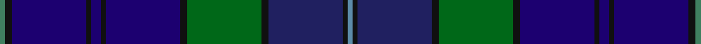

**Bands:** [GKBKBKBKGKBKB](/stripes/gkbkbkbkgkbkb/) · **Stripes:** [G K DB K DB K DB K G K DB K T](/stripes/stripes13/) G K DB K DB K DB K G K DB K T

This was sourced from tartans-authority.  It is a [13 band tartan](/bands/bands13/).

Original link http://www.tartansauthority.com/tartan-ferret/display/3410/

## Attestations

This cloth appears in 2 source records; the oldest owns this page.

- 2002 — Davies (Welsh Name) (tartans-authority, [record](http://www.tartansauthority.com/tartan-ferret/display/3410/))
- undated — Davies Welsh Name Tartan Tartan Number: 3410. Earliest known date: 2002 The tartan for this Welsh surname and its variations, Davy, Davis, Day, David, is actually woven in Wales at the Cambrian Woollen Mill, weaving on the same site since 1830. This tartan differs from many traditional patterns in that the warp and weft differ, giving the finished worsted wool cloth more of a predominant stripe, vertically noticeable in the finished Kilt, or Cilt in Wales. See products available Copyright © Blair Urquhart, Comrie, 2015 (house-of-tartan, [record](http://www.house-of-tartan.scotland.net/house/TartanViewjs.asp?colr=Def&tnam=3410))

## Thread count
G/2 K3 DBa30 K2 DBa4 K2 DBa30 K3 Ga30 K3 DB30 K2 B/2

## Palette
Each colour and its ΔE from the base-6 reference it is a variant of.

| Colour | Shade | Base | ΔE (OKLab) |
|---|---|---|---|
| B | <code style="background-color:#5C8CA8;">#5C8CA8</code> `#5C8CA8` | B <code style="background-color:#2A418A;">#2A418A</code> | 0.23 |
| DB | <code style="background-color:#202060;">#202060</code> `#202060` | B <code style="background-color:#2A418A;">#2A418A</code> | 0.11 |
| DBa | <code style="background-color:#1C0070;">#1C0070</code> `#1C0070` | B <code style="background-color:#2A418A;">#2A418A</code> | 0.14 |
| G | <code style="background-color:#408060;">#408060</code> `#408060` | G <code style="background-color:#006100;">#006100</code> | 0.14 |
| Ga | <code style="background-color:#006818;">#006818</code> `#006818` | G <code style="background-color:#006100;">#006100</code> | 0.02 |
| Gb | <code style="background-color:#00643C;">#00643C</code> `#00643C` | G <code style="background-color:#006100;">#006100</code> | 0.05 |
| Gc | <code style="background-color:#289C18;">#289C18</code> `#289C18` | G <code style="background-color:#006100;">#006100</code> | 0.19 |
| K | <code style="background-color:#101010;">#101010</code> `#101010` | K <code style="background-color:#000000;">#000000</code> | 0.17 |

## Nearest tartans

The nearest existing variants by ΔTartan distance.

1. [Blue Peter](/setts/s10/lo3db25db4db4db4db4db25g4dp4o2~x2/) — ΔT 1.16
1. [St Margaret's School for Girls, Aberdeen](/setts/s16/r6db3r3db54g6db3g6db4t24db4t4db50db6db4db12lo4/) — ΔT 1.24
1. [Davies of Wales](/setts/s24/k3db30k2db4k2db30k3g30k3db30k2t2k2db30k3g30k3db30k2db4k2db30k3g3/) — ΔT 1.26
1. [Century 21 (Fashion)](/setts/s11/db2k2db21db1db1db2db1db8dg23ly2r2~x2/) — ΔT 1.26
1. [World Corporate Golf Challenge](/setts/s16/db2lr2db22k6db3k4db3k4db3k6db12n4db2n6db7w2~x2/) — ΔT 1.27
1. [Glaz (Fashion)](/setts/s18/n2dt9db1dt4db2dt2db4n1db15g1db3g3db2g4db1g7ly1r2~x2/) — ΔT 1.29
1. [St. Kentigern College (Corporate)](/setts/s10/db30db3db3db3db3db10k10dg20k2w4~x2/) — ΔT 1.29
1. [Boyle (Personal)](/setts/s10/db4db3r2db26k3db3g3db3g17lo3~x2/) — ΔT 1.32
1. [Stewmann (Personal)](/setts/s9/dg24t4dg3db11dp8db37k3db2r4~x2/) — ΔT 1.33
1. [Harmon of Plenderleith (Personal)](/setts/s18/k2db6lo2db2lo2db19r2y2r2db2dt4k2dt11y2dt2y2dt6lo2~x2/) — ΔT 1.38

## Neighbour map

Every grey dot is one of 14299 variants placed by the first two principal components of the ΔTartan feature space (44% of its variance). Red is this tartan; blue dots are its nearest — click one to open its page.

<svg viewBox="0 0 640 380" role="img" style="max-width:100%;height:auto;border:1px solid #e0e0e0;border-radius:4px;display:block" xmlns="http://www.w3.org/2000/svg"><image href="/nn/cloud.v1.png" width="640" height="380"/><a href="/setts/s10/lo3db25db4db4db4db4db25g4dp4o2~x2/"><circle cx="259.4" cy="170.5" r="4" fill="#3465a4"><title>Blue Peter</title></circle></a><a href="/setts/s16/r6db3r3db54g6db3g6db4t24db4t4db50db6db4db12lo4/"><circle cx="253.5" cy="112.5" r="4" fill="#3465a4"><title>St Margaret's School for Girls, Aberdeen</title></circle></a><a href="/setts/s24/k3db30k2db4k2db30k3g30k3db30k2t2k2db30k3g30k3db30k2db4k2db30k3g3/"><circle cx="254.3" cy="133.3" r="4" fill="#3465a4"><title>Davies of Wales</title></circle></a><a href="/setts/s11/db2k2db21db1db1db2db1db8dg23ly2r2~x2/"><circle cx="286.1" cy="138.6" r="4" fill="#3465a4"><title>Century 21 (Fashion)</title></circle></a><a href="/setts/s16/db2lr2db22k6db3k4db3k4db3k6db12n4db2n6db7w2~x2/"><circle cx="187.5" cy="170.3" r="4" fill="#3465a4"><title>World Corporate Golf Challenge</title></circle></a><a href="/setts/s18/n2dt9db1dt4db2dt2db4n1db15g1db3g3db2g4db1g7ly1r2~x2/"><circle cx="251.8" cy="152.5" r="4" fill="#3465a4"><title>Glaz (Fashion)</title></circle></a><a href="/setts/s10/db30db3db3db3db3db10k10dg20k2w4~x2/"><circle cx="244.2" cy="183.4" r="4" fill="#3465a4"><title>St. Kentigern College (Corporate)</title></circle></a><a href="/setts/s10/db4db3r2db26k3db3g3db3g17lo3~x2/"><circle cx="243.8" cy="156.9" r="4" fill="#3465a4"><title>Boyle (Personal)</title></circle></a><a href="/setts/s9/dg24t4dg3db11dp8db37k3db2r4~x2/"><circle cx="325.8" cy="165.3" r="4" fill="#3465a4"><title>Stewmann (Personal)</title></circle></a><a href="/setts/s18/k2db6lo2db2lo2db19r2y2r2db2dt4k2dt11y2dt2y2dt6lo2~x2/"><circle cx="209.6" cy="149.2" r="4" fill="#3465a4"><title>Harmon of Plenderleith (Personal)</title></circle></a><circle cx="263.4" cy="153.0" r="5" fill="#c00000"/></svg>

ID: /setts/s13/g2k3db30k2db4k2db30k3g30k3db30k2t2/
