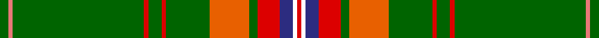

This page is one **sett** — a single exact thread-count. It belongs to the [tartan](/tartans/g2lr1g30r1g3r1g10o9g2r5db3w1r1/)
(the same proportion at any scale), whose colour order is pattern [GRGRGRGRGRBWR](/stripes/grgrgrgrgrbwr/).

Sourced from register-of-tartans.  It is a [13 stripe tartan](/stripes/stripes13/).

Original link https://www.tartanregister.gov.uk/tartanDetails.aspx?ref=11541

## Register references

External register numbers recorded for this tartan.

- Scottish Register of Tartans: [11541](https://www.tartanregister.gov.uk/tartanDetails.aspx?ref=11541)

## Thread count
G/4 LR2 G60 R2 G6 R2 G20 O18 G4 R10 DB6 W2 R/2

## Palette
Each colour and the base-6 reference it is a variant of.

| Colour | Shade | Base |
|---|---|---|
| DB | <code style="background-color:#2C2C80;">#2C2C80</code> `oklch(35.0% 0.138 276.6)` <small>#2C2C80</small> | B <code style="background-color:#2A418A;">#2A418A</code> |
| G | <code style="background-color:#006400;">#006400</code> `oklch(43.6% 0.148 142.5)` <small>#006400</small> | G <code style="background-color:#006100;">#006100</code> |
| LR | <code style="background-color:#E87878;">#E87878</code> `oklch(70.0% 0.139 21.2)` <small>#E87878</small> | R <code style="background-color:#CC0000;">#CC0000</code> |
| O | <code style="background-color:#E86000;">#E86000</code> `oklch(65.3% 0.187 44.9)` <small>#E86000</small> | R <code style="background-color:#CC0000;">#CC0000</code> |
| R | <code style="background-color:#DC0000;">#DC0000</code> `oklch(56.2% 0.230 29.2)` <small>#DC0000</small> | R <code style="background-color:#CC0000;">#CC0000</code> |
| W | <code style="background-color:#FFFFFF;">#FFFFFF</code> `oklch(100.0% 0.000 89.9)` <small>#FFFFFF</small> | W <code style="background-color:#F7F7F7;">#F7F7F7</code> |

## Nearest tartans

The nearest existing variants by ΔTartan distance, with this tartan at the top so the swatches line up against it.

ΔTartan

Tartan

Sett

—

<a href="/ttd/edit/#slug=g2r1g30r1g3r1g10o9g2r5db3w1r1~x2">Hans, Jaswinder (Personal)</a> <a class="nn-out" href="/setts/s13/g2r1g30r1g3r1g10o9g2r5db3w1r1~x2/" title="open its dictionary page">↗</a>

1.20

<a href="/ttd/edit/#slug=g64k4db9ly2db4ly2db4g11r8db2r4w3~x2">Sillars (Name)</a> <a class="nn-out" href="/setts/s12/g64k4db9ly2db4ly2db4g11r8db2r4w3~x2/" title="open its dictionary page">↗</a>

1.20

<a href="/ttd/edit/#slug=g24g2b2k3lo1k1lr1k1g4r2k1r2lr1~x4">Princess Mary #2</a> <a class="nn-out" href="/setts/s13/g24g2b2k3lo1k1lr1k1g4r2k1r2lr1~x4/" title="open its dictionary page">↗</a>

1.33

<a href="/ttd/edit/#slug=g42b3k8ly2k2w3k2g12r5k2r2w2~x2">King George VI (Royal)</a> <a class="nn-out" href="/setts/s12/g42b3k8ly2k2w3k2g12r5k2r2w2~x2/" title="open its dictionary page">↗</a>

1.36

<a href="/ttd/edit/#slug=dg32t2k7ly1k1w1k2r7dg5k1dg3w1~x2">Stuart/Stewart (Variant)</a> <a class="nn-out" href="/setts/s12/dg32t2k7ly1k1w1k2r7dg5k1dg3w1~x2/" title="open its dictionary page">↗</a>

1.41

<a href="/ttd/edit/#slug=dg40r5k2w2k2ly3k2dg10r3k3~x2">Palmer, Arnold</a> <a class="nn-out" href="/setts/s10/dg40r5k2w2k2ly3k2dg10r3k3~x2/" title="open its dictionary page">↗</a>

1.49

<a href="/ttd/edit/#slug=dg3g2dg40g2dg4g8w1g4dg2lo4ly4w2~x2">Springbok (Fashion)</a> <a class="nn-out" href="/setts/s12/dg3g2dg40g2dg4g8w1g4dg2lo4ly4w2~x2/" title="open its dictionary page">↗</a>

1.49

<a href="/ttd/edit/#slug=w2k2w2k10lb1dg40w1r4w1dg5r1~x2">Knox, David Paul (Personal)</a> <a class="nn-out" href="/setts/s11/w2k2w2k10lb1dg40w1r4w1dg5r1~x2/" title="open its dictionary page">↗</a>

1.51

<a href="/ttd/edit/#slug=dg44db3k8ly2k2w2k2dg9r5k2r2w2~x2">Princess Mary</a> <a class="nn-out" href="/setts/s12/dg44db3k8ly2k2w2k2dg9r5k2r2w2~x2/" title="open its dictionary page">↗</a>

1.53

<a href="/ttd/edit/#slug=g20lb2g2lb2g2lb8g2lb2g2lb2g20ly4g8r2g4do1dp2~x2">Bryant</a> <a class="nn-out" href="/setts/s17/g20lb2g2lb2g2lb8g2lb2g2lb2g20ly4g8r2g4do1dp2~x2/" title="open its dictionary page">↗</a>

1.54

<a href="/ttd/edit/#slug=dg28b1dg4r1k1lr1k1g4r4k2r4lr2~x2">Carroll O'Reed</a> <a class="nn-out" href="/setts/s12/dg28b1dg4r1k1lr1k1g4r4k2r4lr2~x2/" title="open its dictionary page">↗</a>

## Neighbour map

Every grey dot is one of 14299 variants placed by the first two principal components of the ΔTartan feature space (44% of its variance). Red is this tartan; blue dots are its nearest — click one to open its page.

<svg viewBox="0 0 640 380" role="img" style="max-width:100%;height:auto;border:1px solid #e0e0e0;border-radius:4px;display:block" xmlns="http://www.w3.org/2000/svg"><image href="/nn/cloud.v1.png" width="640" height="380"/><a href="/setts/s12/g64k4db9ly2db4ly2db4g11r8db2r4w3~x2/"><circle cx="384.7" cy="72.8" r="4" fill="#3465a4"><title>Sillars (Name)</title></circle></a><a href="/setts/s13/g24g2b2k3lo1k1lr1k1g4r2k1r2lr1~x4/"><circle cx="403.1" cy="88.4" r="4" fill="#3465a4"><title>Princess Mary #2</title></circle></a><a href="/setts/s12/g42b3k8ly2k2w3k2g12r5k2r2w2~x2/"><circle cx="347.8" cy="89.5" r="4" fill="#3465a4"><title>King George VI (Royal)</title></circle></a><a href="/setts/s12/dg32t2k7ly1k1w1k2r7dg5k1dg3w1~x2/"><circle cx="381.8" cy="79.3" r="4" fill="#3465a4"><title>Stuart/Stewart (Variant)</title></circle></a><a href="/setts/s10/dg40r5k2w2k2ly3k2dg10r3k3~x2/"><circle cx="438.4" cy="127.6" r="4" fill="#3465a4"><title>Palmer, Arnold</title></circle></a><a href="/setts/s12/dg3g2dg40g2dg4g8w1g4dg2lo4ly4w2~x2/"><circle cx="378.0" cy="66.7" r="4" fill="#3465a4"><title>Springbok (Fashion)</title></circle></a><a href="/setts/s11/w2k2w2k10lb1dg40w1r4w1dg5r1~x2/"><circle cx="385.3" cy="55.4" r="4" fill="#3465a4"><title>Knox, David Paul (Personal)</title></circle></a><a href="/setts/s12/dg44db3k8ly2k2w2k2dg9r5k2r2w2~x2/"><circle cx="366.6" cy="88.4" r="4" fill="#3465a4"><title>Princess Mary</title></circle></a><a href="/setts/s17/g20lb2g2lb2g2lb8g2lb2g2lb2g20ly4g8r2g4do1dp2~x2/"><circle cx="386.1" cy="102.4" r="4" fill="#3465a4"><title>Bryant</title></circle></a><a href="/setts/s12/dg28b1dg4r1k1lr1k1g4r4k2r4lr2~x2/"><circle cx="358.9" cy="85.1" r="4" fill="#3465a4"><title>Carroll O'Reed</title></circle></a><circle cx="409.7" cy="82.2" r="5" fill="#c00000"/></svg>

ID: /setts/s13/g2r1g30r1g3r1g10o9g2r5db3w1r1~x2/
