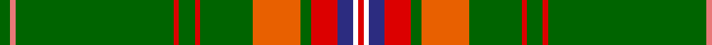

In pattern [GRGRGRGRGRBWR](/patterns/grgrgrgrgrbwr/).

This was sourced from register-of-tartans.  It is a [13 stripes tartan](/stripes/stripes13/).

Original link https://www.tartanregister.gov.uk/tartanDetails.aspx?ref=11541

## Thread count
G/4 LR2 G60 R2 G6 R2 G20 O18 G4 R10 DB6 W2 R/2

## Palette
Each colour and its ΔE from the base-6 reference it is a variant of.

| Colour | Shade | Base | ΔE (OKLab) |
|---|---|---|---|
| DB | <code style="background-color:#2C2C80;">#2C2C80</code> `#2C2C80` | B <code style="background-color:#2A418A;">#2A418A</code> | 0.06 |
| G | <code style="background-color:#006400;">#006400</code> `#006400` | G <code style="background-color:#006100;">#006100</code> | 0.01 |
| LR | <code style="background-color:#E87878;">#E87878</code> `#E87878` | R <code style="background-color:#CC0000;">#CC0000</code> | 0.19 |
| O | <code style="background-color:#E86000;">#E86000</code> `#E86000` | R <code style="background-color:#CC0000;">#CC0000</code> | 0.14 |
| R | <code style="background-color:#DC0000;">#DC0000</code> `#DC0000` | R <code style="background-color:#CC0000;">#CC0000</code> | 0.03 |
| W | <code style="background-color:#FFFFFF;">#FFFFFF</code> `#FFFFFF` | W <code style="background-color:#F7F7F7;">#F7F7F7</code> | 0.02 |

## Nearest tartans

The nearest existing variants by ΔTartan distance.

1. [Princess Mary #2](/setts/s13/g24g2b2k3y1k1ya1k1g4r2k1r2ya1~b2474e8-g006818-k101010-r880000-ybc8c00-yab8b8b8~x4/) — ΔT 1.20
1. [Sillars (Name)](/setts/s12/g64k4b9y2b4y2b4g11r8b2r4w3~b2c2c80-g006818-k101010-rc80000-wfcfcfc-ye8c000~x2/) — ΔT 1.20
1. [Princess Mary Royal Family Tartan Tartan Number: 735. Earliest known date: pre 1930 Colours reversed from MacGregor See products available Copyright © Blair Urquhart, Comrie, 2015](/setts/s12/g44b3k8y2k2w2k2g9r5k2r2w2~b2c2c80-g006818-k101010-rc80000-we0e0e0-ye8c000~x2/) — ΔT 1.28
1. [King George VI (Royal)](/setts/s12/g42b3k8y2k2w3k2g12r5k2r2w2~b1474b4-g006818-k101010-rc8002c-we0e0e0-ye8c000~x2/) — ΔT 1.33
1. [Arnold Palmer Corporate Tartan Tartan Number: 6482. Earliest known date: 2004 Proprietary tartan design for use on Mr. Palmer's products. The Arnold Palmer logo colors are red, yellow, white, green and black. See products available Copyright © Blair Urquhart, Comrie, 2015](/setts/s10/g40r5k2w2k2y3k2g10r3k3~g285800-k101010-rc80000-we0e0e0-ye8c000~x2/) — ΔT 1.33
1. [Stuart/Stewart (Variant)](/setts/s12/g32b2k7y1k1w1k2r7g5k1g3w1~b3c82af-g005020-k101010-rdc0000-we0e0e0-ye8c000~x2/) — ΔT 1.36
1. [Palmer, Arnold](/setts/s10/g40r5k2w2k2y3k2g10r3k3~g285800-k101010-r880000-we0e0e0-ye8c000~x2/) — ΔT 1.41
1. [Springbok (Fashion)](/setts/s12/g3ga2g40gb2g4gb8w1ga4g2y4ya4w2~g003820-ga006818-gb289c18-we0e0e0-ybc8c00-yafccc00~x2/) — ΔT 1.49
1. [Knox, David Paul (Personal)](/setts/s11/w2k2w2k10wa1g40w1r4w1g5ra1~g285800-k101010-rdc0000-rae87878-wffffff-wa98c8e8~x2/) — ΔT 1.50
1. [Seller, Sillar](/setts/s12/g46k3b6y2b3y2b3g7r6b2r3w4~b304080-g008000-k000000-rc00000-we0e0e0-yf0c000~x2/) — ΔT 1.50

## Neighbour map

Every grey dot is one of 15726 variants placed by the first two principal components of the ΔTartan feature space (44% of its variance). Red is this tartan; blue dots are its nearest — click one to open its page.

<svg viewBox="0 0 640 380" role="img" style="max-width:100%;height:auto;border:1px solid #e0e0e0;border-radius:4px;display:block" xmlns="http://www.w3.org/2000/svg"><image href="/nn/cloud.v1.png" width="640" height="380"/><a href="/setts/s13/g24g2b2k3y1k1ya1k1g4r2k1r2ya1~b2474e8-g006818-k101010-r880000-ybc8c00-yab8b8b8~x4/"><circle cx="400.8" cy="85.2" r="4" fill="#3465a4"><title>Princess Mary #2</title></circle></a><a href="/setts/s12/g64k4b9y2b4y2b4g11r8b2r4w3~b2c2c80-g006818-k101010-rc80000-wfcfcfc-ye8c000~x2/"><circle cx="382.3" cy="71.0" r="4" fill="#3465a4"><title>Sillars (Name)</title></circle></a><a href="/setts/s12/g44b3k8y2k2w2k2g9r5k2r2w2~b2c2c80-g006818-k101010-rc80000-we0e0e0-ye8c000~x2/"><circle cx="357.4" cy="84.2" r="4" fill="#3465a4"><title>Princess Mary Royal Family Tartan Tartan Number: 735. Earliest known date: pre 1930 Colours reversed from MacGregor See products available Copyright © Blair Urquhart, Comrie, 2015</title></circle></a><a href="/setts/s12/g42b3k8y2k2w3k2g12r5k2r2w2~b1474b4-g006818-k101010-rc8002c-we0e0e0-ye8c000~x2/"><circle cx="345.3" cy="88.7" r="4" fill="#3465a4"><title>King George VI (Royal)</title></circle></a><a href="/setts/s10/g40r5k2w2k2y3k2g10r3k3~g285800-k101010-rc80000-we0e0e0-ye8c000~x2/"><circle cx="428.2" cy="121.4" r="4" fill="#3465a4"><title>Arnold Palmer Corporate Tartan Tartan Number: 6482. Earliest known date: 2004 Proprietary tartan design for use on Mr. Palmer's products. The Arnold Palmer logo colors are red, yellow, white, green and black. See products available Copyright © Blair Urquhart, Comrie, 2015</title></circle></a><a href="/setts/s12/g32b2k7y1k1w1k2r7g5k1g3w1~b3c82af-g005020-k101010-rdc0000-we0e0e0-ye8c000~x2/"><circle cx="379.6" cy="77.5" r="4" fill="#3465a4"><title>Stuart/Stewart (Variant)</title></circle></a><a href="/setts/s10/g40r5k2w2k2y3k2g10r3k3~g285800-k101010-r880000-we0e0e0-ye8c000~x2/"><circle cx="436.7" cy="126.5" r="4" fill="#3465a4"><title>Palmer, Arnold</title></circle></a><a href="/setts/s12/g3ga2g40gb2g4gb8w1ga4g2y4ya4w2~g003820-ga006818-gb289c18-we0e0e0-ybc8c00-yafccc00~x2/"><circle cx="375.3" cy="65.4" r="4" fill="#3465a4"><title>Springbok (Fashion)</title></circle></a><a href="/setts/s11/w2k2w2k10wa1g40w1r4w1g5ra1~g285800-k101010-rdc0000-rae87878-wffffff-wa98c8e8~x2/"><circle cx="383.0" cy="56.7" r="4" fill="#3465a4"><title>Knox, David Paul (Personal)</title></circle></a><a href="/setts/s12/g46k3b6y2b3y2b3g7r6b2r3w4~b304080-g008000-k000000-rc00000-we0e0e0-yf0c000~x2/"><circle cx="327.7" cy="76.8" r="4" fill="#3465a4"><title>Seller, Sillar</title></circle></a><circle cx="408.3" cy="81.2" r="5" fill="#c00000"/></svg>

ID: /setts/s13/g2r1g30ra1g3ra1g10rb9g2ra5b3w1ra1~b2c2c80-g006400-re87878-radc0000-rbe86000-wffffff~x2/
