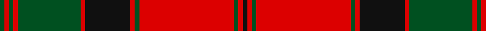

In pattern [GRGRGRKRGRGRK](/patterns/grgrgrkrgrgrk/).

This was sourced from register-of-tartans.  It is a [13 stripes tartan](/stripes/stripes13/).

Original link https://www.tartanregister.gov.uk/tartanDetails.aspx?ref=2731

## Thread count
G/2 R2 G2 R2 G28 R2 K20 R2 G2 R42 G2 R2 K/2

## Palette
Each colour and its ΔE from the base-6 reference it is a variant of.

| Colour | Shade | Base | ΔE (OKLab) |
|---|---|---|---|
| G | <code style="background-color:#005020;">#005020</code> `#005020` | G <code style="background-color:#006400;">#006400</code> | 0.08 |
| K | <code style="background-color:#101010;">#101010</code> `#101010` | K <code style="background-color:#000000;">#000000</code> | 0.17 |
| R | <code style="background-color:#DC0000;">#DC0000</code> `#DC0000` | R <code style="background-color:#C80000;">#C80000</code> | 0.04 |

## Nearest tartans

The nearest existing variants by ΔTartan distance.

1. [MacQuarrie 1815](/setts/s13/g2r4g2r52g2r2b28r2g42r2g2r4g2-b00004c-g004c00-rc80000/) — ΔT 0.72
1. [MacQuarrie #3](/setts/s13/g4r6g4r104g4r4b56r4g84r4g4r6g4-b2c4084-g005020-rdc0000/) — ΔT 0.91
1. [Stewart/Stuart of Atholl](/setts/s16/r12k4r80k32g12k4g8k4g88k4g8k4g12k32r80k4-g005028-k101010-rc80000/) — ΔT 0.92
1. [MacQuarrie 6](/setts/s13/g2r2g2r2g28r2k20r2g2r42g2r2k2-g008000-k000000-rc00000/) — ΔT 0.94
1. [Stewart of Appin](/setts/s16/r3b2w1r2g24r4g2r2b8r2g2r24b2w1r2g2-b000064-g004c00-rc80000-wd0d0d0/) — ΔT 1.09
1. [Grant and Drummond](/setts/s15/r6b4r4g76r4g4r4b20r4w4r74b4r4b4r6-b1c0070-g006818-rc80000-wa8ace8/) — ΔT 1.12
1. [MacLintock](/setts/s12/g76r6g6r6b18r6ba4r80b6r6b4r12-b1c0070-ba5c8ca8-g006818-rc80000/) — ΔT 1.12
1. [MacDonell of Glengarry #4](/setts/s11/g36r6g4r4b12r4g4r48g2r4g12-b2c4084-g005020-rdc0000/) — ΔT 1.12
1. [MacLintock - 1880 (Clan)](/setts/s12/g72r6g6r6b18r6ba4r80b6r6b4r12-b1c0070-ba5c8ca8-g006818-rc80000/) — ΔT 1.14
1. [MacQuarrie 3](/setts/s13/g4r6g4r104g4r4b56r4g84r4g4r6g4-b304080-g008000-rc00000/) — ΔT 1.24

## Neighbour map

Every grey dot is one of 15726 variants placed by the first two principal components of the ΔTartan feature space (44% of its variance). Red is this tartan; blue dots are its nearest — click one to open its page.

<svg viewBox="0 0 640 380" role="img" style="max-width:100%;height:auto;border:1px solid #e0e0e0;border-radius:4px;display:block" xmlns="http://www.w3.org/2000/svg"><image href="/nn/cloud.v1.png" width="640" height="380"/><a href="/setts/s13/g2r4g2r52g2r2b28r2g42r2g2r4g2-b00004c-g004c00-rc80000/"><circle cx="328.6" cy="112.9" r="4" fill="#3465a4"><title>MacQuarrie 1815</title></circle></a><a href="/setts/s13/g4r6g4r104g4r4b56r4g84r4g4r6g4-b2c4084-g005020-rdc0000/"><circle cx="339.1" cy="113.3" r="4" fill="#3465a4"><title>MacQuarrie #3</title></circle></a><a href="/setts/s16/r12k4r80k32g12k4g8k4g88k4g8k4g12k32r80k4-g005028-k101010-rc80000/"><circle cx="308.1" cy="127.5" r="4" fill="#3465a4"><title>Stewart/Stuart of Atholl</title></circle></a><a href="/setts/s13/g2r2g2r2g28r2k20r2g2r42g2r2k2-g008000-k000000-rc00000/"><circle cx="305.9" cy="111.0" r="4" fill="#3465a4"><title>MacQuarrie 6</title></circle></a><a href="/setts/s16/r3b2w1r2g24r4g2r2b8r2g2r24b2w1r2g2-b000064-g004c00-rc80000-wd0d0d0/"><circle cx="306.0" cy="93.7" r="4" fill="#3465a4"><title>Stewart of Appin</title></circle></a><a href="/setts/s15/r6b4r4g76r4g4r4b20r4w4r74b4r4b4r6-b1c0070-g006818-rc80000-wa8ace8/"><circle cx="318.1" cy="96.0" r="4" fill="#3465a4"><title>Grant and Drummond</title></circle></a><a href="/setts/s12/g76r6g6r6b18r6ba4r80b6r6b4r12-b1c0070-ba5c8ca8-g006818-rc80000/"><circle cx="335.5" cy="115.9" r="4" fill="#3465a4"><title>MacLintock</title></circle></a><a href="/setts/s11/g36r6g4r4b12r4g4r48g2r4g12-b2c4084-g005020-rdc0000/"><circle cx="359.5" cy="141.9" r="4" fill="#3465a4"><title>MacDonell of Glengarry #4</title></circle></a><a href="/setts/s12/g72r6g6r6b18r6ba4r80b6r6b4r12-b1c0070-ba5c8ca8-g006818-rc80000/"><circle cx="338.6" cy="116.2" r="4" fill="#3465a4"><title>MacLintock - 1880 (Clan)</title></circle></a><a href="/setts/s13/g4r6g4r104g4r4b56r4g84r4g4r6g4-b304080-g008000-rc00000/"><circle cx="339.4" cy="116.0" r="4" fill="#3465a4"><title>MacQuarrie 3</title></circle></a><circle cx="329.6" cy="116.7" r="5" fill="#c00000"/></svg>

ID: /setts/s13/g2r2g2r2g28r2k20r2g2r42g2r2k2-g005020-k101010-rdc0000/
