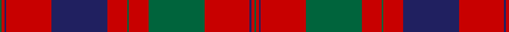

In pattern [GRBRBRGRGRBRG](/patterns/grbrbrgrgrbrg/).

This was sourced from tartans-authority.  It is a [13 stripes tartan](/stripes/stripes13/).

Original link http://www.tartansauthority.com/tartan-ferret/display/837/

## Thread count
G/2 R3 DB2 R48 DB60 R21 G2 R21 G60 R48 DB2 R3 G/2

## Palette
Each colour and its ΔE from the base-6 reference it is a variant of.

| Colour | Shade | Base | ΔE (OKLab) |
|---|---|---|---|
| DB | <code style="background-color:#202060;">#202060</code> `#202060` | B <code style="background-color:#2A418A;">#2A418A</code> | 0.11 |
| G | <code style="background-color:#00643C;">#00643C</code> `#00643C` | G <code style="background-color:#006100;">#006100</code> | 0.05 |
| R | <code style="background-color:#C80000;">#C80000</code> `#C80000` | R <code style="background-color:#CC0000;">#CC0000</code> | 0.01 |

## Nearest tartans

The nearest existing variants by ΔTartan distance.

1. [Grant of Rothiemurchus Artifact Tartan Tartan Number: 1496. Earliest known date: pre 2003 From a wedding plaid recorded by Miss M. MacDougall. See products available Copyright © Blair Urquhart, Comrie, 2015](/setts/s13/r2g2r64b64r16g2r2g2r16g64r64g2r2-b2c2c80-g006818-rc80000/) — ΔT 0.43
1. [Fraser, Wedding dress](/setts/s13/g4r6b4r96b120r42g4r42g120r96b4r6g4-b304080-g008000-rc00000/) — ΔT 0.57
1. [Grant of Rothiemurchus](/setts/s13/r2g2r64b64r16g2r2g2r16g64r64g2r2-b304080-g008000-rc00000/) — ΔT 0.69
1. [Unnamed 18th century plaid from Rothiemurchus](/setts/s13/r2g2r64b64r16g2r2g2r16g64r64g2r2-b440044-g006818-rc80000/) — ΔT 0.74
1. [Unidentified Cant #14](/setts/s12/b80r56g3r56g88r64b3r4g3r4b3r64-b2c2c80-g285800-rc80000/) — ΔT 0.86
1. [MacDonell of Glengarry #4](/setts/s11/g36r6g4r4b12r4g4r48g2r4g12-b2c4084-g005020-rdc0000/) — ΔT 1.02
1. [Drummond #2](/setts/s12/b48r14g14r78b8r4b4r10g84r14b12r14-b2c4084-g005020-rdc0000/) — ΔT 1.03
1. [Murray of Tullibardine (plaid)](/setts/s21/b8r2b2r8b24r8b2r2g8r2b2r52b52r8g8r52g42r26b12r10g2-b2c4084-g005020-rdc0000/) — ΔT 1.06
1. [Murray of Tullibardine 4](/setts/s21/b8r2b2r8b24r8b2r2g8r2b2r52b52r8g8r52g42r26b12r10g2-b304080-g008000-rc00000/) — ΔT 1.07
1. [MacDougall VS](/setts/s11/b4g8ba6b8r6g2r2g2r24g1r3-b5a3094-ba00004c-g004c00-rc80000/) — ΔT 1.09

## Neighbour map

Every grey dot is one of 15726 variants placed by the first two principal components of the ΔTartan feature space (44% of its variance). Red is this tartan; blue dots are its nearest — click one to open its page.

<svg viewBox="0 0 640 380" role="img" style="max-width:100%;height:auto;border:1px solid #e0e0e0;border-radius:4px;display:block" xmlns="http://www.w3.org/2000/svg"><image href="/nn/cloud.v1.png" width="640" height="380"/><a href="/setts/s13/r2g2r64b64r16g2r2g2r16g64r64g2r2-b2c2c80-g006818-rc80000/"><circle cx="385.6" cy="123.2" r="4" fill="#3465a4"><title>Grant of Rothiemurchus Artifact Tartan Tartan Number: 1496. Earliest known date: pre 2003 From a wedding plaid recorded by Miss M. MacDougall. See products available Copyright © Blair Urquhart, Comrie, 2015</title></circle></a><a href="/setts/s13/g4r6b4r96b120r42g4r42g120r96b4r6g4-b304080-g008000-rc00000/"><circle cx="365.1" cy="133.0" r="4" fill="#3465a4"><title>Fraser, Wedding dress</title></circle></a><a href="/setts/s13/r2g2r64b64r16g2r2g2r16g64r64g2r2-b304080-g008000-rc00000/"><circle cx="388.1" cy="125.3" r="4" fill="#3465a4"><title>Grant of Rothiemurchus</title></circle></a><a href="/setts/s13/r2g2r64b64r16g2r2g2r16g64r64g2r2-b440044-g006818-rc80000/"><circle cx="391.4" cy="122.5" r="4" fill="#3465a4"><title>Unnamed 18th century plaid from Rothiemurchus</title></circle></a><a href="/setts/s12/b80r56g3r56g88r64b3r4g3r4b3r64-b2c2c80-g285800-rc80000/"><circle cx="393.8" cy="148.5" r="4" fill="#3465a4"><title>Unidentified Cant #14</title></circle></a><a href="/setts/s11/g36r6g4r4b12r4g4r48g2r4g12-b2c4084-g005020-rdc0000/"><circle cx="359.5" cy="141.9" r="4" fill="#3465a4"><title>MacDonell of Glengarry #4</title></circle></a><a href="/setts/s12/b48r14g14r78b8r4b4r10g84r14b12r14-b2c4084-g005020-rdc0000/"><circle cx="304.5" cy="148.2" r="4" fill="#3465a4"><title>Drummond #2</title></circle></a><a href="/setts/s21/b8r2b2r8b24r8b2r2g8r2b2r52b52r8g8r52g42r26b12r10g2-b2c4084-g005020-rdc0000/"><circle cx="342.0" cy="111.9" r="4" fill="#3465a4"><title>Murray of Tullibardine (plaid)</title></circle></a><a href="/setts/s21/b8r2b2r8b24r8b2r2g8r2b2r52b52r8g8r52g42r26b12r10g2-b304080-g008000-rc00000/"><circle cx="348.5" cy="117.5" r="4" fill="#3465a4"><title>Murray of Tullibardine 4</title></circle></a><a href="/setts/s11/b4g8ba6b8r6g2r2g2r24g1r3-b5a3094-ba00004c-g004c00-rc80000/"><circle cx="324.9" cy="131.5" r="4" fill="#3465a4"><title>MacDougall VS</title></circle></a><circle cx="364.1" cy="131.8" r="5" fill="#c00000"/></svg>

ID: /setts/s13/g2r3b2r48b60r21g2r21g60r48b2r3g2-b202060-g00643c-rc80000/
