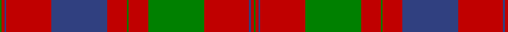

In pattern [GRBRBRGRGRBRG](/patterns/grbrbrgrgrbrg/).

This was sourced from weddslist.  It is a [13 stripes tartan](/stripes/stripes13/).

Original link http://www.weddslist.com/cgi-bin/tartans/pg.pl?source=sts

## Thread count
G/4 R6 B4 R96 B120 R42 G4 R42 G120 R96 B4 R6 G/4

## Palette
Each colour and its ΔE from the base-6 reference it is a variant of.

| Colour | Shade | Base | ΔE (OKLab) |
|---|---|---|---|
| B | <code style="background-color:#304080;">#304080</code> `#304080` | B <code style="background-color:#2A418A;">#2A418A</code> | 0.02 |
| G | <code style="background-color:#008000;">#008000</code> `#008000` | G <code style="background-color:#006100;">#006100</code> | 0.10 |
| R | <code style="background-color:#C00000;">#C00000</code> `#C00000` | R <code style="background-color:#CC0000;">#CC0000</code> | 0.03 |

## Nearest tartans

The nearest existing variants by ΔTartan distance.

1. [Grant of Rothiemurchus](/setts/s13/r1g1r32b32r8g1r1g1r8g32r32g1r1x2~b304080-g008000-rc00000/) — ΔT 0.37
1. [Grant of Rothiemurchus Artifact Tartan Tartan Number: 1496. Earliest known date: pre 2003 From a wedding plaid recorded by Miss M. MacDougall. See products available Copyright © Blair Urquhart, Comrie, 2015](/setts/s13/r1g1r32b32r8g1r1g1r8g32r32g1r1x2~b2c2c80-g006818-rc80000/) — ΔT 0.55
1. [Fraser, Isabella (Artefact)](/setts/s13/g2r3b2r48b60r21g2r21g60r48b2r3g2~b202060-g00643c-rc80000/) — ΔT 0.57
1. [MacDonell of Glengarry #4](/setts/s11/g18r3g2r2b6r2g2r24g1r2g6x2~b2c4084-g005020-rdc0000/) — ΔT 0.81
1. [Unnamed 18th century plaid from Rothiemurchus](/setts/s13/r1g1r32b32r8g1r1g1r8g32r32g1r1x2~b440044-g006818-rc80000/) — ΔT 0.91
1. [Unidentified Cant #14](/setts/s12/b80r56g3r56g88r64b3r4g3r4b3r64~b2c2c80-g285800-rc80000/) — ΔT 1.00
1. [Drummond #2](/setts/s12/b24r7g7r39b4r2b2r5g42r7b6r7x2~b2c4084-g005020-rdc0000/) — ΔT 1.03
1. [Murray of Tullibardine 4](/setts/s21/b4r1b1r4b12r4b1r1g4r1b1r26b26r4g4r26g21r13b6r5g1x2~b304080-g008000-rc00000/) — ΔT 1.07
1. [Drummond](/setts/s12/b24r7g7r39b4r2b2r5g42r7b6r7x2~b304080-g008000-rc00000/) — ΔT 1.10
1. [Drummond Clan Tartan Tartan Number: 457. Earliest known date: 1822 The sett closely resembles the pattern used by McIan for his Drummond figure, which Logan asserts is in fact a Grant tartan. Nevertheless it is established that the Drummonds wore this sett to meet George IV in Edinburgh in 1822. The illustration here come from a sample in the MacGregor-Hastie Collection. There is also a Drummond of Perth sett. See products available Copyright © Blair Urquhart, Comrie, 2015](/setts/s16/r6b1r2b2r28ba2r2b9r2g2r2g24r3b2r6b2x2~b2c2c80-ba5c8ca8-g006818-rc80000/) — ΔT 1.12

## Neighbour map

Every grey dot is one of 15726 variants placed by the first two principal components of the ΔTartan feature space (44% of its variance). Red is this tartan; blue dots are its nearest — click one to open its page.

<svg viewBox="0 0 640 380" role="img" style="max-width:100%;height:auto;border:1px solid #e0e0e0;border-radius:4px;display:block" xmlns="http://www.w3.org/2000/svg"><image href="/nn/cloud.v1.png" width="640" height="380"/><a href="/setts/s13/r1g1r32b32r8g1r1g1r8g32r32g1r1x2~b304080-g008000-rc00000/"><circle cx="389.4" cy="127.4" r="4" fill="#3465a4"><title>Grant of Rothiemurchus</title></circle></a><a href="/setts/s13/r1g1r32b32r8g1r1g1r8g32r32g1r1x2~b2c2c80-g006818-rc80000/"><circle cx="386.8" cy="125.6" r="4" fill="#3465a4"><title>Grant of Rothiemurchus Artifact Tartan Tartan Number: 1496. Earliest known date: pre 2003 From a wedding plaid recorded by Miss M. MacDougall. See products available Copyright © Blair Urquhart, Comrie, 2015</title></circle></a><a href="/setts/s13/g2r3b2r48b60r21g2r21g60r48b2r3g2~b202060-g00643c-rc80000/"><circle cx="365.3" cy="133.9" r="4" fill="#3465a4"><title>Fraser, Isabella (Artefact)</title></circle></a><a href="/setts/s11/g18r3g2r2b6r2g2r24g1r2g6x2~b2c4084-g005020-rdc0000/"><circle cx="360.3" cy="144.2" r="4" fill="#3465a4"><title>MacDonell of Glengarry #4</title></circle></a><a href="/setts/s13/r1g1r32b32r8g1r1g1r8g32r32g1r1x2~b440044-g006818-rc80000/"><circle cx="392.6" cy="125.0" r="4" fill="#3465a4"><title>Unnamed 18th century plaid from Rothiemurchus</title></circle></a><a href="/setts/s12/b80r56g3r56g88r64b3r4g3r4b3r64~b2c2c80-g285800-rc80000/"><circle cx="394.4" cy="151.0" r="4" fill="#3465a4"><title>Unidentified Cant #14</title></circle></a><a href="/setts/s12/b24r7g7r39b4r2b2r5g42r7b6r7x2~b2c4084-g005020-rdc0000/"><circle cx="305.6" cy="149.6" r="4" fill="#3465a4"><title>Drummond #2</title></circle></a><a href="/setts/s21/b4r1b1r4b12r4b1r1g4r1b1r26b26r4g4r26g21r13b6r5g1x2~b304080-g008000-rc00000/"><circle cx="350.2" cy="118.9" r="4" fill="#3465a4"><title>Murray of Tullibardine 4</title></circle></a><a href="/setts/s12/b24r7g7r39b4r2b2r5g42r7b6r7x2~b304080-g008000-rc00000/"><circle cx="306.2" cy="152.0" r="4" fill="#3465a4"><title>Drummond</title></circle></a><a href="/setts/s16/r6b1r2b2r28ba2r2b9r2g2r2g24r3b2r6b2x2~b2c2c80-ba5c8ca8-g006818-rc80000/"><circle cx="359.4" cy="97.9" r="4" fill="#3465a4"><title>Drummond Clan Tartan Tartan Number: 457. Earliest known date: 1822 The sett closely resembles the pattern used by McIan for his Drummond figure, which Logan asserts is in fact a Grant tartan. Nevertheless it is established that the Drummonds wore this sett to meet George IV in Edinburgh in 1822. The illustration here come from a sample in the MacGregor-Hastie Collection. There is also a Drummond of Perth sett. See products available Copyright © Blair Urquhart, Comrie, 2015</title></circle></a><circle cx="366.3" cy="134.9" r="5" fill="#c00000"/></svg>

ID: /setts/s13/g2r3b2r48b60r21g2r21g60r48b2r3g2x2~b304080-g008000-rc00000/
