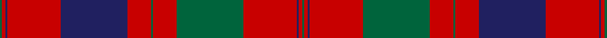

This page is one **sett** — a single exact thread-count. It belongs to the [tartan](/tartans/g2r3db2r48db60r21g2r21g60r48db2r3g2/)
(the same proportion at any scale), whose colour order is pattern [GRBRBRGRGRBRG](/stripes/grbrbrgrgrbrg/).

Sourced from tartans-authority.  It is a [13 stripe tartan](/stripes/stripes13/).

Original link http://www.tartansauthority.com/tartan-ferret/display/837/

## Also known as

This cloth is also recorded under:

- Fraser, Wedding dress

## Register references

External register numbers recorded for this tartan.

- Scottish Tartans Authority (ITI): 837

## Thread count
G/2 R3 DB2 R48 DB60 R21 G2 R21 G60 R48 DB2 R3 G/2

## Palette

Palette: <strong>Tartan Register</strong>
<table><thead><tr><th>Colour</th><th>Threads</th><th>Shade</th><th>Base</th><th>OKLCh</th></tr></thead><tbody><tr><td>G/</td><td style="text-align:right;font-variant-numeric:tabular-nums">2</td><td><code style="background-color:#00643C;">#00643C</code> <small style="color:#888">#00643C</small></td><td>G <code style="background-color:#006100;">#006100</code></td><td><small style="color:#888">oklch(44.3% 0.104 157.7)</small></td></tr><tr><td>R</td><td style="text-align:right;font-variant-numeric:tabular-nums">3</td><td><code style="background-color:#C80000;">#C80000</code> <small style="color:#888">#C80000</small></td><td>R <code style="background-color:#CC0000;">#CC0000</code></td><td><small style="color:#888">oklch(52.3% 0.215 29.2)</small></td></tr><tr><td>DB</td><td style="text-align:right;font-variant-numeric:tabular-nums">2</td><td><code style="background-color:#202060;">#202060</code> <small style="color:#888">#202060</small></td><td>B <code style="background-color:#2A418A;">#2A418A</code></td><td><small style="color:#888">oklch(28.9% 0.111 276.9)</small></td></tr><tr><td>R</td><td style="text-align:right;font-variant-numeric:tabular-nums">48</td><td><code style="background-color:#C80000;">#C80000</code> <small style="color:#888">#C80000</small></td><td>R <code style="background-color:#CC0000;">#CC0000</code></td><td><small style="color:#888">oklch(52.3% 0.215 29.2)</small></td></tr><tr><td>DB</td><td style="text-align:right;font-variant-numeric:tabular-nums">60</td><td><code style="background-color:#202060;">#202060</code> <small style="color:#888">#202060</small></td><td>B <code style="background-color:#2A418A;">#2A418A</code></td><td><small style="color:#888">oklch(28.9% 0.111 276.9)</small></td></tr><tr><td>R</td><td style="text-align:right;font-variant-numeric:tabular-nums">21</td><td><code style="background-color:#C80000;">#C80000</code> <small style="color:#888">#C80000</small></td><td>R <code style="background-color:#CC0000;">#CC0000</code></td><td><small style="color:#888">oklch(52.3% 0.215 29.2)</small></td></tr><tr><td>G</td><td style="text-align:right;font-variant-numeric:tabular-nums">2</td><td><code style="background-color:#00643C;">#00643C</code> <small style="color:#888">#00643C</small></td><td>G <code style="background-color:#006100;">#006100</code></td><td><small style="color:#888">oklch(44.3% 0.104 157.7)</small></td></tr><tr><td>R</td><td style="text-align:right;font-variant-numeric:tabular-nums">21</td><td><code style="background-color:#C80000;">#C80000</code> <small style="color:#888">#C80000</small></td><td>R <code style="background-color:#CC0000;">#CC0000</code></td><td><small style="color:#888">oklch(52.3% 0.215 29.2)</small></td></tr><tr><td>G</td><td style="text-align:right;font-variant-numeric:tabular-nums">60</td><td><code style="background-color:#00643C;">#00643C</code> <small style="color:#888">#00643C</small></td><td>G <code style="background-color:#006100;">#006100</code></td><td><small style="color:#888">oklch(44.3% 0.104 157.7)</small></td></tr><tr><td>R</td><td style="text-align:right;font-variant-numeric:tabular-nums">48</td><td><code style="background-color:#C80000;">#C80000</code> <small style="color:#888">#C80000</small></td><td>R <code style="background-color:#CC0000;">#CC0000</code></td><td><small style="color:#888">oklch(52.3% 0.215 29.2)</small></td></tr><tr><td>DB</td><td style="text-align:right;font-variant-numeric:tabular-nums">2</td><td><code style="background-color:#202060;">#202060</code> <small style="color:#888">#202060</small></td><td>B <code style="background-color:#2A418A;">#2A418A</code></td><td><small style="color:#888">oklch(28.9% 0.111 276.9)</small></td></tr><tr><td>R</td><td style="text-align:right;font-variant-numeric:tabular-nums">3</td><td><code style="background-color:#C80000;">#C80000</code> <small style="color:#888">#C80000</small></td><td>R <code style="background-color:#CC0000;">#CC0000</code></td><td><small style="color:#888">oklch(52.3% 0.215 29.2)</small></td></tr><tr><td>G/</td><td style="text-align:right;font-variant-numeric:tabular-nums">2</td><td><code style="background-color:#00643C;">#00643C</code> <small style="color:#888">#00643C</small></td><td>G <code style="background-color:#006100;">#006100</code></td><td><small style="color:#888">oklch(44.3% 0.104 157.7)</small></td></tr></tbody></table>

## Nearest tartans

The nearest existing variants by ΔTartan distance, with this tartan at the top so the swatches line up against it.

ΔTartan

Tartan

Sett

—

<a href="/ttd/edit/#slug=g2r3db2r48db60r21g2r21g60r48db2r3g2">Fraser, Isabella (Artefact)</a> <a class="nn-out" href="/setts/s13/g2r3db2r48db60r21g2r21g60r48db2r3g2/" title="open its dictionary page">↗</a>

0.58

<a href="/ttd/edit/#slug=g2r3db2r48db60r21g2r21g60r48db2r3g2~x2">Fraser, Wedding dress</a> <a class="nn-out" href="/setts/s13/g2r3db2r48db60r21g2r21g60r48db2r3g2~x2/" title="open its dictionary page">↗</a>

0.69

<a href="/ttd/edit/#slug=r1g1r32db32r8g1r1g1r8g32r32g1r1~x2">Grant of Rothiemurchus</a> <a class="nn-out" href="/setts/s13/r1g1r32db32r8g1r1g1r8g32r32g1r1~x2/" title="open its dictionary page">↗</a>

0.74

<a href="/ttd/edit/#slug=r1g1r32dp32r8g1r1g1r8g32r32g1r1~x2">Unnamed 18th century plaid from Rothiemurchus</a> <a class="nn-out" href="/setts/s13/r1g1r32dp32r8g1r1g1r8g32r32g1r1~x2/" title="open its dictionary page">↗</a>

0.86

<a href="/ttd/edit/#slug=db80r56dg3r56dg88r64db3r4dg3r4db3r64">Unidentified Cant #14</a> <a class="nn-out" href="/setts/s12/db80r56dg3r56dg88r64db3r4dg3r4db3r64/" title="open its dictionary page">↗</a>

1.02

<a href="/ttd/edit/#slug=dg18r3dg2r2db6r2dg2r24dg1r2dg6~x2">MacDonell of Glengarry #4</a> <a class="nn-out" href="/setts/s11/dg18r3dg2r2db6r2dg2r24dg1r2dg6~x2/" title="open its dictionary page">↗</a>

1.03

<a href="/ttd/edit/#slug=db24r7dg7r39db4r2db2r5dg42r7db6r7~x2">Drummond #2</a> <a class="nn-out" href="/setts/s12/db24r7dg7r39db4r2db2r5dg42r7db6r7~x2/" title="open its dictionary page">↗</a>

1.06

<a href="/ttd/edit/#slug=db4r1db1r4db12r4db1r1dg4r1db1r26db26r4dg4r26dg21r13db6r5dg1~x2">Murray of Tullibardine (plaid)</a> <a class="nn-out" href="/setts/s21/db4r1db1r4db12r4db1r1dg4r1db1r26db26r4dg4r26dg21r13db6r5dg1~x2/" title="open its dictionary page">↗</a>

1.07

<a href="/ttd/edit/#slug=db4r1db1r4db12r4db1r1g4r1db1r26db26r4g4r26g21r13db6r5g1~x2">Murray of Tullibardine 4</a> <a class="nn-out" href="/setts/s21/db4r1db1r4db12r4db1r1g4r1db1r26db26r4g4r26g21r13db6r5g1~x2/" title="open its dictionary page">↗</a>

1.09

<a href="/ttd/edit/#slug=dp4dg8db6dp8r6dg2r2dg2r24dg1r3">MacDougall VS</a> <a class="nn-out" href="/setts/s11/dp4dg8db6dp8r6dg2r2dg2r24dg1r3/" title="open its dictionary page">↗</a>

1.15

<a href="/ttd/edit/#slug=r3dp1r1dg21r3dp18r35dp1ly1r4dg1">MacPherson Of Cluny</a> <a class="nn-out" href="/setts/s11/r3dp1r1dg21r3dp18r35dp1ly1r4dg1/" title="open its dictionary page">↗</a>

## Neighbour map

Every grey dot is one of 14359 variants placed by the first two principal components of the ΔTartan feature space (44% of its variance). Red is this tartan; blue dots are its nearest — click one to open its page.

<svg viewBox="0 0 640 380" role="img" style="max-width:100%;height:auto;border:1px solid #e0e0e0;border-radius:4px;display:block" xmlns="http://www.w3.org/2000/svg"><image href="/nn/cloud.v1.png" width="640" height="380"/><a href="/setts/s13/g2r3db2r48db60r21g2r21g60r48db2r3g2~x2/"><circle cx="365.8" cy="134.9" r="4" fill="#3465a4"><title>Fraser, Wedding dress</title></circle></a><a href="/setts/s13/r1g1r32db32r8g1r1g1r8g32r32g1r1~x2/"><circle cx="388.6" cy="127.0" r="4" fill="#3465a4"><title>Grant of Rothiemurchus</title></circle></a><a href="/setts/s13/r1g1r32dp32r8g1r1g1r8g32r32g1r1~x2/"><circle cx="391.4" cy="123.6" r="4" fill="#3465a4"><title>Unnamed 18th century plaid from Rothiemurchus</title></circle></a><a href="/setts/s12/db80r56dg3r56dg88r64db3r4dg3r4db3r64/"><circle cx="393.1" cy="149.8" r="4" fill="#3465a4"><title>Unidentified Cant #14</title></circle></a><a href="/setts/s11/dg18r3dg2r2db6r2dg2r24dg1r2dg6~x2/"><circle cx="359.9" cy="143.1" r="4" fill="#3465a4"><title>MacDonell of Glengarry #4</title></circle></a><a href="/setts/s12/db24r7dg7r39db4r2db2r5dg42r7db6r7~x2/"><circle cx="305.9" cy="150.2" r="4" fill="#3465a4"><title>Drummond #2</title></circle></a><a href="/setts/s21/db4r1db1r4db12r4db1r1dg4r1db1r26db26r4dg4r26dg21r13db6r5dg1~x2/"><circle cx="343.1" cy="113.3" r="4" fill="#3465a4"><title>Murray of Tullibardine (plaid)</title></circle></a><a href="/setts/s21/db4r1db1r4db12r4db1r1g4r1db1r26db26r4g4r26g21r13db6r5g1~x2/"><circle cx="350.0" cy="119.8" r="4" fill="#3465a4"><title>Murray of Tullibardine 4</title></circle></a><a href="/setts/s11/dp4dg8db6dp8r6dg2r2dg2r24dg1r3/"><circle cx="325.6" cy="132.7" r="4" fill="#3465a4"><title>MacDougall VS</title></circle></a><a href="/setts/s11/r3dp1r1dg21r3dp18r35dp1ly1r4dg1/"><circle cx="367.7" cy="103.7" r="4" fill="#3465a4"><title>MacPherson Of Cluny</title></circle></a><circle cx="364.8" cy="133.5" r="5" fill="#c00000"/></svg>

ID: /setts/s13/g2r3db2r48db60r21g2r21g60r48db2r3g2/
