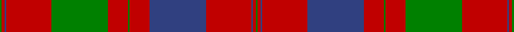

In pattern [GRBRBRGRGRBRG](/stripes/grbrbrgrgrbrg/).

This was sourced from weddslist.  It is a [13 stripe tartan](/stripes/stripes13/).

Original link http://www.weddslist.com/cgi-bin/tartans/pg.pl?source=sts

## Thread count
G/4 R6 B4 R96 G120 R42 G4 R42 B120 R96 B4 R6 G/4

## Palette
Each colour and the base-6 reference it is a variant of.

| Colour | Shade | Base |
|---|---|---|
| B | <code style="background-color:#304080;">#304080</code> `oklch(39.4% 0.109 270.2)` <small>#304080</small> | B <code style="background-color:#2A418A;">#2A418A</code> |
| G | <code style="background-color:#008000;">#008000</code> `oklch(52.0% 0.177 142.5)` <small>#008000</small> | G <code style="background-color:#006100;">#006100</code> |
| R | <code style="background-color:#C00000;">#C00000</code> `oklch(50.7% 0.208 29.2)` <small>#C00000</small> | R <code style="background-color:#CC0000;">#CC0000</code> |

## Nearest tartans

The nearest existing variants by ΔTartan distance.

1. [Grant of Rothiemurchus](/setts/s13/r1g1r32db32r8g1r1g1r8g32r32g1r1~x2/) — ΔT 0.37
1. [Fraser, Isabella (Artefact)](/setts/s13/g2r3db2r48db60r21g2r21g60r48db2r3g2/) — ΔT 0.58
1. [MacDonell of Glengarry #4](/setts/s11/dg18r3dg2r2db6r2dg2r24dg1r2dg6~x2/) — ΔT 0.81
1. [Unnamed 18th century plaid from Rothiemurchus](/setts/s13/r1g1r32dp32r8g1r1g1r8g32r32g1r1~x2/) — ΔT 0.92
1. [Unidentified Cant #14](/setts/s12/db80r56dg3r56dg88r64db3r4dg3r4db3r64/) — ΔT 1.00
1. [Drummond #2](/setts/s12/db24r7dg7r39db4r2db2r5dg42r7db6r7~x2/) — ΔT 1.02
1. [Murray of Tullibardine 4](/setts/s21/db4r1db1r4db12r4db1r1g4r1db1r26db26r4g4r26g21r13db6r5g1~x2/) — ΔT 1.07
1. [Drummond](/setts/s12/db24r7g7r39db4r2db2r5g42r7db6r7~x2/) — ΔT 1.10
1. [Drummond](/setts/s16/r6db1r2db2r28t2r2db9r2g2r2g24r3db2r6db2~x2/) — ΔT 1.12
1. [MacAlister of Glenbarr](/setts/s14/g20r3g6r6g6r8dp2r2g20r2dp2r46dp3r8~x2/) — ΔT 1.17

## Neighbour map

Every grey dot is one of 14299 variants placed by the first two principal components of the ΔTartan feature space (44% of its variance). Red is this tartan; blue dots are its nearest — click one to open its page.

<svg viewBox="0 0 640 380" role="img" style="max-width:100%;height:auto;border:1px solid #e0e0e0;border-radius:4px;display:block" xmlns="http://www.w3.org/2000/svg"><image href="/nn/cloud.v1.png" width="640" height="380"/><a href="/setts/s13/r1g1r32db32r8g1r1g1r8g32r32g1r1~x2/"><circle cx="389.6" cy="126.8" r="4" fill="#3465a4"><title>Grant of Rothiemurchus</title></circle></a><a href="/setts/s13/g2r3db2r48db60r21g2r21g60r48db2r3g2/"><circle cx="365.7" cy="133.1" r="4" fill="#3465a4"><title>Fraser, Isabella (Artefact)</title></circle></a><a href="/setts/s11/dg18r3dg2r2db6r2dg2r24dg1r2dg6~x2/"><circle cx="360.9" cy="142.6" r="4" fill="#3465a4"><title>MacDonell of Glengarry #4</title></circle></a><a href="/setts/s13/r1g1r32dp32r8g1r1g1r8g32r32g1r1~x2/"><circle cx="392.4" cy="123.3" r="4" fill="#3465a4"><title>Unnamed 18th century plaid from Rothiemurchus</title></circle></a><a href="/setts/s12/db80r56dg3r56dg88r64db3r4dg3r4db3r64/"><circle cx="394.2" cy="149.4" r="4" fill="#3465a4"><title>Unidentified Cant #14</title></circle></a><a href="/setts/s12/db24r7dg7r39db4r2db2r5dg42r7db6r7~x2/"><circle cx="306.7" cy="149.6" r="4" fill="#3465a4"><title>Drummond #2</title></circle></a><a href="/setts/s21/db4r1db1r4db12r4db1r1g4r1db1r26db26r4g4r26g21r13db6r5g1~x2/"><circle cx="350.8" cy="119.5" r="4" fill="#3465a4"><title>Murray of Tullibardine 4</title></circle></a><a href="/setts/s12/db24r7g7r39db4r2db2r5g42r7db6r7~x2/"><circle cx="307.4" cy="152.7" r="4" fill="#3465a4"><title>Drummond</title></circle></a><a href="/setts/s16/r6db1r2db2r28t2r2db9r2g2r2g24r3db2r6db2~x2/"><circle cx="360.9" cy="99.6" r="4" fill="#3465a4"><title>Drummond</title></circle></a><a href="/setts/s14/g20r3g6r6g6r8dp2r2g20r2dp2r46dp3r8~x2/"><circle cx="408.9" cy="136.5" r="4" fill="#3465a4"><title>MacAlister of Glenbarr</title></circle></a><circle cx="366.8" cy="134.6" r="5" fill="#c00000"/></svg>

ID: /setts/s13/g2r3db2r48db60r21g2r21g60r48db2r3g2~x2/
