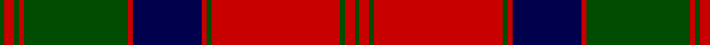

In pattern [GRGRGRBRGRGRG](/patterns/grgrgrbrgrgrg/).

This was sourced from weddslist.  It is a [13 stripes tartan](/stripes/stripes13/).

Original link http://www.weddslist.com/cgi-bin/tartans/pg.pl?source=rb

## Thread count
G/2 R4 G2 R2 G42 R2 DB28 R2 G2 R52 G2 R4 G/2

## Palette
Each colour and its ΔE from the base-6 reference it is a variant of.

| Colour | Shade | Base | ΔE (OKLab) |
|---|---|---|---|
| DB | <code style="background-color:#00004C;">#00004C</code> `#00004C` | B <code style="background-color:#2A418A;">#2A418A</code> | 0.21 |
| G | <code style="background-color:#004C00;">#004C00</code> `#004C00` | G <code style="background-color:#006100;">#006100</code> | 0.07 |
| R | <code style="background-color:#C80000;">#C80000</code> `#C80000` | R <code style="background-color:#CC0000;">#CC0000</code> | 0.01 |

## Nearest tartans

The nearest existing variants by ΔTartan distance.

1. [MacQuarrie #4](/setts/s13/g2r2g2r2g28r2k20r2g2r42g2r2k2-g005020-k101010-rdc0000/) — ΔT 0.72
1. [MacQuarrie #3](/setts/s13/g4r6g4r104g4r4b56r4g84r4g4r6g4-b2c4084-g005020-rdc0000/) — ΔT 0.73
1. [MacQuarrie 1815](/setts/s13/g4r6g4r104g4r4b56r4g84r4g4r6g4-b000052-g11450d-raa0000/) — ΔT 0.78
1. [MacQuarrie 1815](/setts/s13/g2r3g2r52g2r2b28r2g42r2g2r3g2-b000052-g11450d-raa0000/) — ΔT 0.78
1. [Stewart/Stuart of Atholl](/setts/s16/r12k4r80k32g12k4g8k4g88k4g8k4g12k32r80k4-g005028-k101010-rc80000/) — ΔT 0.89
1. [Stewart of Appin](/setts/s16/r3b2w1r2g24r4g2r2b8r2g2r24b2w1r2g2-b000064-g004c00-rc80000-wd0d0d0/) — ΔT 1.01
1. [Fraser of Altyre](/setts/s14/r8b4r90b4r4b80r8b8r4b4r4g80r4b4-b202060-g00643c-rc80000/) — ΔT 1.06
1. [Fraser of Altyre Clan Tartan Tartan Number: 528. Earliest known date: (c.1850) Proportional count of silk sample from Messrs Andersons of Edinburgh (now Kinloch Anderson). MacGregor-Hastie was of the opinion that the sett could be dated to around 1850, based on the story of an 'old lady' (c.1938) who said that a kilt of this pattern had been in the family for generations. The MacGregor-Hastie collection is housed at the Scottish Tartans Museum, Stirling. (1994) See products available Copyright © Blair Urquhart, Comrie, 2015](/setts/s14/r9b4r89b4r4b80r9b9r4b4r4g80r4b4-b2c2c80-g006818-rc80000/) — ΔT 1.07
1. [Kerr Clan Tartan Tartan Number: 791. Earliest known date: 1842 The Kerrs are believed to be of Viking descent, arriving in the Borders of Scotland by way of France. The Kerrs of Ferniehurst lived near Jedburgh. The Marquesses of Lothian now live at Monteviot. The true origin of the tartan is unknown as the claims of antiquity in the Vestiarium Scoticum, where this sett first appears, are doubtful. See products available Copyright © Blair Urquhart, Comrie, 2015](/setts/s10/g40k2g4k2g6k28r56k2r4k8-g006818-k101010-rc80000/) — ΔT 1.07
1. [MacQuarrie 3](/setts/s13/g4r6g4r104g4r4b56r4g84r4g4r6g4-b304080-g008000-rc00000/) — ΔT 1.09

## Neighbour map

Every grey dot is one of 15726 variants placed by the first two principal components of the ΔTartan feature space (44% of its variance). Red is this tartan; blue dots are its nearest — click one to open its page.

<svg viewBox="0 0 640 380" role="img" style="max-width:100%;height:auto;border:1px solid #e0e0e0;border-radius:4px;display:block" xmlns="http://www.w3.org/2000/svg"><image href="/nn/cloud.v1.png" width="640" height="380"/><a href="/setts/s13/g2r2g2r2g28r2k20r2g2r42g2r2k2-g005020-k101010-rdc0000/"><circle cx="329.6" cy="116.7" r="4" fill="#3465a4"><title>MacQuarrie #4</title></circle></a><a href="/setts/s13/g4r6g4r104g4r4b56r4g84r4g4r6g4-b2c4084-g005020-rdc0000/"><circle cx="339.1" cy="113.3" r="4" fill="#3465a4"><title>MacQuarrie #3</title></circle></a><a href="/setts/s13/g4r6g4r104g4r4b56r4g84r4g4r6g4-b000052-g11450d-raa0000/"><circle cx="346.0" cy="123.0" r="4" fill="#3465a4"><title>MacQuarrie 1815</title></circle></a><a href="/setts/s13/g2r3g2r52g2r2b28r2g42r2g2r3g2-b000052-g11450d-raa0000/"><circle cx="346.0" cy="123.0" r="4" fill="#3465a4"><title>MacQuarrie 1815</title></circle></a><a href="/setts/s16/r12k4r80k32g12k4g8k4g88k4g8k4g12k32r80k4-g005028-k101010-rc80000/"><circle cx="308.1" cy="127.5" r="4" fill="#3465a4"><title>Stewart/Stuart of Atholl</title></circle></a><a href="/setts/s16/r3b2w1r2g24r4g2r2b8r2g2r24b2w1r2g2-b000064-g004c00-rc80000-wd0d0d0/"><circle cx="306.0" cy="93.7" r="4" fill="#3465a4"><title>Stewart of Appin</title></circle></a><a href="/setts/s14/r8b4r90b4r4b80r8b8r4b4r4g80r4b4-b202060-g00643c-rc80000/"><circle cx="307.7" cy="120.5" r="4" fill="#3465a4"><title>Fraser of Altyre</title></circle></a><a href="/setts/s14/r9b4r89b4r4b80r9b9r4b4r4g80r4b4-b2c2c80-g006818-rc80000/"><circle cx="304.3" cy="120.4" r="4" fill="#3465a4"><title>Fraser of Altyre Clan Tartan Tartan Number: 528. Earliest known date: (c.1850) Proportional count of silk sample from Messrs Andersons of Edinburgh (now Kinloch Anderson). MacGregor-Hastie was of the opinion that the sett could be dated to around 1850, based on the story of an 'old lady' (c.1938) who said that a kilt of this pattern had been in the family for generations. The MacGregor-Hastie collection is housed at the Scottish Tartans Museum, Stirling. (1994) See products available Copyright © Blair Urquhart, Comrie, 2015</title></circle></a><a href="/setts/s10/g40k2g4k2g6k28r56k2r4k8-g006818-k101010-rc80000/"><circle cx="294.3" cy="136.7" r="4" fill="#3465a4"><title>Kerr Clan Tartan Tartan Number: 791. Earliest known date: 1842 The Kerrs are believed to be of Viking descent, arriving in the Borders of Scotland by way of France. The Kerrs of Ferniehurst lived near Jedburgh. The Marquesses of Lothian now live at Monteviot. The true origin of the tartan is unknown as the claims of antiquity in the Vestiarium Scoticum, where this sett first appears, are doubtful. See products available Copyright © Blair Urquhart, Comrie, 2015</title></circle></a><a href="/setts/s13/g4r6g4r104g4r4b56r4g84r4g4r6g4-b304080-g008000-rc00000/"><circle cx="339.4" cy="116.0" r="4" fill="#3465a4"><title>MacQuarrie 3</title></circle></a><circle cx="328.6" cy="112.9" r="5" fill="#c00000"/></svg>

ID: /setts/s13/g2r4g2r52g2r2b28r2g42r2g2r4g2-b00004c-g004c00-rc80000/
