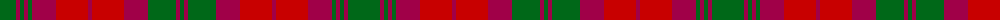

In pattern [GRGRGRRRRRGRG](/patterns/grgrgrrrrrgrg/).

This was sourced from register-of-tartans.  It is a [13 stripes tartan](/stripes/stripes13/).

Original link https://www.tartanregister.gov.uk/tartanDetails.aspx?ref=2669

## Thread count
G/32 R4 G4 R4 G4 R24 Ra32 R4 Ra32 R24 G28 R4 G/4

## Palette
Each colour and its ΔE from the base-6 reference it is a variant of.

| Colour | Shade | Base | ΔE (OKLab) |
|---|---|---|---|
| G | <code style="background-color:#006818;">#006818</code> `#006818` | G <code style="background-color:#006400;">#006400</code> | 0.02 |
| R | <code style="background-color:#A00048;">#A00048</code> `#A00048` | R <code style="background-color:#C80000;">#C80000</code> | 0.11 |
| Ra | <code style="background-color:#C80000;">#C80000</code> `#C80000` | R <code style="background-color:#C80000;">#C80000</code> | 0.00 |

ID: /setts/s13/g32r4g4r4g4r24ra32r4ra32r24g28r4g4-g006818-ra00048-rac80000/
