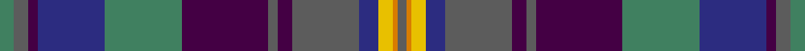

This page is one **sett** — a single exact thread-count. It belongs to the [tartan](/tartans/g3n3dp2db14g16dp18n2dp3n14db4ly3lo1n2/)
(the same proportion at any scale), whose colour order is pattern [BYYBBBBBGBBBG](/stripes/byybbbbbgbbbg/).

Sourced from tartans-authority.  It is a [13 stripe tartan](/stripes/stripes13/).

Original link http://www.tartansauthority.com/tartan-ferret/display/11177/

## Register references

External register numbers recorded for this tartan.

- Scottish Register of Tartans: [11177](https://www.tartanregister.gov.uk/tartanDetails?ref=11177)
- Scottish Tartans Authority (ITI): 11177

## Thread count
G/6 N6 DP4 DB28 G32 DP36 N4 DP6 N28 DB8 Y6 O2 N/4

## Palette

Palette: <strong>Tartan Register</strong> <small style="color:#888">(5 of 6 colours)</small>
<table><thead><tr><th>Colour</th><th>Threads</th><th>Shade</th><th>Base</th><th>OKLCh</th></tr></thead><tbody><tr><td>G/</td><td style="text-align:right;font-variant-numeric:tabular-nums">6</td><td><code style="background-color:#408060;">#408060</code> <small style="color:#888">#408060</small></td><td>G <code style="background-color:#006100;">#006100</code></td><td><small style="color:#888">oklch(54.8% 0.084 160.1)</small></td></tr><tr><td>N</td><td style="text-align:right;font-variant-numeric:tabular-nums">6</td><td><code style="background-color:#5C5C5C;">#5C5C5C</code> <small style="color:#888">#5C5C5C</small></td><td>B <code style="background-color:#2A418A;">#2A418A</code></td><td><small style="color:#888">oklch(47.5% 0.000 89.9)</small></td></tr><tr><td>DP</td><td style="text-align:right;font-variant-numeric:tabular-nums">4</td><td><code style="background-color:#440044;">#440044</code> <small style="color:#888">#440044</small></td><td>B <code style="background-color:#2A418A;">#2A418A</code></td><td><small style="color:#888">oklch(27.1% 0.125 328.4)</small></td></tr><tr><td>DB</td><td style="text-align:right;font-variant-numeric:tabular-nums">28</td><td><code style="background-color:#2C2C80;">#2C2C80</code> <small style="color:#888">#2C2C80</small></td><td>B <code style="background-color:#2A418A;">#2A418A</code></td><td><small style="color:#888">oklch(35.0% 0.138 276.6)</small></td></tr><tr><td>G</td><td style="text-align:right;font-variant-numeric:tabular-nums">32</td><td><code style="background-color:#408060;">#408060</code> <small style="color:#888">#408060</small></td><td>G <code style="background-color:#006100;">#006100</code></td><td><small style="color:#888">oklch(54.8% 0.084 160.1)</small></td></tr><tr><td>DP</td><td style="text-align:right;font-variant-numeric:tabular-nums">36</td><td><code style="background-color:#440044;">#440044</code> <small style="color:#888">#440044</small></td><td>B <code style="background-color:#2A418A;">#2A418A</code></td><td><small style="color:#888">oklch(27.1% 0.125 328.4)</small></td></tr><tr><td>N</td><td style="text-align:right;font-variant-numeric:tabular-nums">4</td><td><code style="background-color:#5C5C5C;">#5C5C5C</code> <small style="color:#888">#5C5C5C</small></td><td>B <code style="background-color:#2A418A;">#2A418A</code></td><td><small style="color:#888">oklch(47.5% 0.000 89.9)</small></td></tr><tr><td>DP</td><td style="text-align:right;font-variant-numeric:tabular-nums">6</td><td><code style="background-color:#440044;">#440044</code> <small style="color:#888">#440044</small></td><td>B <code style="background-color:#2A418A;">#2A418A</code></td><td><small style="color:#888">oklch(27.1% 0.125 328.4)</small></td></tr><tr><td>N</td><td style="text-align:right;font-variant-numeric:tabular-nums">28</td><td><code style="background-color:#5C5C5C;">#5C5C5C</code> <small style="color:#888">#5C5C5C</small></td><td>B <code style="background-color:#2A418A;">#2A418A</code></td><td><small style="color:#888">oklch(47.5% 0.000 89.9)</small></td></tr><tr><td>DB</td><td style="text-align:right;font-variant-numeric:tabular-nums">8</td><td><code style="background-color:#2C2C80;">#2C2C80</code> <small style="color:#888">#2C2C80</small></td><td>B <code style="background-color:#2A418A;">#2A418A</code></td><td><small style="color:#888">oklch(35.0% 0.138 276.6)</small></td></tr><tr><td>Y</td><td style="text-align:right;font-variant-numeric:tabular-nums">6</td><td><code style="background-color:#E8C000;">#E8C000</code> <small style="color:#888">#E8C000</small></td><td>Y <code style="background-color:#F2BF00;">#F2BF00</code></td><td><small style="color:#888">oklch(81.9% 0.168 93.7)</small></td></tr><tr><td>O</td><td style="text-align:right;font-variant-numeric:tabular-nums">2</td><td><code style="background-color:#D87C00;">#D87C00</code> <small style="color:#888">#D87C00</small></td><td>Y <code style="background-color:#F2BF00;">#F2BF00</code></td><td><small style="color:#888">oklch(67.3% 0.155 61.8)</small></td></tr><tr><td>N/</td><td style="text-align:right;font-variant-numeric:tabular-nums">4</td><td><code style="background-color:#5C5C5C;">#5C5C5C</code> <small style="color:#888">#5C5C5C</small></td><td>B <code style="background-color:#2A418A;">#2A418A</code></td><td><small style="color:#888">oklch(47.5% 0.000 89.9)</small></td></tr></tbody></table>

## Nearest tartans

The nearest existing variants by ΔTartan distance, with this tartan at the top so the swatches line up against it.

ΔTartan

Tartan

Sett

—

<a href="/ttd/edit/#slug=g3n3dp2db14g16dp18n2dp3n14db4ly3lo1n2~x2">ENABLE Scotland</a> <a class="nn-out" href="/setts/s13/g3n3dp2db14g16dp18n2dp3n14db4ly3lo1n2~x2/" title="open its dictionary page">↗</a>

0.65

<a href="/ttd/edit/#slug=g3dp3dti2dt14g16dp18dti2dp3dti14dt4ly3o1dti2~x2">ENABLE Scotland</a> <a class="nn-out" href="/setts/s13/g3dp3dti2dt14g16dp18dti2dp3dti14dt4ly3o1dti2~x2/" title="open its dictionary page">↗</a>

0.95

<a href="/ttd/edit/#slug=yi4t3yi18dt14y2dt2dp18lo1dp2lo3~x2">Caisteal Leòdhais</a> <a class="nn-out" href="/setts/s10/yi4t3yi18dt14y2dt2dp18lo1dp2lo3~x2/" title="open its dictionary page">↗</a>

1.00

<a href="/ttd/edit/#slug=g19r3g19dt7m26k3dt7k3dp42k3dt7k3~x2">Tartan Spirit</a> <a class="nn-out" href="/setts/s12/g19r3g19dt7m26k3dt7k3dp42k3dt7k3~x2/" title="open its dictionary page">↗</a>

1.17

<a href="/ttd/edit/#slug=dp3k2dp5lb2db12r1db2k1g9dp3g5k12db2~x2">MacKusick (Piper) #2 (Personal)</a> <a class="nn-out" href="/setts/s13/dp3k2dp5lb2db12r1db2k1g9dp3g5k12db2~x2/" title="open its dictionary page">↗</a>

1.17

<a href="/setts/s17/ly3k2r9k1nii8k1r2k1ni8k1n2k1ni16k1n12k4ni2~x2/">Golden Glow</a>

1.20

<a href="/ttd/edit/#slug=db6dt22k12dp10g3k1g3dp10db2w2~x2">Cowal (Corporate)</a> <a class="nn-out" href="/setts/s10/db6dt22k12dp10g3k1g3dp10db2w2~x2/" title="open its dictionary page">↗</a>

1.21

<a href="/setts/s17/ly3k2o9k1ni8k1o2k1n8k1t2k1n16k1t12k4n2~x2/">Golden Glow (Fashion)</a>

1.30

<a href="/ttd/edit/#slug=o2g2o16g2dp17dg10gi10g15dg1w2~x2">Grewar (Name)</a> <a class="nn-out" href="/setts/s10/o2g2o16g2dp17dg10gi10g15dg1w2~x2/" title="open its dictionary page">↗</a>

1.33

<a href="/ttd/edit/#slug=dp3o1db4g2r2g21o3dp21db25w3~x2">Accenture</a> <a class="nn-out" href="/setts/s10/dp3o1db4g2r2g21o3dp21db25w3~x2/" title="open its dictionary page">↗</a>

1.36

<a href="/ttd/edit/#slug=g10ly2dp2g2dp13g2dp2g1k13db24w2~x2">Lang of Sherbrooke (Personal)</a> <a class="nn-out" href="/setts/s11/g10ly2dp2g2dp13g2dp2g1k13db24w2~x2/" title="open its dictionary page">↗</a>

## Neighbour map

Every grey dot is one of 14359 variants placed by the first two principal components of the ΔTartan feature space (44% of its variance). Red is this tartan; blue dots are its nearest — click one to open its page.

<svg viewBox="0 0 640 380" role="img" style="max-width:100%;height:auto;border:1px solid #e0e0e0;border-radius:4px;display:block" xmlns="http://www.w3.org/2000/svg"><image href="/nn/cloud.v1.png" width="640" height="380"/><a href="/setts/s13/g3dp3dti2dt14g16dp18dti2dp3dti14dt4ly3o1dti2~x2/"><circle cx="160.3" cy="142.0" r="4" fill="#3465a4"><title>ENABLE Scotland</title></circle></a><a href="/setts/s10/yi4t3yi18dt14y2dt2dp18lo1dp2lo3~x2/"><circle cx="188.0" cy="138.2" r="4" fill="#3465a4"><title>Caisteal Leòdhais</title></circle></a><a href="/setts/s12/g19r3g19dt7m26k3dt7k3dp42k3dt7k3~x2/"><circle cx="154.6" cy="135.9" r="4" fill="#3465a4"><title>Tartan Spirit</title></circle></a><a href="/setts/s13/dp3k2dp5lb2db12r1db2k1g9dp3g5k12db2~x2/"><circle cx="116.5" cy="153.9" r="4" fill="#3465a4"><title>MacKusick (Piper) #2 (Personal)</title></circle></a><a href="/setts/s17/ly3k2r9k1nii8k1r2k1ni8k1n2k1ni16k1n12k4ni2~x2/"><circle cx="176.4" cy="119.6" r="4" fill="#3465a4"><title>Golden Glow</title></circle></a><a href="/setts/s10/db6dt22k12dp10g3k1g3dp10db2w2~x2/"><circle cx="174.0" cy="147.1" r="4" fill="#3465a4"><title>Cowal (Corporate)</title></circle></a><a href="/setts/s17/ly3k2o9k1ni8k1o2k1n8k1t2k1n16k1t12k4n2~x2/"><circle cx="163.9" cy="115.3" r="4" fill="#3465a4"><title>Golden Glow (Fashion)</title></circle></a><a href="/setts/s10/o2g2o16g2dp17dg10gi10g15dg1w2~x2/"><circle cx="129.8" cy="156.2" r="4" fill="#3465a4"><title>Grewar (Name)</title></circle></a><a href="/setts/s10/dp3o1db4g2r2g21o3dp21db25w3~x2/"><circle cx="204.2" cy="117.2" r="4" fill="#3465a4"><title>Accenture</title></circle></a><a href="/setts/s11/g10ly2dp2g2dp13g2dp2g1k13db24w2~x2/"><circle cx="176.0" cy="113.1" r="4" fill="#3465a4"><title>Lang of Sherbrooke (Personal)</title></circle></a><circle cx="153.6" cy="136.4" r="5" fill="#c00000"/></svg>

ID: /setts/s13/g3n3dp2db14g16dp18n2dp3n14db4ly3lo1n2~x2/
