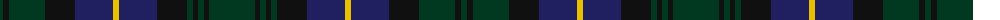

In pattern [GKGKBYBKGKGKG](/patterns/gkgkbybkgkgkg/).

This was sourced from house-of-tartan.  It is a [13 stripes tartan](/stripes/stripes13/).

Original link http://www.house-of-tartan.scotland.net/house/TartanViewjs.asp?colr=Def&tnam=694

## Thread count
DG/6 K6 DG36 K30 DB38 Y6 DB38 K30 DG6 K5 DG6 K5 DG/46

## Palette
Each colour and its ΔE from the base-6 reference it is a variant of.

| Colour | Shade | Base | ΔE (OKLab) |
|---|---|---|---|
| DB | <code style="background-color:#202060;">#202060</code> `#202060` | B <code style="background-color:#2C4084;">#2C4084</code> | 0.11 |
| DG | <code style="background-color:#003820;">#003820</code> `#003820` | G <code style="background-color:#006400;">#006400</code> | 0.16 |
| DR | <code style="background-color:#680028;">#680028</code> `#680028` | B <code style="background-color:#2C4084;">#2C4084</code> | 0.20 |
| K | <code style="background-color:#101010;">#101010</code> `#101010` | K <code style="background-color:#000000;">#000000</code> | 0.17 |
| Y | <code style="background-color:#E8C000;">#E8C000</code> `#E8C000` | Y <code style="background-color:#E8C000;">#E8C000</code> | 0.00 |

ID: /setts/s13/g46k5g6k5g6k30b38y6b38k30g36k6g6-b202060-g003820-k101010-ye8c000/
