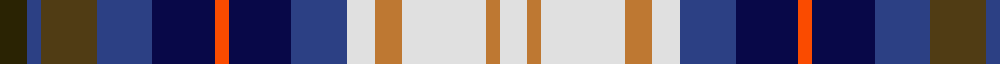

In pattern [GBGBBRBBWRWRW](/patterns/gbgbbrbbwrwrw/).

This was sourced from register-of-tartans.  It is a [13 stripes tartan](/stripes/stripes13/).

Original link https://www.tartanregister.gov.uk/tartanDetails.aspx?ref=4299

## Thread count
K/8 B4 T16 B16 DB18 R4 DB18 B16 LN8 DO8 LN24 DO4 LN/8

## Palette
Each colour and its ΔE from the base-6 reference it is a variant of.

| Colour | Shade | Base | ΔE (OKLab) |
|---|---|---|---|
| B | <code style="background-color:#2C4084;">#2C4084</code> `#2C4084` | B <code style="background-color:#2A418A;">#2A418A</code> | 0.01 |
| DB | <code style="background-color:#080848;">#080848</code> `#080848` | B <code style="background-color:#2A418A;">#2A418A</code> | 0.20 |
| DO | <code style="background-color:#BE7832;">#BE7832</code> `#BE7832` | R <code style="background-color:#CC0000;">#CC0000</code> | 0.17 |
| K | <code style="background-color:#2A2303;">#2A2303</code> `#2A2303` | G <code style="background-color:#006100;">#006100</code> | 0.21 |
| LN | <code style="background-color:#E0E0E0;">#E0E0E0</code> `#E0E0E0` | W <code style="background-color:#F7F7F7;">#F7F7F7</code> | 0.07 |
| R | <code style="background-color:#FA4B00;">#FA4B00</code> `#FA4B00` | R <code style="background-color:#CC0000;">#CC0000</code> | 0.13 |
| T | <code style="background-color:#503C14;">#503C14</code> `#503C14` | G <code style="background-color:#006100;">#006100</code> | 0.14 |

## Nearest tartans

The nearest existing variants by ΔTartan distance.

1. [Unidentified, Gordon variant](/setts/s13/b4ba2r8ba8bb9y2bb9ba8w4ra4w12ra2w4~b401000-ba304080-bb000050-r806050-ra906030-we0e0e0-yff8500~x2/) — ΔT 0.17
1. [Cascade Summers](/setts/s12/b3y13r3g6b3k10w2k10b3r11ba13k3~b3c8cfc-ba3474fc-g007800-k000000-rb45050-wc8c8c8-y3cc83c~x2/) — ΔT 1.11
1. [Hoban (Personal)](/setts/s16/w9k3w4k9g15k9b11wa2b11k9g15k9w4k3w9y3~b2c2c80-g408060-k101010-wc49cd8-wafcfcfc-ye8c000~x4/) — ΔT 1.38
1. [Hoban (Name)](/setts/s9/y3w9k3w4k9g15k9b11wa2~b2c2c80-g408060-k101010-wc49cd8-wafcfcfc-ye8c000~x4/) — ΔT 1.40
1. [St. Margaret's School Edinburgh](/setts/s17/k16g3ga8k3r12k3r12k3ga8k3w12ga8w12ga8g3k16wa3~g006818-ga408060-k101010-rb468ac-wc0c0c0-wafcfcfc~x2/) — ΔT 1.43
1. [O'Sullivan](/setts/s11/b6k4b10w2ba10g4ba6g9r2g4y2~b1474b4-ba1c0070-g408060-k101010-rc80000-wfcfcfc-ye8c000~x4/) — ΔT 1.45
1. [Clauwaert (Personal)](/setts/s17/b4y2b4w6wa2k2w6wa2k2w13y3k4y3k8b6wa2r4~b2c2c80-k101010-rc80000-wc0c0c0-wae0e0e0-ya08858~x2/) — ΔT 1.45
1. [Anderson (Blackwood) (Personal)](/setts/s12/k5g15ga8g15k5r4b8w5wa3w5b8r4~b0000cd-g008b00-ga603311-k101010-rff0000-w82cffd-waffffff~x2/) — ΔT 1.46
1. [Land's End (Unnamed Maroon) (Personal)](/setts/s14/w3b2w7b2w2k7g8k1w2k1g8k7ba7r2~b3c82af-ba2c4084-g005020-k101010-rdc0000-we0e0e0~x2/) — ΔT 1.46
1. [Cascade Summers, (The Resort at the Mountain)](/setts/s12/b3g14r3ga6b3k10w2k10b3r11ba14k3~b304080-ba5480b0-g30a010-ga006030-k000000-rd03030-we0e0e0~x2/) — ΔT 1.47

## Neighbour map

Every grey dot is one of 15726 variants placed by the first two principal components of the ΔTartan feature space (44% of its variance). Red is this tartan; blue dots are its nearest — click one to open its page.

<svg viewBox="0 0 640 380" role="img" style="max-width:100%;height:auto;border:1px solid #e0e0e0;border-radius:4px;display:block" xmlns="http://www.w3.org/2000/svg"><image href="/nn/cloud.v1.png" width="640" height="380"/><a href="/setts/s13/b4ba2r8ba8bb9y2bb9ba8w4ra4w12ra2w4~b401000-ba304080-bb000050-r806050-ra906030-we0e0e0-yff8500~x2/"><circle cx="14.0" cy="153.8" r="4" fill="#3465a4"><title>Unidentified, Gordon variant</title></circle></a><a href="/setts/s12/b3y13r3g6b3k10w2k10b3r11ba13k3~b3c8cfc-ba3474fc-g007800-k000000-rb45050-wc8c8c8-y3cc83c~x2/"><circle cx="14.0" cy="146.6" r="4" fill="#3465a4"><title>Cascade Summers</title></circle></a><a href="/setts/s16/w9k3w4k9g15k9b11wa2b11k9g15k9w4k3w9y3~b2c2c80-g408060-k101010-wc49cd8-wafcfcfc-ye8c000~x4/"><circle cx="43.6" cy="165.7" r="4" fill="#3465a4"><title>Hoban (Personal)</title></circle></a><a href="/setts/s9/y3w9k3w4k9g15k9b11wa2~b2c2c80-g408060-k101010-wc49cd8-wafcfcfc-ye8c000~x4/"><circle cx="47.5" cy="180.1" r="4" fill="#3465a4"><title>Hoban (Name)</title></circle></a><a href="/setts/s17/k16g3ga8k3r12k3r12k3ga8k3w12ga8w12ga8g3k16wa3~g006818-ga408060-k101010-rb468ac-wc0c0c0-wafcfcfc~x2/"><circle cx="29.0" cy="161.6" r="4" fill="#3465a4"><title>St. Margaret's School Edinburgh</title></circle></a><a href="/setts/s11/b6k4b10w2ba10g4ba6g9r2g4y2~b1474b4-ba1c0070-g408060-k101010-rc80000-wfcfcfc-ye8c000~x4/"><circle cx="16.6" cy="184.6" r="4" fill="#3465a4"><title>O'Sullivan</title></circle></a><a href="/setts/s17/b4y2b4w6wa2k2w6wa2k2w13y3k4y3k8b6wa2r4~b2c2c80-k101010-rc80000-wc0c0c0-wae0e0e0-ya08858~x2/"><circle cx="35.3" cy="140.2" r="4" fill="#3465a4"><title>Clauwaert (Personal)</title></circle></a><a href="/setts/s12/k5g15ga8g15k5r4b8w5wa3w5b8r4~b0000cd-g008b00-ga603311-k101010-rff0000-w82cffd-waffffff~x2/"><circle cx="14.0" cy="167.5" r="4" fill="#3465a4"><title>Anderson (Blackwood) (Personal)</title></circle></a><a href="/setts/s14/w3b2w7b2w2k7g8k1w2k1g8k7ba7r2~b3c82af-ba2c4084-g005020-k101010-rdc0000-we0e0e0~x2/"><circle cx="22.4" cy="149.1" r="4" fill="#3465a4"><title>Land's End (Unnamed Maroon) (Personal)</title></circle></a><a href="/setts/s12/b3g14r3ga6b3k10w2k10b3r11ba14k3~b304080-ba5480b0-g30a010-ga006030-k000000-rd03030-we0e0e0~x2/"><circle cx="14.0" cy="144.2" r="4" fill="#3465a4"><title>Cascade Summers, (The Resort at the Mountain)</title></circle></a><circle cx="14.0" cy="153.8" r="5" fill="#c00000"/></svg>

ID: /setts/s13/g4b2ga8b8ba9r2ba9b8w4ra4w12ra2w4~b2c4084-ba080848-g2a2303-ga503c14-rfa4b00-rabe7832-we0e0e0~x2/
