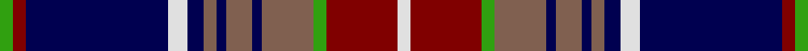

In pattern [GRBWBRBRBRGRW](/stripes/grbwbrbrbrgrw/).

This was sourced from weddslist.  It is a [13 stripe tartan](/stripes/stripes13/).

Original link http://www.weddslist.com/cgi-bin/tartans/pg.pl?source=sts

## Thread count
G/4 DR4 DB44 LN6 DB5 LT4 DB3 LT8 DB3 LT16 G4 DR22 LN/4

## Palette
Each colour and the base-6 reference it is a variant of.

| Colour | Shade | Base |
|---|---|---|
| DB | <code style="background-color:#000050;">#000050</code> `oklch(19.5% 0.135 264.1)` <small>#000050</small> | B <code style="background-color:#2A418A;">#2A418A</code> |
| DR | <code style="background-color:#800000;">#800000</code> `oklch(37.7% 0.155 29.2)` <small>#800000</small> | R <code style="background-color:#CC0000;">#CC0000</code> |
| G | <code style="background-color:#30A010;">#30A010</code> `oklch(61.9% 0.195 140.5)` <small>#30A010</small> | G <code style="background-color:#006100;">#006100</code> |
| LN | <code style="background-color:#E0E0E0;">#E0E0E0</code> `oklch(90.7% 0.000 89.9)` <small>#E0E0E0</small> | W <code style="background-color:#F7F7F7;">#F7F7F7</code> |
| LT | <code style="background-color:#806050;">#806050</code> `oklch(51.7% 0.049 47.8)` <small>#806050</small> | R <code style="background-color:#CC0000;">#CC0000</code> |

## Nearest tartans

The nearest existing variants by ΔTartan distance.

1. [McGuffey (School)](/setts/s11/o14k2db3k1ly2k1db3k14db3k1w1~x2/) — ΔT 0.60
1. [MacMichael](/setts/s11/r1db1r8w1k2db16k2w1g8db1g1~x2/) — ΔT 0.80
1. [Rangers Dress (Sports)](/setts/s11/r2db6lr2db2k9y30k9db5lr4db2r2~x2/) — ΔT 0.81
1. [Auld Lang Syne Blue Fashion Tartan Tartan Number: 7250. Earliest known date: 01/01/2007 No further information. Also called Auld Lang Syne Modern. See products available Copyright © Blair Urquhart, Comrie, 2015](/setts/s12/w4k2b9k3b3k3b3k25dg10k2b6w2~x2/) — ΔT 0.82
1. [Auld Lang Syne, Blue (Fashion)](/setts/s12/w4k2n9k3dp3k3dp3k23g10k2dp6w2~x2/) — ΔT 0.86
1. [Auld Lang Syne Blue](/setts/s12/w4k2b9k3m3k3m3k23g10k2m6w2~x2/) — ΔT 0.87
1. [MacMichael](/setts/s11/r1db1r8lb1k2db16k2lb1g8db1g1~x4/) — ΔT 0.96
1. [Wcwm 1138](/setts/s14/db14k2g3k2g3k2db12r4db10r3db10r4lb28r4~x2/) — ΔT 1.02
1. [Glenfalloch](/setts/s12/k4r1k12w1r4w1dg4w1m4dg12k1w2~x2/) — ΔT 1.09
1. [Royal Canadian Air Force #2](/setts/s16/r3t7k1r2k1t12k4w3k2r1k1r1db3r2db4r2~x2/) — ΔT 1.11

## Neighbour map

Every grey dot is one of 14299 variants placed by the first two principal components of the ΔTartan feature space (44% of its variance). Red is this tartan; blue dots are its nearest — click one to open its page.

<svg viewBox="0 0 640 380" role="img" style="max-width:100%;height:auto;border:1px solid #e0e0e0;border-radius:4px;display:block" xmlns="http://www.w3.org/2000/svg"><image href="/nn/cloud.v1.png" width="640" height="380"/><a href="/setts/s11/o14k2db3k1ly2k1db3k14db3k1w1~x2/"><circle cx="210.0" cy="129.1" r="4" fill="#3465a4"><title>McGuffey (School)</title></circle></a><a href="/setts/s11/r1db1r8w1k2db16k2w1g8db1g1~x2/"><circle cx="211.3" cy="117.4" r="4" fill="#3465a4"><title>MacMichael</title></circle></a><a href="/setts/s11/r2db6lr2db2k9y30k9db5lr4db2r2~x2/"><circle cx="197.3" cy="124.7" r="4" fill="#3465a4"><title>Rangers Dress (Sports)</title></circle></a><a href="/setts/s12/w4k2b9k3b3k3b3k25dg10k2b6w2~x2/"><circle cx="207.1" cy="135.7" r="4" fill="#3465a4"><title>Auld Lang Syne Blue Fashion Tartan Tartan Number: 7250. Earliest known date: 01/01/2007 No further information. Also called Auld Lang Syne Modern. See products available Copyright © Blair Urquhart, Comrie, 2015</title></circle></a><a href="/setts/s12/w4k2n9k3dp3k3dp3k23g10k2dp6w2~x2/"><circle cx="205.5" cy="147.1" r="4" fill="#3465a4"><title>Auld Lang Syne, Blue (Fashion)</title></circle></a><a href="/setts/s12/w4k2b9k3m3k3m3k23g10k2m6w2~x2/"><circle cx="187.4" cy="137.7" r="4" fill="#3465a4"><title>Auld Lang Syne Blue</title></circle></a><a href="/setts/s11/r1db1r8lb1k2db16k2lb1g8db1g1~x4/"><circle cx="232.9" cy="132.9" r="4" fill="#3465a4"><title>MacMichael</title></circle></a><a href="/setts/s14/db14k2g3k2g3k2db12r4db10r3db10r4lb28r4~x2/"><circle cx="192.1" cy="122.7" r="4" fill="#3465a4"><title>Wcwm 1138</title></circle></a><a href="/setts/s12/k4r1k12w1r4w1dg4w1m4dg12k1w2~x2/"><circle cx="148.0" cy="138.6" r="4" fill="#3465a4"><title>Glenfalloch</title></circle></a><a href="/setts/s16/r3t7k1r2k1t12k4w3k2r1k1r1db3r2db4r2~x2/"><circle cx="150.1" cy="132.3" r="4" fill="#3465a4"><title>Royal Canadian Air Force #2</title></circle></a><circle cx="201.3" cy="117.6" r="5" fill="#c00000"/></svg>

ID: /setts/s13/g4r4db44w6db5o4db3o8db3o16g4r22w4/
